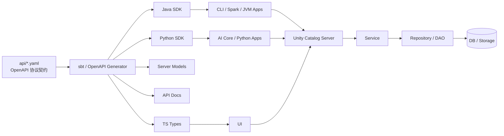
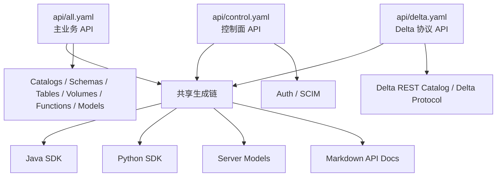
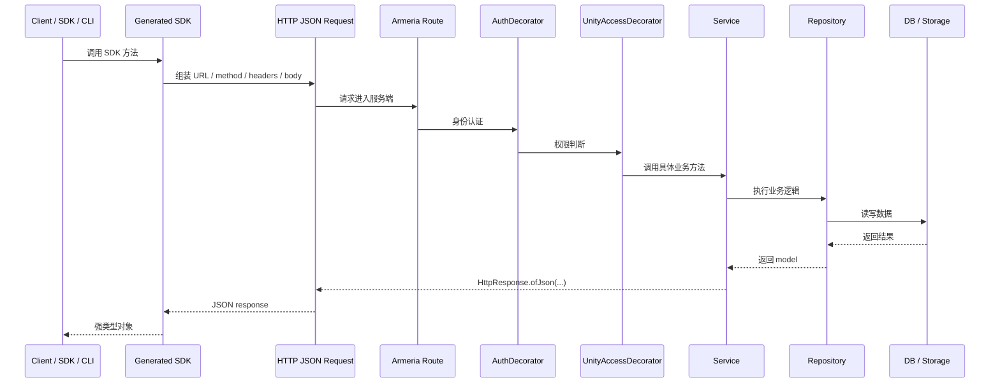
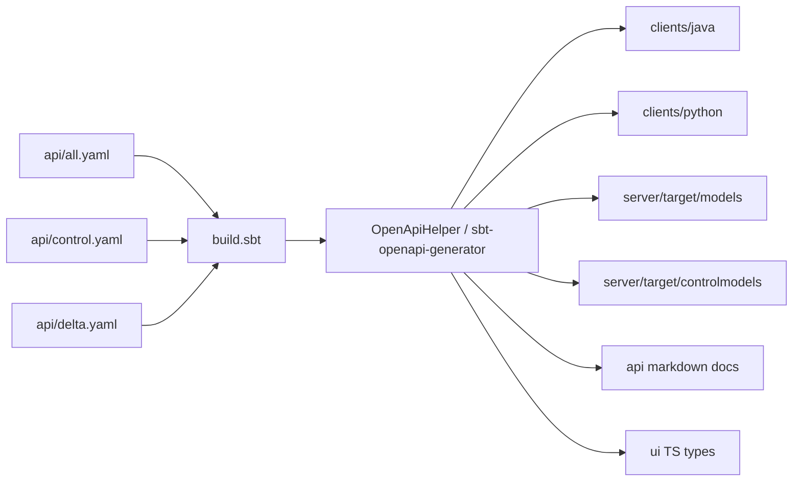
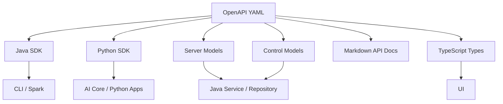
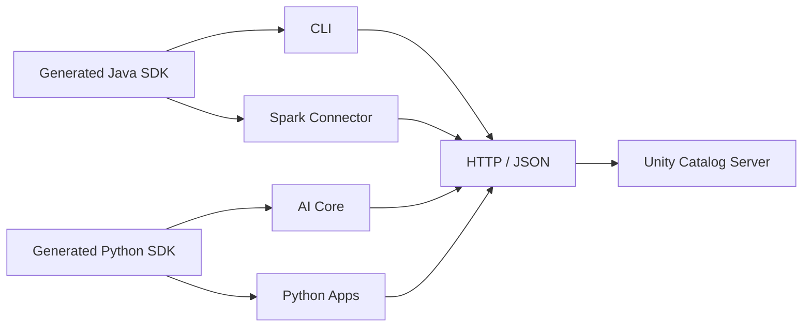
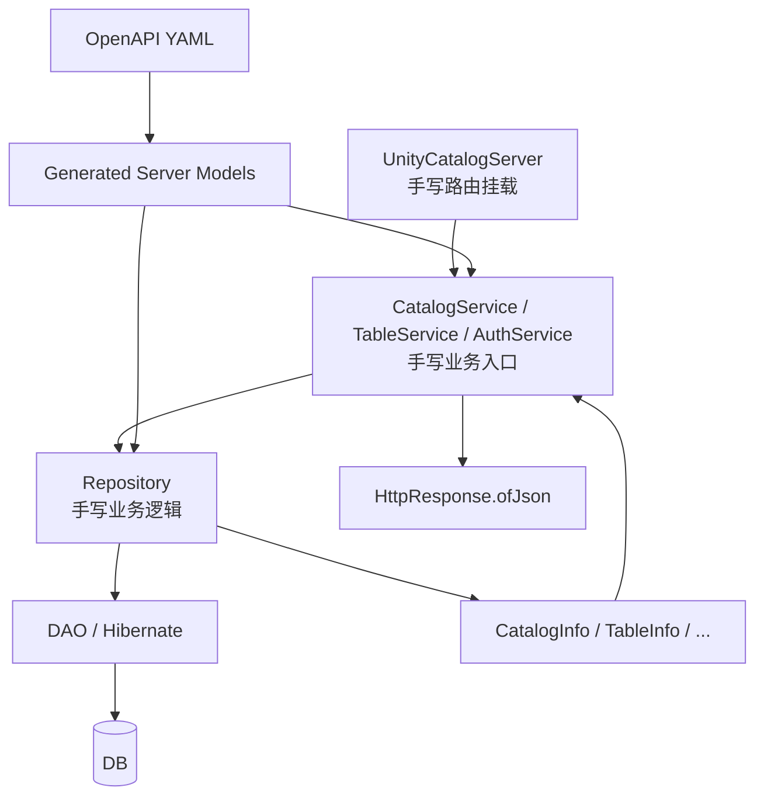
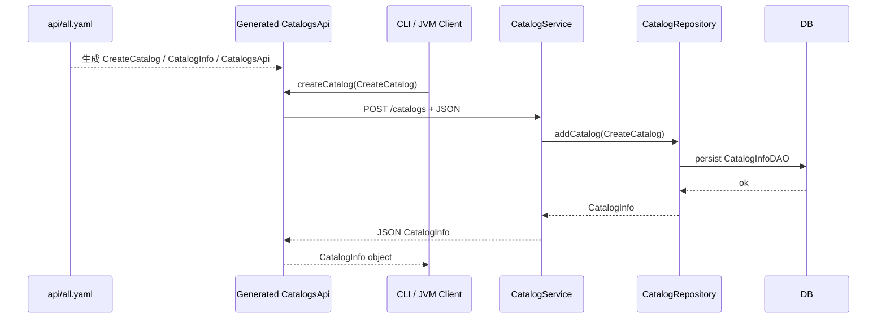
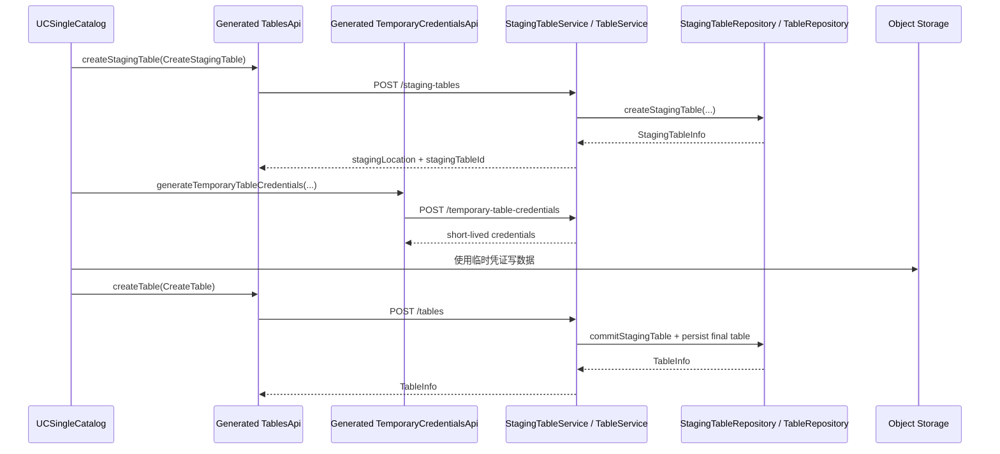

# Unity Catalog API 架构与 SDK 生成机制解析

更新时间：2026-04-15

仓库：
- GitHub: https://github.com/unitycatalog/unitycatalog
- 本地路径：`/home/lei/data_ai/learning/codebase/unitycatalog`

本文聚焦 Unity Catalog 中和 API 相关的核心问题：
- `api/*.yaml` 到底是什么
- `sbt` 在这里承担了什么角色
- SDK 是如何从 YAML 生成出来的
- 后端为什么不是“由 YAML 自动生成”，而是“手写实现 + 共享模型”
- Unity Catalog 的 client / server 通信协议到底是什么形态

如果先给一句结论，可以这样概括：

> Unity Catalog 采用的是 `HTTP/HTTPS + REST + JSON + OpenAPI` 的 C/S 通信模型。  
> `api/*.yaml` 是统一协议契约源头，`sbt` 负责围绕这份契约生成 SDK、模型和文档；后端业务逻辑本身仍然是手写的 Java Service / Repository。

## 1. 先建立整体认知

很多人看到 `api/all.yaml`、`clients/java`、`server`、`build.sbt` 会自然想到两个问题：

1. 这是不是一套“自定义报文协议”？
2. 既然有 OpenAPI YAML，后端是不是也是自动生成的？

Unity Catalog 的答案分别是：

- 不是自定义二进制协议，而是标准 REST 协议体系
- 不是自动生成整个后端，而是“协议统一、实现手写”

### 1.1 它的通信协议长什么样

在 Unity Catalog 里，请求类型不是靠自定义 `messageType=1/2/3` 区分，而是靠下面四个维度共同决定：

- HTTP Method：`GET` / `POST` / `PATCH` / `DELETE`
- URL Path：例如 `/catalogs`、`/schemas`、`/tables`
- Query 参数：例如 `page_token`、`max_results`
- JSON Body Schema：例如 `CreateCatalog`、`CreateTable`

也就是说，这套系统的“协议定义”本质上是：

- 传输协议：HTTP / HTTPS
- 请求风格：REST
- 报文载荷：JSON
- 契约描述：OpenAPI YAML

### 1.2 总体关系图

这张图只表达一件事：YAML 并不是孤立文件，它处在整个 API 链路的最上游。



解读：
- `api/*.yaml` 是契约源头
- `sbt` 根据契约生成 SDK、模型、文档和前端类型
- 各类客户端通过生成出来的 SDK 调服务端
- 服务端自己不靠代码生成执行业务逻辑，而是手写 `Service -> Repository -> DAO`

## 2. `api/*.yaml` 分别负责什么

Unity Catalog 并不是只有一个 YAML，而是把不同 API 族拆成了几份协议定义。

### 2.1 三份核心 YAML

| 文件 | 主要职责 | 典型基路径 |
|---|---|---|
| `api/all.yaml` | 主业务 API，覆盖 catalog、schema、table、volume、function、model、temporary credentials 等 | `/api/2.1/unity-catalog` |
| `api/control.yaml` | 控制面 API，覆盖 auth、SCIM 等 | `/api/1.0/unity-control` |
| `api/delta.yaml` | Delta REST Catalog 相关 API | `/api/2.1/unity-catalog` 下的 Delta 路径 |

从源码可直接看到：

- `all.yaml` 的 server URL 是 `http://localhost:8080/api/2.1/unity-catalog`
- `control.yaml` 的 server URL 是 `http://localhost:8080/api/1.0/unity-control`
- `delta.yaml` 也是挂在 `unity-catalog` 基路径下，但描述的是 Delta 协议接口

### 2.2 YAML 的职责分工图

这张图表达的是“不同 YAML 定义不同 API 家族，并共同喂给下游产物”。



解读：
- `all.yaml` 更像产品主 API
- `control.yaml` 更像控制平面和身份接口
- `delta.yaml` 更像协议兼容层的专用定义
- 三者都可以成为代码生成输入

### 2.3 它更像“接口协议/IDL”，不是运行时配置

`api/*.yaml` 不是拿来给 server 启动时读配置的。它更接近下面几类东西：

- gRPC 里的 `.proto`
- Thrift 里的 `.thrift`
- RPC 系统中的 IDL
- Web 体系中的接口契约文档

它定义的是：

- endpoint 路径
- method
- request body
- response body
- schema / enum / model
- 约束和描述信息

比如在 `all.yaml` 里，`/catalogs` 下会定义：

- `POST /catalogs`
- `GET /catalogs`
- `CreateCatalog`
- `CatalogInfo`

所以它表达的是“协议长什么样”，不是“后端怎么实现”。

## 3. Unity Catalog 的 C/S 通信是怎么工作的

在经典 C/S 视角里，你可以把 Unity Catalog 看成下面这个结构：

- Client：CLI、Spark connector、Python SDK、AI client、UI
- Shared protocol：OpenAPI YAML
- Transport：HTTP / HTTPS
- Request payload：JSON
- Server dispatcher：Armeria annotated services
- Business logic：Java service / repository

### 3.1 请求生命周期顺序图

这张图表达的是“一次请求从客户端到服务端到底经过了哪些层”。



解读：
- 客户端不是直接“拼报文字符串”，而是调用生成的 SDK
- 服务端不是“读 YAML 执行逻辑”，而是手写的 service 在处理请求
- YAML 主要负责保证双方对“请求和响应的形状”理解一致

### 3.2 什么是“不同报文类型”

如果换成更接近传统通信协议的表述，Unity Catalog 里的“不同报文类型”可以对应成：

| 传统协议视角 | Unity Catalog 中的等价物 |
|---|---|
| message type | HTTP method + URL path |
| request payload struct | OpenAPI model，例如 `CreateCatalog` |
| response payload struct | OpenAPI model，例如 `CatalogInfo` |
| dispatcher | Armeria route + annotated service |
| handler | `CatalogService` / `TableService` 等 |

所以本质思想和经典 C/S 完全一致，只是采用了 Web 标准化表达方式。

## 4. `sbt` 在这里到底做什么

### 4.1 `sbt` 不是只负责编译 Java

在 Unity Catalog 里，`sbt` 更准确的角色是：

- JVM 构建编排器
- 模块依赖管理器
- 代码生成任务调度器
- 文档生成入口之一

也就是说，它同时负责：

- 编译 `server`
- 编译 `clients/java`
- 编译 `connectors/spark`
- 触发 OpenAPI 代码生成
- 生成 server models / control models / docs

### 4.2 为什么 `sbt` 能根据 YAML 生成代码

原因是项目引入了 `sbt-openapi-generator` 插件，并且还写了一个本地辅助器 `project/OpenApiHelper.scala`。

`OpenApiHelper` 的核心逻辑很直接：

1. 读取某个 `inputSpec`
2. 设置 `outputDir`
3. 设置 `generatorName`
4. 配置 `apiPackage`、`modelPackage`、`packageName`
5. 调用 OpenAPI Generator 的 `generate()`

这意味着 `sbt` 本身不是“理解 YAML 并生成代码”，而是：

- `sbt` 负责任务编排
- OpenAPI Generator 负责编码生成
- `OpenApiHelper` 只是做了一层项目内封装

### 4.3 生成链总图

这张图只回答一个问题：YAML 到底是如何变成各种产物的。



解读：
- 不同 YAML 会进入不同模块的生成流程
- Java / Python / server models / docs / TS types 都能从同一契约派生
- 这样可以显著减少“文档说一套、SDK 一套、服务端模型一套”的分裂问题

## 5. YAML 是怎么生成 SDK、模型和文档的

这一章把 `build.sbt` 中最关键的几个模块串起来。

### 5.1 Java SDK 生成

`client` 模块会从：

- `api/all.yaml`
- `api/delta.yaml`

生成 Java SDK。生成后的源码放入 `clients/java/target/src/main/java`，然后在编译阶段被加入源码目录。

因此 Java SDK 的典型链路是：

```text
api/all.yaml + api/delta.yaml
  -> sbt client/generate
  -> 生成 CatalogsApi / TablesApi / Models
  -> 编译进 clients/java
  -> CLI / Spark / JVM 应用使用
```

### 5.2 Python SDK 生成

`pythonClient` 模块同样从：

- `api/all.yaml`
- `api/delta.yaml`

生成 Python SDK。

不过 Python 侧多了一层后处理：

- 准备 `.openapi-generator-ignore`
- 处理版本信息
- 拷贝 `setup.py` / `pyproject.toml` / `README.md`
- 调整生成目录布局

这部分由 `project/PythonClientPostBuild.scala` 完成。

### 5.3 Server Models 生成

很多人容易误解 `serverModels`。

它生成的不是：

- Controller
- Route
- Service
- Repository

而是：

- 服务端要用的请求 / 响应模型类
- 枚举类
- 协议对象

比如：

- `CreateCatalog`
- `CatalogInfo`
- `CreateTable`
- `TableInfo`
- `Privilege`

这一步的意义是：

- 让服务端和客户端共享同一套协议对象定义
- 避免后端手写一套 DTO，客户端再手写一套 DTO

### 5.4 文档和前端类型生成

除了 SDK 和 model，YAML 还会生成：

- Markdown API 文档：`apiDocs`
- UI TypeScript 类型：`ui/package.json` 里的 `openapi-typescript`

所以同一份 YAML 既服务于：

- 服务端
- Java SDK
- Python SDK
- API 文档
- 前端类型系统

### 5.5 生成产物分解图



解读：
- 这里最重要的不是“生成很多文件”，而是“所有参与方共享同一协议源头”
- `Server Models` 是桥梁，让手写后端和生成 SDK 使用同一套对象语义

## 6. 生成出来的 SDK 在客户端怎么用

### 6.1 Java 侧

Java 侧的典型模式是：

1. 先构造 `ApiClient`
2. 再构造具体资源的 API 类，例如 `CatalogsApi`
3. 直接调用强类型方法，如 `createCatalog(...)`

例如 CLI 中就是：

- `CatalogsApi catalogsApi = new CatalogsApi(apiClient);`
- `catalogsApi.createCatalog(createCatalog);`

这说明 Java 侧完全不需要手动拼 URL 和 JSON。

### 6.2 Spark connector 侧

Spark connector 的调用更能体现 SDK 的实际价值。

在 `UCSingleCatalog` 里，会直接创建：

- `TemporaryCredentialsApi`
- `TablesApi`
- `SchemasApi`

然后通过这些 SDK 调服务端，例如：

- `tablesApi.createStagingTable(...)`
- `tablesApi.createTable(...)`
- `temporaryCredentialsApi.generateTemporaryTableCredentials(...)`

所以 Spark connector 的行为不是“内部硬编码所有 REST 报文”，而是“通过生成 SDK 使用统一 API 契约”。

### 6.3 Python / AI 侧

Python AI client 也遵循同样模式。

在 `ai/core/src/unitycatalog/ai/core/client.py` 中，会创建：

- `FunctionsApi`
- `CatalogsApi`
- `SchemasApi`

然后直接调用：

- `create_catalog(...)`
- `create_function(...)`
- `get_function(...)`

这意味着：

- Python client 也基于同一份 OpenAPI 契约
- AI 功能层是在“生成 SDK 之上再做高层封装”

### 6.4 客户端 SDK 消费图



解读：
- SDK 的职责是把协议细节封装成强类型方法调用
- 业务客户端只需要关心“调用什么 API”，而不是“如何手动序列化报文”

## 7. 后端是如何和生成模型对接的

这是最容易误解的一点。

### 7.1 后端不是由 YAML 直接生成出来的

Unity Catalog 的后端：

- Route 是手写挂载的
- Service 是手写的
- Repository 是手写的
- DAO / 持久化逻辑也是手写的

但它大量使用由 YAML 生成出来的 model classes 作为：

- 请求对象
- 响应对象
- 枚举
- 协议 DTO

### 7.2 服务端注册路由的方式

在 `UnityCatalogServer` 里，会显式把不同 service 挂到不同路径上，例如：

- `BASE_PATH + "catalogs"` -> `CatalogService`
- `BASE_PATH + "schemas"` -> `SchemaService`
- `BASE_PATH + "tables"` -> `TableService`
- `CONTROL_PATH + "auth"` -> `AuthService`

这说明：

- 路由分发是手写的
- 不是 YAML 自动生成 controller

### 7.3 Service 如何接收生成模型

以 `CatalogService` 为例，方法签名直接接受 `CreateCatalog`：

```text
POST /catalogs
  -> CatalogService.createCatalog(CreateCatalog)
  -> CatalogRepository.addCatalog(CreateCatalog)
  -> return CatalogInfo
```

这里的 `CreateCatalog` 和 `CatalogInfo` 都是来自生成模型。

### 7.4 Repository 如何继续消费这些模型

在 `CatalogRepository.addCatalog(CreateCatalog createCatalog)` 中：

1. 读取 `createCatalog` 的字段
2. 构造 `CatalogInfo`
3. 转换成 DAO
4. 持久化
5. 返回 `CatalogInfo`

这说明生成模型并不是只停留在 HTTP 层，而是贯穿：

- Service 入参
- Repository 业务处理
- Response 出参

### 7.5 后端对接图

这张图的重点是：生成的是共享模型，不是业务实现。



解读：
- 生成模型是“契约桥梁”
- 手写 service / repository 是“执行中心”
- 这就是典型的 contract-first 手写后端

## 8. 端到端例子一：`POST /catalogs`

这是最适合理解整体链路的一个简单例子。

### 8.1 从协议到实现的完整路径

```text
api/all.yaml
  -> 定义 POST /catalogs + CreateCatalog + CatalogInfo
  -> 生成 CatalogsApi / CreateCatalog / CatalogInfo
  -> Java CLI 或其他客户端调用 catalogsApi.createCatalog(...)
  -> HTTP POST /api/2.1/unity-catalog/catalogs
  -> UnityCatalogServer 路由到 CatalogService
  -> CatalogService.createCatalog(CreateCatalog)
  -> CatalogRepository.addCatalog(CreateCatalog)
  -> DB 持久化
  -> 返回 CatalogInfo
```

### 8.2 顺序图

这张图展示的是一次具体请求如何在系统中流动。



解读：
- YAML 决定了这个请求的“协议形状”
- SDK 把它封装成方法调用
- Service / Repository 负责执行业务逻辑
- 最终响应也回到同一套生成对象上

## 9. 端到端例子二：Spark Managed Delta 建表

相比 `POST /catalogs`，这条链路更能体现“生成 SDK + 手写后端 + 协议兼容层”的组合方式。

### 9.1 关键点

Spark connector 会直接使用生成的：

- `TablesApi`
- `TemporaryCredentialsApi`

来完成两段请求：

1. `createStagingTable`
2. `generateTemporaryTableCredentials`
3. 最终再 `createTable`

也就是说，Spark 不是绕过 SDK 去和后端通信，而是严格复用 OpenAPI 生成出的客户端接口。

### 9.2 Managed Delta 调用图



解读：
- 这里的 SDK 不只是给 CLI 用，也给 Spark connector 用
- 复杂链路仍然建立在统一 OpenAPI 契约上
- 后端真正的核心状态变更仍然发生在手写 repository 中

## 10. 为什么这种设计有价值

Unity Catalog 采用这种设计，不只是为了“自动生成一点代码”，而是为了建立一个统一的 API 生产链。

### 10.1 主要收益

1. 契约统一
- 服务端、客户端、文档、前端类型共享同一份协议源头

2. 减少重复劳动
- 不必手写 Java SDK、Python SDK、前端类型和大量 DTO

3. 降低接口漂移
- 如果 API 字段变化，相关产物可以一起更新

4. 保留后端实现灵活性
- 业务逻辑仍然是手写的，能保留复杂授权、持久化和协议兼容逻辑

5. 更适合开放生态
- Spark、CLI、Python、AI integrations 都可以围绕统一契约构建

### 10.2 代价和边界

这种设计也有边界：

- YAML 不能自动替代业务逻辑设计
- service / repository 的实现复杂度不会因为有 OpenAPI 就消失
- 协议升级时需要同时考虑服务端兼容性和 SDK 兼容性
- 复杂协议兼容层，例如 Delta / Iceberg，仍然需要大量手写逻辑

## 11. 最后用几句话记住这套机制

如果只保留最关键的记忆点，可以记住下面 6 条：

1. Unity Catalog 的 client / server 通信协议，本质上是 REST API，不是自定义二进制报文协议。

2. `api/*.yaml` 是统一接口契约，作用类似 Web 世界里的 IDL。

3. `sbt` 在这里不仅负责编译，还负责调度 OpenAPI 代码生成。

4. Java SDK、Python SDK、server models、API 文档、前端类型都可以从同一份 YAML 派生出来。

5. 后端业务逻辑不是自动生成的，而是手写的 `UnityCatalogServer -> Service -> Repository -> DAO`。

6. Unity Catalog 的关键设计不是“代码生成很多”，而是“让协议成为整个系统的共同源头”。

## 12. 适合继续阅读的源码入口

如果你想继续往下追源码，建议从下面这些入口开始：

- 协议定义：`api/all.yaml`、`api/control.yaml`、`api/delta.yaml`
- 构建与生成：`build.sbt`
- 生成辅助器：`project/OpenApiHelper.scala`
- Python 生成后处理：`project/PythonClientPostBuild.scala`
- 服务端入口：`server/src/main/java/io/unitycatalog/server/UnityCatalogServer.java`
- 业务示例：`server/src/main/java/io/unitycatalog/server/service/CatalogService.java`
- 持久化示例：`server/src/main/java/io/unitycatalog/server/persist/CatalogRepository.java`
- Java SDK 消费示例：`examples/cli/src/main/java/io/unitycatalog/cli/CatalogCli.java`
- Spark SDK 消费示例：`connectors/spark/src/main/scala/io/unitycatalog/spark/UCSingleCatalog.scala`
- Python SDK 消费示例：`ai/core/src/unitycatalog/ai/core/client.py`

