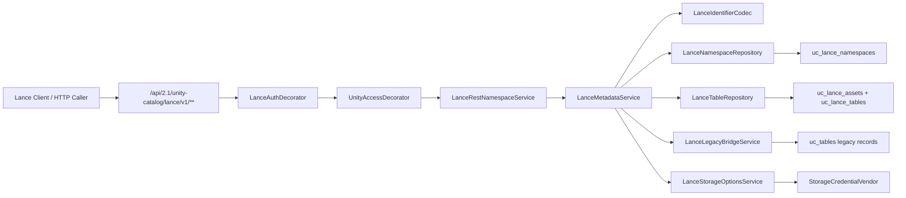

# Unity Catalog Lance REST API 第一阶段设计

副标题：Metadata Compatibility 详细设计

更新日期：2026-04-23

关联文档：

- `docs/unitycatalog-lancedb-rest-api-requirements.md`
- `docs/unitycatalog-lancedb-rest-api-technical-design.md`
- `docs/unitycatalog-lancedb-implementation-breakdown.md`
- `docs/unitycatalog-lancedb-rest-api-test-strategy.md`

## 1. 文档目标

本文件用于细化“第一阶段”的实现设计，目标是把技术设计文档中的 `Phase 1：Metadata Compatibility` 展开成可直接进入开发的设计说明。

阶段映射说明：

- 本文中的“第一阶段”对应技术设计文档中的 `Phase 1`
- 技术设计文档中的 `Phase 0` 视为本阶段的前置准备阶段

## 1.1 上游协议基线

第一阶段设计需要固定一份明确的上游基线，避免“只看某个语言客户端便利方法”导致协议偏差。

本次本地核对基线：

- Lance REST OpenAPI 快照：`/home/lei/data_ai/learning/codebase/lancedb-docs/docs/api-reference/rest/openapi.yml`
  - commit：`6c0ccc001e6b`
- Lance 客户端源码快照：`/home/lei/data_ai/learning/codebase/lancedb`
  - commit：`a92ae0ded522`

契约优先级：

1. 先以 REST OpenAPI 快照作为 endpoint 和 HTTP 方法的正式定义
2. 再以 Rust / Python / Java 客户端实现校对真实客户端行为
3. 如果某语言客户端没有暴露某个便利方法，不代表对应 REST endpoint 不存在

本次核对结论：

- `namespace exists` 在正式 REST OpenAPI 中存在，对应 `POST /v1/namespace/{id}/exists`
- `namespace/list` 与 `namespace/{id}/table/list` 在正式 REST OpenAPI 中是 `GET`
- 当前本地 Python namespace 包装层没有单独暴露 `namespace_exists` 高层方法，因此该能力在 Phase 1 需要通过协议测试和原始 HTTP 测试覆盖，而不是只依赖 Python 包装层 smoke

## 2. 范围与边界

## 2.1 本阶段目标

本阶段只解决 Lance namespace 和 table metadata compatibility，不引入完整数据面执行后端。

必须完成：

- namespace CRUD
- namespace 下 table list
- table register / declare / create-empty / describe / exists / drop / deregister
- `storage_options` 与 `vend_credentials`
- legacy Unity bridge 识别与桥接读取
- Lance 专用认证、上下文透传与授权接入

## 2.2 本阶段不做

本阶段不包含以下能力：

- `/v1/table` 与 `/v1/table/{id}/create` 这类需要实际建表与初始数据写入的数据面操作
- query / stats / count_rows
- insert / merge_insert / update / delete
- restore / rename / schema evolution
- index / version / tag / transaction / batch commit
- UC 主 UI 的 Lance 管理页面
- UC 自带 Lance Java/Python SDK 生成

## 2.3 本阶段前置依赖

本阶段开始前，准备阶段需要至少交付以下内容：

- `api/lance-rest-upstream.yaml` 与 `lance-models` 生成链
- Lance 路由挂载入口
- `LanceAuthDecorator` 与基础 context 解析骨架
- `uc_lance_namespaces` / `uc_lance_assets` / `uc_lance_tables` 基础表结构
- `LanceResourceKeyMapper` 与新增 `SecurableType` / `Privilege`

## 3. 目标架构

第一阶段的主链路如下：

设计原则：

- HTTP 协议层仍然沿用 UC 当前“手写 route + 手写 service”的模式
- OpenAPI 只负责生成 DTO / enum / one-of 模型
- metadata-only 能力只依赖 metadata repository，不依赖 `LanceExecutionBackend`
- Lance 路由必须复用 UC 现有鉴权、授权、审计框架，不能旁路

## 4. 路由与 endpoint 设计

## 4.1 路由挂载方式

建议在 `server/src/main/java/io/unitycatalog/server/UnityCatalogServer.java` 中新增：

- `addLanceApiServices(ServerBuilder, ...)`

挂载前缀：

- `/api/2.1/unity-catalog/lance`

因此第一阶段实际对外 endpoint 形如：

- `/api/2.1/unity-catalog/lance/v1/namespace/{id}/create`
- `/api/2.1/unity-catalog/lance/v1/table/{id}/describe`

## 4.2 本阶段 endpoint 清单

| 能力域 | Method | Endpoint | 本阶段状态 | 说明 |
|---|---|---|---|---|
| Namespace | `POST` | `/v1/namespace/{id}/create` | 必做 | 新建 namespace |
| Namespace | `GET` | `/v1/namespace/{id}/list` | 必做 | 列举子 namespace |
| Namespace | `POST` | `/v1/namespace/{id}/describe` | 必做 | 读取 namespace properties |
| Namespace | `POST` | `/v1/namespace/{id}/drop` | 必做 | 默认实现 `Restrict` |
| Namespace | `POST` | `/v1/namespace/{id}/exists` | 必做 | 判断 namespace 是否存在 |
| Namespace | `GET` | `/v1/namespace/{id}/table/list` | 必做 | 列出 namespace 下 table |
| Table | `POST` | `/v1/table/{id}/register` | 必做 | 注册已有 Lance table |
| Table | `POST` | `/v1/table/{id}/declare` | 必做 | 声明表但不要求立即建物理数据 |
| Table | `POST` | `/v1/table/{id}/create-empty` | 必做 | deprecated alias，内部复用 `declare` |
| Table | `POST` | `/v1/table/{id}/describe` | 必做 | 读取 metadata 与可选 `storage_options` |
| Table | `POST` | `/v1/table/{id}/exists` | 必做 | 判断表是否存在 |
| Table | `POST` | `/v1/table/{id}/drop` | 有条件支持 | 首阶段只保证 declared-only 表的立即 drop |
| Table | `POST` | `/v1/table/{id}/deregister` | 必做 | 注销元数据，不删除物理数据 |

## 4.3 本阶段 endpoint 映射

| Endpoint | Service 方法 | Repository 依赖 | 特殊处理 |
|---|---|---|---|
| `namespace/create` | `createNamespace` | `LanceNamespaceRepository` | 路径校验、父 namespace 授权 |
| `namespace/list` | `listNamespaces` | `LanceNamespaceRepository` | 支持 root 和任意深度子节点 |
| `namespace/describe` | `describeNamespace` | `LanceNamespaceRepository` | namespace properties 走 `uc_properties` |
| `namespace/drop` | `dropNamespace` | `LanceNamespaceRepository`, `LanceTableRepository` | Phase 1 默认只完整支持 `Restrict` |
| `namespace/exists` | `namespaceExists` | `LanceNamespaceRepository` | 只返回 existence |
| `namespace/table/list` | `listTables` | `LanceTableRepository`, `LanceLegacyBridgeService` | 支持 `include_declared` |
| `table/register` | `registerTable` | `LanceTableRepository` | 写入 location / properties / state |
| `table/declare` | `declareTable` | `LanceTableRepository`, `LanceStorageOptionsService` | 标记 `is_only_declared=true` |
| `table/create-empty` | `createEmptyTable` | 同 `declareTable` | 兼容别名，记录 deprecation usage |
| `table/describe` | `describeTable` | `LanceTableRepository`, `LanceLegacyBridgeService`, `LanceStorageOptionsService` | 根据 `vend_credentials` 决定是否下发凭证 |
| `table/exists` | `tableExists` | `LanceTableRepository`, `LanceLegacyBridgeService` | 原生 Lance + legacy 双路径识别 |
| `table/drop` | `dropTable` | `LanceTableRepository` | 首阶段仅 declared-only 立即 drop；其余场景返回受限错误 |
| `table/deregister` | `deregisterTable` | `LanceTableRepository` | metadata-only |

## 5. 模块设计

## 5.1 契约与模型生成

新增与修改：

- `[新增]` `api/lance-rest-upstream.yaml`
- `[修改]` `build.sbt`

设计要求：

- `lance-rest-upstream.yaml` 固定使用上游 Lance REST OpenAPI 快照
- `build.sbt` 增加 `server/target/lance-models` 的生成链
- 第一阶段只生成：
  - request DTO
  - response DTO
  - 协议枚举
  - one-of DTO
- 第一阶段不生成：
  - controller
  - server stub
  - UC 自带 Lance SDK

## 5.2 服务层

建议新增包：

- `server/src/main/java/io/unitycatalog/server/service/lance`

建议类：

- `LanceRestNamespaceService`
  - Annotated service
  - 接收 `lance-models` 生成的请求对象
  - 返回 `lance-models` 生成的响应对象
- `LanceMetadataService`
  - 编排 namespace/table metadata 业务语义
  - 屏蔽 repository、legacy bridge、storage options 细节
- `LanceIdentifierCodec`
  - 负责 `List<String>`、字符串 identifier 与内部 canonical key 互转
- `LanceStorageOptionsService`
  - 负责 `vend_credentials=true` 时的 `storage_options`
- `LanceLegacyBridgeService`
  - 负责 legacy Unity table 识别、桥接读取与可迁移性说明

## 5.3 认证与授权

新增与修改：

- `[新增]` `server/src/main/java/io/unitycatalog/server/service/LanceAuthDecorator.java`
- `[修改]` `server/src/main/java/io/unitycatalog/server/UnityCatalogServer.java`
- `[新增]` `server/src/main/java/io/unitycatalog/server/auth/decorator/LanceResourceKeyMapper.java`
- `[新增]` `server/src/main/java/io/unitycatalog/server/persist/LanceApiKeyRepository.java`

设计要求：

- Lance 路由不得直接复用当前 `AuthDecorator` 的“仅内部 issuer Bearer”假设
- `LanceAuthDecorator` 要支持：
  - UC 内部 Bearer token
  - 外部 Bearer token 的 token exchange
  - `x-api-key`
  - Lance context headers
- `UnityAccessDecorator` 仍然作用于 Lance 路由
- `LanceResourceKeyMapper` 将 Lance namespace/table 标识解析为 UC 授权资源键

具体约束：

- 外部 Bearer token 的 issuer 白名单和 audience 校验直接复用 UC 现有配置：
  - `server.allowed-issuers`
  - `server.audiences`
- `LanceAuthDecorator` 不应通过内部 HTTP 再调 `/api/1.0/unity-control/auth/tokens`
- 推荐做法是把 `AuthService.grantToken()` 中的 token exchange 核心逻辑抽到内部 helper / service，再由 `LanceAuthDecorator` 直接调用
- `x-api-key` 推荐使用单独的 `LanceApiKeyRepository` 和 `uc_lance_api_keys` 表，而不是复用 cloud credential 元数据
- API key 只存哈希，不存明文

第一阶段最小权限集：

- `CREATE_NAMESPACE`
- `USE_NAMESPACE`
- `READ_METADATA`
- `MODIFY`

说明：

- `READ_METADATA` 用于 `list` / `describe` / `exists`
- `MODIFY` 用于 `register` / `declare` / `create-empty` / `drop` / `deregister`
- version/tag/transaction 等高级权限留到后续阶段补齐

`LanceResourceKeyMapper` 与现有 `KeyMapper` 的关系：

- `KeyMapper` 继续作为统一入口，不建议被 Lance 逻辑整体替换
- `LanceResourceKeyMapper` 作为 `KeyMapper` 的委托组件，只处理 `LANCE_*` 类型
- 对已有 namespace / table 资源的鉴权，只解析当前目标 UUID
- 对创建子 namespace / 子 table 的鉴权，解析父 namespace UUID
- 多层父 namespace 继承关系不在 `Map<SecurableType, Object>` 中展开，而是通过 UC 授权图中的父子关系表达

## 5.4 持久化模型

第一阶段只启用 3 张 Lance 主表：

- `uc_lance_namespaces`
- `uc_lance_assets`
- `uc_lance_tables`

### 5.4.1 `uc_lance_namespaces`

建议字段：

- `id`
- `root_scope_id`
- `parent_namespace_id`
- `name`
- `depth`
- `path_key`
- `display_name`
- `owner`
- `created_at`
- `created_by`
- `updated_at`
- `updated_by`

关键约束：

- 唯一键：`(root_scope_id, parent_namespace_id, name)`
- 唯一键：`(root_scope_id, path_key)`

设计补充：

- `path_key` 使用“按 segment 百分号编码后用 `/` 拼接”的内部 canonical 形式
- `path_key` 与外部 delimiter 无关，避免 `$` 或自定义 delimiter 影响持久化主键
- `root_scope_id` 在当前 v1 语义下直接取 UC `metastore_id`，表示 Lance namespace 树在当前 UC 部署中的根锚点

示例：

- namespace path：`["ml", "team", "embeddings"]`
- canonical `path_key`：`ml/team/embeddings`
- 默认对外 delimiter 为 `$` 时：`ml$team$embeddings`
- 自定义 delimiter 为 `.` 时：`ml.team.embeddings`

说明：

- delimiter 是协议层表示，不进入持久化主键
- 同一个 namespace path 可以用不同 delimiter 表达，因此数据库层只保留 canonical `path_key`

### 5.4.2 `uc_lance_assets`

建议字段：

- `id`
- `namespace_id`
- `asset_type`
- `name`
- `canonical_identifier`
- `state`
- `owner`
- `created_at`
- `created_by`
- `updated_at`
- `updated_by`

第一阶段只使用：

- `asset_type = TABLE`

建议状态枚举：

- `ACTIVE`
- `DECLARED`
- `DEREGISTERED`
- `DROPPED`

不纳入 `asset_type` 的对象：

- `NAMESPACE`
  - namespace 使用独立层级表建模
- `SCHEMA`
  - schema 属于 table metadata / schema evolution 范畴
- `MANIFEST`
  - manifest 作为 version 的物理明细字段存在，不作为独立治理资产

### 5.4.3 `uc_lance_tables`

建议字段：

- `asset_id`
- `storage_location`
- `table_uri`
- `arrow_schema_json`
- `storage_options_template_json`
- `is_only_declared`
- `legacy_uc_table_id`
- `current_version`
- `managed_versioning`
- `stats_json`

说明：

- `is_only_declared` 是第一阶段必须补充的字段，用于支撑 `declare` / `create-empty` / `include_declared`
- `legacy_uc_table_id` 用于桥接现有 Unity legacy Lance table
- `arrow_schema_json` 第一阶段允许为空，特别是 declared-only 或 legacy bridge 场景
- `storage_options_template_json` 只保存非敏感、可长期存在的配置模板，例如 endpoint、region、provider 参数
- `vend_credentials=true` 返回的临时凭证只能在请求时动态生成，不能写回数据库

## 5.4.4 高级资产表的 DDL 时序

第一阶段不创建以下物理表：

- `uc_lance_indices`
- `uc_lance_versions`
- `uc_lance_tags`
- `uc_lance_transactions`

原因：

- 第一阶段只做 metadata compatibility
- `batch-create versions` 与 `batch-commit` 在第一阶段不实现
- 过早创建但不消费这些表，会让迁移和回归边界变得更模糊

因此这些表的 DDL 统一延后到 Phase 3。

## 5.5 Repository 设计

建议新增：

- `server/src/main/java/io/unitycatalog/server/persist/LanceNamespaceRepository.java`
- `server/src/main/java/io/unitycatalog/server/persist/LanceTableRepository.java`
- `server/src/main/java/io/unitycatalog/server/persist/dao/LanceNamespaceDAO.java`
- `server/src/main/java/io/unitycatalog/server/persist/dao/LanceAssetDAO.java`
- `server/src/main/java/io/unitycatalog/server/persist/dao/LanceTableDAO.java`

核心方法建议：

- `LanceNamespaceRepository`
  - `createNamespace(rootScopeId, path, properties, createMode)`
  - `getNamespace(rootScopeId, path)`
  - `listChildNamespaces(rootScopeId, path, limit, pageToken)`
  - `exists(rootScopeId, path)`
  - `dropNamespace(rootScopeId, path, behavior, mode)`
- `LanceTableRepository`
  - `listTables(rootScopeId, namespacePath, includeDeclared, limit, pageToken)`
  - `registerTable(rootScopeId, tableRef, location, properties, mode)`
  - `declareTable(rootScopeId, tableRef, location, properties)`
  - `getTable(rootScopeId, tableRef)`
  - `exists(rootScopeId, tableRef)`
  - `dropDeclaredTable(rootScopeId, tableRef)`
  - `deregisterTable(rootScopeId, tableRef)`

设计要求：

- Repository 返回内部 record / aggregate，不直接暴露上游 Lance DTO
- Service 负责内部对象到 Lance DTO 的映射
- `Repositories.java` 需要纳入 Lance repository 的统一装配

## 6. 关键设计细节

## 6.1 Identifier 编码

内部统一形态：

- namespace：`List<String> namespacePath`
- table：`namespacePath + tableName`

`LanceIdentifierCodec` 负责：

- 校验请求中的 `id`
- 将 `id` 解析成 namespace path 或 table ref
- 生成 `ListTablesResponse.tables` 所需的全路径字符串
- 处理默认 delimiter `$` 与自定义 delimiter

内部约束：

- path segment 不在持久化层直接拼接成外部 delimiter 字符串
- 持久化层只保存 canonical `path_key`

## 6.2 `DeclareTable` 与 `CreateEmptyTable`

设计结论：

- `DeclareTable` 是主路径
- `CreateEmptyTable` 是 deprecated alias

实施要求：

- `create-empty` 入口直接复用 `declare` 业务实现
- `DeclareTableRequest` 与 `CreateEmptyTableRequest` 在 Phase 1 都只接收：
  - `id`
  - `location`
  - `vend_credentials`
  - `properties`
- 审计日志中记录：
  - `protocol_operation=declare_table`
  - `protocol_variant=create-empty` 或 `protocol_variant=declare`
  - `deprecated_alias_used=true/false`
- 新增测试、示例与文档全部优先使用 `DeclareTable`

## 6.3 `DescribeTable` 与 `storage_options`

`DescribeTable` 需要分三类处理：

- 原生 Lance table
  - 从 `uc_lance_assets` + `uc_lance_tables` 读取 metadata
- declared-only table
  - 允许返回 location、properties、`is_only_declared=true`
  - `load_detailed_metadata=true` 时若缺少物理数据，返回受控错误
- legacy bridge table
  - 从 UC 原生 `TableInfo` 桥接
  - 只保证 location、properties、可选 `storage_options`

`vend_credentials=true` 时：

- 调用 `StorageCredentialVendor`
- 由 `LanceStorageOptionsService` 转成 Lance 兼容 `storage_options`
- 不在数据库中持久化短期凭证

## 6.4 `ListTables(include_declared=true)`

规则：

- `include_declared=false` 或缺省时，只返回：
  - 已注册表
  - legacy bridge 表
- `include_declared=true` 时，额外返回：
  - `is_only_declared=true` 的 declared-only 表

返回值要求：

- 返回全路径字符串
- 内部 canonical key 必须在 service 层转换回协议需要的 path string

## 6.5 `DropNamespace` 与 `DropTable`

这是第一阶段最需要提前说清楚的边界。

`DropNamespace`：

- 第一阶段完整支持 `Restrict`
- 第一阶段不建议承诺完整 `Cascade`
- 若请求 `Cascade` 且子树包含已注册或 legacy bridge 表，返回“阶段受限”错误

`DropTable`：

- declared-only 表可以立即 metadata drop
- 已注册表和 legacy bridge 表的物理数据删除不在第一阶段承诺范围
- 第一阶段推荐：
  - 对 declared-only 表支持立即 drop
  - 对其余表优先使用 `deregister`
  - `drop` 若涉及物理删除，返回受限错误，等第二/三阶段接入执行后端或事务后再扩展

这样做的原因是：

- 第一阶段不引入 `LanceExecutionBackend`
- 第一阶段也不引入 transaction 跟踪面
- 先保证 metadata compatibility 正确，比“伪造成功的物理删除语义”更稳妥

## 6.6 Legacy bridge

识别条件：

- `table_type = EXTERNAL`
- `data_source_format = TEXT`
- `properties.table_type = lance`

桥接行为：

- `listTables` 可见
- `describeTable` 可读
- `exists` 可识别
- 标记 `legacy_bridge=true`

桥接限制：

- 不把 legacy bridge 视为新主模型
- 只保证 metadata 读取兼容
- 迁移到 `uc_lance_*` 主模型应作为单独工具或后台任务

## 6.7 错误模型

建议新增：

- `server/src/main/java/io/unitycatalog/server/exception/LanceRestExceptionHandler.java`

职责：

- 将 `BaseException` / `AuthorizationException` / repository 异常映射成 Lance 兼容错误响应
- 区分：
  - not found
  - already exists
  - permission denied
  - invalid request
  - not supported in current phase

设计要求：

- 对外错误语义优先对齐 Lance 协议
- 对内仍复用 UC 现有异常体系和错误码

## 7. 建议修改与新增文件

第一阶段建议直接落到以下文件层级：

- `[修改]` `build.sbt`
- `[新增]` `api/lance-rest-upstream.yaml`
- `[修改]` `server/src/main/java/io/unitycatalog/server/UnityCatalogServer.java`
- `[新增]` `server/src/main/java/io/unitycatalog/server/service/LanceAuthDecorator.java`
- `[新增]` `server/src/main/java/io/unitycatalog/server/service/lance/LanceRestNamespaceService.java`
- `[新增]` `server/src/main/java/io/unitycatalog/server/service/lance/LanceMetadataService.java`
- `[新增]` `server/src/main/java/io/unitycatalog/server/service/lance/LanceIdentifierCodec.java`
- `[新增]` `server/src/main/java/io/unitycatalog/server/service/lance/LanceStorageOptionsService.java`
- `[新增]` `server/src/main/java/io/unitycatalog/server/service/lance/LanceLegacyBridgeService.java`
- `[新增]` `server/src/main/java/io/unitycatalog/server/auth/decorator/LanceResourceKeyMapper.java`
- `[修改]` `server/src/main/java/io/unitycatalog/server/persist/Repositories.java`
- `[新增]` `server/src/main/java/io/unitycatalog/server/persist/LanceNamespaceRepository.java`
- `[新增]` `server/src/main/java/io/unitycatalog/server/persist/LanceTableRepository.java`
- `[新增]` `server/src/main/java/io/unitycatalog/server/persist/dao/LanceNamespaceDAO.java`
- `[新增]` `server/src/main/java/io/unitycatalog/server/persist/dao/LanceAssetDAO.java`
- `[新增]` `server/src/main/java/io/unitycatalog/server/persist/dao/LanceTableDAO.java`
- `[新增]` `server/src/main/java/io/unitycatalog/server/exception/LanceRestExceptionHandler.java`
- `[新增]` `server/src/test/java/.../lance/**`

## 8. 验收与测试设计

第一阶段验收重点：

- metadata-only 协议兼容正确
- UC 治理能力没有被绕过
- legacy bridge 可读但不篡改主模型方向

测试分层：

- 单元测试
  - `LanceIdentifierCodec`
  - `LanceMetadataService`
  - `LanceStorageOptionsService`
  - `LanceLegacyBridgeService`
- 组件测试
  - `LanceAuthDecorator + UnityAccessDecorator + LanceRestNamespaceService`
  - `LanceNamespaceRepository / LanceTableRepository` with H2
- 协议集成测试
  - `namespace/create/list/describe/exists/drop`
  - `table/register/declare/create-empty/describe/exists/deregister`
  - `include_declared=true/false`
  - `vend_credentials=true/false`
- 回归测试
  - UC `/tables`
  - Iceberg REST
  - Delta REST

契约回归要求：

- 对 `lancedb-docs` 中的 REST OpenAPI 快照做 diff 检查
- 对关键 endpoint 额外做实际行为校验，而不是只看 OpenAPI：
  - `GET /v1/namespace/{id}/list`
  - `GET /v1/namespace/{id}/table/list`
  - `POST /v1/namespace/{id}/exists`
  - `POST /v1/table/{id}/declare`
  - `POST /v1/table/{id}/create-empty`
- 原生客户端 smoke 需要明确绑定上游快照版本
  - `lancedb`：`a92ae0ded522`
  - `lancedb-docs`：`6c0ccc001e6b`
- 对 Python namespace 包装层中没有直接暴露的便利方法，例如 `namespace_exists`，由原始 HTTP 协议测试补齐覆盖

第一阶段推荐门禁：

1. Python / Java / Rust metadata smoke 通过
2. `DeclareTable` 路径通过，`CreateEmptyTable` alias 通过
3. `DescribeTable(vend_credentials=true)` 返回合法 `storage_options`
4. legacy bridge `list/describe/exists` 通过
5. UC 原有 API 回归通过

## 9. 第一阶段交付件

第一阶段完成时，建议至少交付：

- 可编译的 Lance 路由与 metadata 服务骨架
- 可运行的 namespace/table metadata endpoint
- H2 下可回归的 repository/component test
- 一份针对第一阶段的 curl 或 client smoke 脚本
- 更新后的实施文档、技术设计补充说明和测试用例清单

## 10. 进入下一阶段的条件

只有在以下条件满足后，才建议进入第二阶段数据面开发：

- metadata model、path key、legacy bridge 语义已稳定
- `drop` / `deregister` / `declare` / `register` 的边界已在测试中固化
- `LanceAuthDecorator`、`LanceResourceKeyMapper`、`storage_options` 已经稳定
- 原生 client metadata 路径不再频繁变更

在这些条件满足前，不建议提前把 `LanceExecutionBackend`、Arrow IPC 和 DML 混入本阶段实现。
