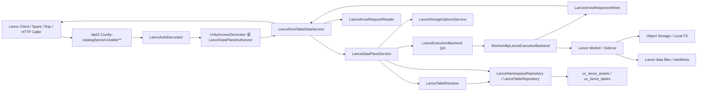

# Unity Catalog Lance REST API 第二阶段设计

副标题：Data Plane Compatibility 详细设计

更新日期：2026-04-27

关联文档：

- `docs/lance/unitycatalog-lancedb-rest-api-requirements.md`
- `docs/lance/unitycatalog-lancedb-rest-api-technical-design.md`
- `docs/lance/unitycatalog-lancedb-implementation-breakdown.md`
- `docs/lance/unitycatalog-lancedb-phase-1-metadata-design.md`
- `docs/lance/unitycatalog-lancedb-phase-1-metadata-test-design.md`
- `docs/lance/unitycatalog-lancedb-rest-api-test-design.md`
- `docs/lance/unitycatalog-test-mechanism-analysis.md`

## 1. 文档目标

本文用于把 “第二阶段：Data Plane Compatibility” 展开成可直接进入开发的详细设计说明。

第二阶段的核心目标不是重新设计 Lance 元数据模型，而是在第一阶段已经完成的 namespace/table metadata compatibility 之上，引入最小可用的数据面能力，使 Unity Catalog 的 Lance REST 协议面可以承接真实的 query、stats、count rows 和基础 DML 请求。

本文需要明确：

- 本阶段做什么、不做什么，以及和第一阶段、第三阶段的边界
- public REST endpoint 如何挂载、如何解析 JSON 和 Arrow IPC 请求
- UC 主进程、Lance execution backend、worker/sidecar 之间如何分工
- table metadata、storage options、authorization、audit、error mapping 如何贯穿数据面请求
- 每个模块、类、接口、状态迁移和测试用例如何落位

## 1.1 阶段映射

本文中的“第二阶段”对应技术设计文档中的 `Phase 2：Data Plane Compatibility`。

阶段目标：

- 引入 `LanceExecutionBackend` SPI
- 引入 `WorkerHttpLanceExecutionBackend` 首选实现
- 增加 Arrow IPC request/response 适配能力
- 实现 query / count rows / stats / insert / merge insert / update / delete / explain / analyze
- 让 Spark、Ray、Python Lance client 至少能完成 P1 级别的数据面 smoke

阶段非目标：

- 不落地 index / version / tag / transaction / batch commit 的完整元数据表和状态机
- 不把 Lance 数据面执行逻辑直接塞进 UC Java 主进程
- 不在本阶段承诺完整事务原子性，物理数据和 UC metadata 的跨系统强一致性留到第三阶段继续强化

## 1.2 当前仓库基线

截至本文生成时，UC 仓库中已经存在以下 Lance Phase 1 代码基础：

- `server/src/main/java/io/unitycatalog/server/UnityCatalogServer.java`
  - 已定义 `LANCE_PATH = /api/2.1/unity-catalog/lance/`
  - 已挂载 `LanceRestNamespaceService`
  - 已挂载 `LanceRestTableService`
  - 已挂载 `LanceAuthDecorator`
- `server/src/main/java/io/unitycatalog/server/service/lance/LanceRestNamespaceService.java`
- `server/src/main/java/io/unitycatalog/server/service/lance/LanceRestTableService.java`
- `server/src/main/java/io/unitycatalog/server/service/lance/LanceMetadataService.java`
- `server/src/main/java/io/unitycatalog/server/service/lance/LanceIdentifierCodec.java`
- `server/src/main/java/io/unitycatalog/server/service/lance/LanceRequestContext.java`
- `server/src/main/java/io/unitycatalog/server/service/lance/LanceExceptionHandler.java`
- `server/src/main/java/io/unitycatalog/server/persist/LanceNamespaceRepository.java`
- `server/src/main/java/io/unitycatalog/server/persist/LanceTableRepository.java`
- `server/src/main/java/io/unitycatalog/server/persist/LanceApiKeyRepository.java`
- `server/src/main/java/io/unitycatalog/server/persist/dao/LanceNamespaceDAO.java`
- `server/src/main/java/io/unitycatalog/server/persist/dao/LanceAssetDAO.java`
- `server/src/main/java/io/unitycatalog/server/persist/dao/LanceTableDAO.java`
- `server/src/main/java/io/unitycatalog/server/persist/dao/LanceApiKeyDAO.java`
- `server/src/test/java/io/unitycatalog/server/service/lance/*Phase1*Test.java`
- `server/src/test/java/io/unitycatalog/server/persist/Lance*RepositoryTest.java`

当前仓库里尚未看到 `api/lance-rest-upstream.yaml`。因此第二阶段开发需要先确认是否要把上游 Lance REST OpenAPI 快照复制到 UC 仓库中，并接入 `build.sbt` 的模型生成链；如果暂时不接入生成链，则本阶段需要继续沿用 Phase 1 的“手写 annotated service + 手写 request record”模式。

本文的实现建议兼容这两种路径，但推荐尽早固定 OpenAPI 快照，避免数据面 DTO 长期漂移。

## 1.3 上游协议基线

本阶段继续沿用第一阶段文档中固定的上游基线：

- Lance REST OpenAPI 快照：`/home/lei/data_ai/learning/codebase/lancedb-docs/docs/api-reference/rest/openapi.yml`
- Lance 客户端源码快照：`/home/lei/data_ai/learning/codebase/lancedb`

第二阶段必须显式覆盖上游 OpenAPI 中以下 endpoint：

| Method | Endpoint | OperationId | 请求体 | 响应体 | 本阶段状态 |
|---|---|---|---|---|---|
| `POST` | `/v1/table/{id}/query` | `QueryTable` | JSON | Arrow IPC file，必要时支持 stream | 必做 |
| `POST` | `/v1/table/{id}/count_rows` | `CountTableRows` | JSON | integer JSON body | 必做 |
| `POST` | `/v1/table/{id}/stats` | `GetTableStats` | JSON | JSON | 必做 |
| `POST` | `/v1/table/{id}/insert` | `InsertIntoTable` | Arrow IPC stream | JSON | 必做 |
| `POST` | `/v1/table/{id}/merge_insert` | `MergeInsertIntoTable` | Arrow IPC stream | JSON | 必做 |
| `POST` | `/v1/table/{id}/update` | `UpdateTable` | JSON | JSON | 必做 |
| `POST` | `/v1/table/{id}/delete` | `DeleteFromTable` | JSON | JSON | 必做 |
| `POST` | `/v1/table/{id}/explain_plan` | `ExplainTableQueryPlan` | JSON | JSON string | 必做 |
| `POST` | `/v1/table/{id}/analyze_plan` | `AnalyzeTableQueryPlan` | JSON | JSON string | 必做 |
| `POST` | `/v1/table/{id}/create` | `CreateTable` | Arrow IPC stream | JSON | 建议纳入，至少实现 declared table 首次物理化 |

说明：

- `create` 在实施拆解中没有被列为 W2 必做项，但 Phase 1 文档已明确 `/v1/table/{id}/create` 属于数据面能力，且 Spark/Ray 等 connector 的建表路径通常会触发真实物理建表。为避免第二阶段只能 `declare` 不能真正建表，本文建议把 `/create` 作为 W2 的条件必做项。
- 如果开发排期必须压缩，最低要求也应支持“已有 `is_only_declared=true` 表通过 `insert` 首次物理化”的路径，并让 `/create` 返回明确的 `UNIMPLEMENTED`，不能静默成功。

## 2. 范围与边界

## 2.1 本阶段目标

第二阶段必须把以下请求链路打通：

1. 原生 Lance client 或 HTTP caller 调用 UC Lance REST data endpoint。
2. `LanceAuthDecorator` 识别 Bearer token、`x-api-key` 和 Lance context headers。
3. 授权层基于 Lance table 资源做读写权限判断。
4. data service 解析 table identifier、query params、JSON body 或 Arrow IPC body。
5. data service 从 Phase 1 metadata repository 解析 table、storage location、schema、state 和 storage options。
6. `LanceDataPlaneService` 构造 backend command。
7. `LanceExecutionBackend` 把命令交给真实 worker/sidecar 执行。
8. UC 将 backend 结果转换回 Lance REST 协议响应。
9. 对写操作，根据 backend 返回的 version、stats、schema 更新 UC Lance metadata。
10. 所有失败路径返回稳定的 Lance REST 错误语义，并留下可观测日志。

## 2.2 必做能力

本阶段必做能力分为四类。

读能力：

- `query`
- `count_rows`
- `stats`
- `explain_plan`
- `analyze_plan`

写能力：

- `insert`
- `merge_insert`
- `update`
- `delete`
- declared-only table 的首次物理化

协议能力：

- Arrow IPC stream request
- Arrow IPC file response
- JSON request/response
- `delimiter`
- request context 透传
- principal/request id/deadline 透传

治理能力：

- 认证不被绕过
- 授权不被绕过
- storage options 动态下发给 backend
- runtime credentials 不持久化
- 写后 metadata 状态推进
- 错误、审计、指标可观测

## 2.3 本阶段不做

以下能力不在第二阶段交付范围内：

- index 创建、查询、删除、异步构建状态管理
- version list/create/describe/delete
- tag list/create/update/delete
- transaction describe/alter/commit 状态机
- `/v1/table/batch-commit`
- schema evolution endpoint 的完整协议支持：
  - `/schema_metadata/update`
  - `/add_columns`
  - `/alter_columns`
  - `/drop_columns`
- restore table（对应 `POST /v1/table/{id}/restore`）
- rename table（对应 `POST /v1/table/{id}/rename`）
- 物理数据删除和 UC metadata 删除的跨系统强事务
- 面向生产的多云对象存储全矩阵验证
- UC 主 UI 的 Lance 数据面管理页面
- legacy bridge 表的迁移工具（迁移工具属于独立的 admin task 或 Phase 1 后续增强，不在数据面阶段）

说明：

- `stats_json`、`current_version`、`arrow_schema_json` 可以在第二阶段被更新，但这不是 version/tag/transaction 元数据表的替代品。
- 若 worker 在执行 DML 时返回 schema 变化，本阶段只允许更新 `uc_lance_tables.arrow_schema_json`，不引入完整 schema evolution endpoint。

## 2.4 Legacy bridge 边界

Phase 1 支持读取 legacy Unity table：

- `EXTERNAL`
- `TEXT`
- `properties.table_type=lance`

第二阶段默认不对 legacy bridge table 提供写入能力。

建议策略：

- `describe` / `list` 继续支持 legacy bridge。
- `query` legacy bridge table 默认返回 `UNIMPLEMENTED`，除非显式开启 `lance.execution.legacy-read-enabled=true`。
- `insert` / `merge_insert` / `update` / `delete` legacy bridge table 一律拒绝。
- 拒绝原因必须清晰：legacy bridge table 只保证 metadata compatibility，若需要数据面能力，应迁移为原生 `uc_lance_assets + uc_lance_tables` 记录。

这样可以避免数据面写入绕过 UC Lance metadata 状态，导致 `uc_tables`、`uc_lance_tables` 和物理 Lance table 三者不可追踪。

**迁移工具归属说明：**

legacy bridge 表的迁移工具不在第二阶段数据面范围内。迁移工具属于独立的 admin task 或单独的管理 API，原因：

1. 迁移本质是 metadata-only 操作，不涉及数据面执行后端
2. 迁移后表的状态变更（从 legacy 标记到原生 `uc_lance_*` 记录）应由单独的管理接口或后台任务完成
3. 数据面阶段的核心目标是打通 query/DML 链路，而非提供迁移能力
4. Phase 1 已完成 metadata compatibility，迁移工具应作为独立运维工具开发

迁移工具可能的实现方式：

- 独立的 admin CLI 命令（如 `uc-lance-migrate-legacy-table`）
- 独立的 REST admin API（如 `POST /api/2.1/unity-catalog/admin/lance/migrate-table`）
- 后台自动化迁移任务（扫描并批量迁移 legacy 表）

本阶段不阻塞该能力但也不纳入交付范围。若需要迁移工具，应在 Phase 2 之后作为独立运维增强项开发。

## 2.5 准入条件

开始第二阶段开发前，必须确认以下条件：

**Phase 1 完成检查点（参考 Phase 1 文档 Section 10）：**

- metadata model、path key、legacy bridge 语义已稳定
- `drop` / `deregister` / `declare` / `register` 的边界已在测试中固化
- `LanceAuthDecorator`、`LanceResourceKeyMapper`、`storage_options` 已经稳定
- 原生 client metadata 路径不再频繁变更
- Phase 1 namespace/table metadata endpoint 测试全部通过
- Phase 1 准出标准（见 `unitycatalog-lancedb-phase-1-metadata-design.md` Section 10.2）已满足

**Phase 2 特定准入条件：**

- `LanceIdentifierCodec` 对 `$` 和自定义 `delimiter` 的行为稳定
- `uc_lance_namespaces`、`uc_lance_assets`、`uc_lance_tables`、`uc_lance_api_keys` 可以在 H2 中正常建表和 CRUD
- `LanceAuthDecorator` 能把 principal 和 context headers 写入 `LanceRequestContext`
- Lance 路由不会被 generic `AuthDecorator` 错误拦截，或者已经明确装饰器执行顺序和排除规则
- 已确定 Phase 2 使用的 worker/sidecar 形态、启动方式和本地测试路径

若上述最后两项尚未满足，必须先做 W2-0 准备任务。

## 3. 目标架构

第二阶段的目标架构如下：



设计原则：

- UC 主进程只做 governance、metadata、协议适配、credential vending 和 backend dispatch。
- UC 主进程不直接实现 Lance scan、vector search、merge、update、delete 等执行逻辑。
- Arrow IPC body 在 UC 中尽量 streaming pass-through，不默认全量读入内存。
- 写操作先完成物理执行，再推进 UC metadata 状态；跨系统强原子性留到第三阶段。
- 所有数据面 endpoint 必须复用 Lance 路由前缀和认证上下文，不能新增旁路 HTTP 入口。
- 对外返回必须对齐上游 Lance REST OpenAPI，而不是返回 UC 自有 table API 形状。

## 4. 请求主链路

## 4.1 Query 链路

`POST /v1/table/{id}/query` 主流程：

1. `LanceRestTableDataService.queryTable(...)` 接收 `id`、`delimiter` 和 JSON body。
2. 解析 JSON body 为 `QueryTableRequest` 或内部 `LanceQuerySpec`。
3. `LanceTableResolver` 使用 `LanceIdentifierCodec` 解析 table path。
4. 从 `LanceTableRepository` 读取 `LanceAssetDAO` 和 `LanceTableDAO`。
5. 检查 asset state 必须是 `ACTIVE`，`DECLARED` 表默认不能 query。
6. `LanceStorageOptionsService` 基于 `storage_location`、模板配置和 UC credential vending 生成 runtime `storage_options`。
7. `LanceDataPlaneService` 构造 `QueryTableCommand`。
8. `WorkerHttpLanceExecutionBackend.query(...)` 调用 worker。
9. worker 返回 Arrow IPC file 或 stream。
10. `LanceArrowResponseWriter` 设置 `Content-Type`，把二进制响应 streaming 返回给 client。

关键约束：

- query request 是 JSON。
- query response 默认使用 `application/vnd.apache.arrow.file`。
- 若客户端显式通过 `Accept: application/vnd.apache.arrow.stream` 请求 stream，且 worker 支持，UC 可返回 `application/vnd.apache.arrow.stream`。
- UC 不把 query 结果转换成 JSON。
- query 失败时不得返回半截 Arrow body 加 JSON 错误；如果响应已经开始 streaming，只能中断连接并记录 audit/error。

## 4.2 Stats 与 Count 链路

`stats` 和 `count_rows` 都属于读链路，但响应是 JSON 或 JSON scalar：

- `stats` 返回 `GetTableStatsResponse`
- `count_rows` 返回 integer

处理要求：

- `stats` 可以读取 worker 实时结果。
- `stats` 成功后可以把响应 JSON 缓存到 `uc_lance_tables.stats_json`。
- `count_rows` 支持 `predicate` 和 `version`。
- `count_rows` 不能直接复用 `stats.num_rows`，因为 predicate 和 version 会改变语义。

## 4.3 Insert 与 declared-only 首次物理化链路

`POST /v1/table/{id}/insert` 主流程：

1. data service 验证 `Content-Type` 必须是 `application/vnd.apache.arrow.stream`。
2. 解析 query param `mode`，默认 `append`。
3. resolver 定位 table metadata。
4. 如果 table 是 `DECLARED + is_only_declared=true`：
   - 允许 `insert` 触发表首次物理化。
   - backend 必须创建物理 Lance table。
   - 成功后 UC 将 asset state 从 `DECLARED` 推进到 `ACTIVE`。
   - `uc_lance_tables.is_only_declared` 更新为 `false`。
   - `arrow_schema_json`、`current_version`、`stats_json` 根据 backend 返回结果更新。
5. 如果 table 是 `ACTIVE`：
   - backend 执行 append 或 overwrite。
   - 成功后更新 `current_version` 和 `stats_json`。
6. 如果 table 是 legacy bridge：
   - 默认拒绝。

写入注意事项：

- `append` 默认不具备天然幂等性，UC 不应在 body 已发送给 worker 后自动重试。
- 若客户端提供 `Idempotency-Key`，UC 应传给 worker，但幂等语义由 worker/后端负责。
- `overwrite` 会改变全表数据，必须要求写权限。

## 4.4 Merge Insert 链路

`merge_insert` 使用 Arrow IPC stream 作为请求体，匹配参数来自 query params：

- `on`
- `when_matched_update_all`
- `when_matched_update_all_filt`
- `when_not_matched_insert_all`
- `when_not_matched_by_source_delete`
- `when_not_matched_by_source_delete_filt`
- `timeout`
- `use_index`

处理要求：

- `on` 必须存在，否则返回 `400 INVALID_ARGUMENT`。
- 对 declared-only table，允许退化为首次物理化写入，因为目标表还没有已有行可 merge。
- 如果 `use_index=true` 但 Phase 3 index 尚未实现，UC 不应直接拒绝；应把参数透传给 worker，由 worker 根据物理表现状决定是否使用 index。
- backend 返回 `num_updated_rows`、`num_inserted_rows`、`num_deleted_rows`、`version` 后，UC 更新 `current_version` 和 stats cache。

## 4.5 Update 与 Delete 链路

`update` 和 `delete` 使用 JSON body。

Update request 关键字段：

- `predicate`
- `updates`
- `properties`

Delete request 关键字段：

- `predicate`

处理要求：

- `updates` 不能为空。
- `delete.predicate` 必须存在，禁止无 predicate delete 全表，除非后续显式增加 `allow_full_table_delete=true` 配置。
- update/delete 只能作用于 `ACTIVE` table。
- 对 `DECLARED` table 返回 `409 CONFLICT` 或 `400 INVALID_ARGUMENT`，错误信息说明表尚未物理化。
- 对 legacy bridge table 返回 `UNIMPLEMENTED`。

## 4.6 Explain 与 Analyze 链路

`explain_plan` 和 `analyze_plan` 都应作为独立 backend command，不要藏在 `query(mode=...)` 中。

原因：

- 上游 OpenAPI 有独立 endpoint。
- 测试设计中有独立验收点。
- 错误语义和权限可以独立调整。

响应要求：

- 返回 JSON string，保持和 OpenAPI response schema 一致。
- 不返回 UC 包装对象。
- 如果 worker 返回结构化 plan，UC 首版只取主文本字段；结构化 plan 可作为第三阶段或后续增强。

## 5. Endpoint 设计

## 5.1 路由挂载

继续使用 Phase 1 已引入的挂载前缀：

- `/api/2.1/unity-catalog/lance`

第二阶段新增 annotated service：

- `server/src/main/java/io/unitycatalog/server/service/lance/LanceRestTableDataService.java`

在 `UnityCatalogServer.addApiServices(...)` 中新增：

```java
LanceRestTableDataService lanceRestTableDataService =
    new LanceRestTableDataService(repositories, lanceExecutionBackend);

armeriaServerBuilder
    .annotatedService(LANCE_PATH, lanceRestTableDataService, requestConverterFunction);
```

也可以先让 `LanceRestTableDataService` 自行从 `Repositories` 和 config 构造 backend factory，但长期建议由 server bootstrap 显式注入，便于测试替换 fake backend。

## 5.2 Endpoint 覆盖矩阵

| 能力 | Method | Endpoint | Request content type | Response content type | Service 方法 | Backend 方法 |
|---|---|---|---|---|---|---|
| Query | `POST` | `/v1/table/{id}/query` | `application/json` | `application/vnd.apache.arrow.file` | `queryTable` | `query` |
| Count | `POST` | `/v1/table/{id}/count_rows` | `application/json` | `application/json` | `countRows` | `countRows` |
| Stats | `POST` | `/v1/table/{id}/stats` | `application/json` | `application/json` | `getTableStats` | `getTableStats` |
| Insert | `POST` | `/v1/table/{id}/insert` | `application/vnd.apache.arrow.stream` | `application/json` | `insertIntoTable` | `insert` |
| Merge insert | `POST` | `/v1/table/{id}/merge_insert` | `application/vnd.apache.arrow.stream` | `application/json` | `mergeInsertIntoTable` | `mergeInsert` |
| Update | `POST` | `/v1/table/{id}/update` | `application/json` | `application/json` | `updateTable` | `update` |
| Delete | `POST` | `/v1/table/{id}/delete` | `application/json` | `application/json` | `deleteFromTable` | `delete` |
| Explain | `POST` | `/v1/table/{id}/explain_plan` | `application/json` | `application/json` | `explainPlan` | `explainPlan` |
| Analyze | `POST` | `/v1/table/{id}/analyze_plan` | `application/json` | `application/json` | `analyzePlan` | `analyzePlan` |
| Create | `POST` | `/v1/table/{id}/create` | `application/vnd.apache.arrow.stream` | `application/json` | `createTable` | `createTable` |

## 5.3 Request parsing 规则

通用 path/query 参数：

- `id`
  - table identifier string
  - 使用 Phase 1 `LanceIdentifierCodec.decodeIdentifier(id, delimiter)` 解析
- `delimiter`
  - 可选
  - 默认由 `LanceIdentifierCodec` 决定，当前文档约定默认 `$`

通用 headers：

- `Authorization`
- `x-api-key`
- `x-lance-*` context headers
- `x-request-id`
- `Idempotency-Key`
- `Accept`
- `Content-Type`

JSON body 规则：

- 允许 body 内存在 `identity`、`context`、`id` 字段，但 server 以 path `id` 和认证上下文为准。
- body 内 `id` 若存在，应仅用于协议兼容，不作为授权和 repository lookup 的可信来源。
- `context` 可以并入 `LanceExecutionContext.lanceContext`，但不得覆盖 server 生成的 principal、request id 和 auth type。

Arrow body 规则：

- `insert`、`merge_insert`、`create` 必须使用 `application/vnd.apache.arrow.stream`。
- 首版不要求 UC 解析 Arrow schema，但必须校验 content type 和 body size 限制。
- 如果配置开启 `lance.execution.arrow.peek-schema=true`，可以读取首个 Arrow schema message 并回填 `arrow_schema_json`，但默认不启用，避免把 UC 主进程变成执行引擎。

## 5.4 Response 规则

Query response：

- 默认 `Content-Type: application/vnd.apache.arrow.file`
- 透传 worker 返回的 Arrow bytes
- 设置 `x-request-id`
- 可选设置 `x-lance-table-version`

JSON response：

- `count_rows` 返回 JSON integer body，例如 `123`
- `explain_plan` / `analyze_plan` 返回 JSON string body，例如 `"Scan ..."`
- DML response 返回上游 schema 对应对象，不额外包一层 UC response

错误 response：

- 使用 `LanceExceptionHandler` 输出 Lance REST error shape。
- 不能返回 UC 内部 exception class name。
- 对 backend error 必须做稳定映射，详见第 12 章。

## 6. 模块设计

## 6.1 新增与修改模块

| 模块或路径 | 动作 | 职责 |
|---|---|---|
| `UnityCatalogServer.java` | 修改 | 注入并挂载 `LanceRestTableDataService`，装配 backend |
| `service/lance/LanceRestTableDataService.java` | 新增 | data endpoint annotated service |
| `service/lance/LanceDataPlaneService.java` | 新增 | 编排 table resolution、storage options、backend command、metadata update |
| `service/lance/LanceTableResolver.java` | 新增 | 解析 Lance table id 到 metadata 和 storage binding |
| `service/lance/LanceStorageOptionsService.java` | 新增或从 `LanceMetadataService` 抽出 | 生成 runtime storage options，合并模板和临时凭证 |
| `service/lance/arrow/LanceArrowRequestReader.java` | 新增 | Arrow request media type、size、stream 引用处理 |
| `service/lance/arrow/LanceArrowResponseWriter.java` | 新增 | Arrow response media type、headers、stream 输出 |
| `service/lance/backend/LanceExecutionBackend.java` | 新增 | 数据面 SPI |
| `service/lance/backend/WorkerHttpLanceExecutionBackend.java` | 新增 | HTTP worker 实现 |
| `service/lance/backend/DisabledLanceExecutionBackend.java` | 新增 | 未配置 backend 时稳定返回 `UNIMPLEMENTED` |
| `service/lance/backend/LanceExecutionBackendFactory.java` | 新增 | 根据 server properties 创建 backend |
| `service/lance/backend/commands/*.java` | 新增 | Phase 2 command records |
| `service/lance/backend/results/*.java` | 新增 | Phase 2 result records |
| `persist/LanceTableRepository.java` | 修改 | 增加写后状态推进、stats/schema/version 更新方法 |
| `service/lance/LanceExceptionHandler.java` | 修改 | 增加 data plane/backend error mapping |
| `auth/decorator/KeyMapper.java` 或 `LanceResourceKeyMapper.java` | 修改或新增 | 支持 Lance table 授权资源解析 |
| `ServerProperties.java` / `etc/conf/server.properties` | 修改 | 新增 backend、timeout、size limit、legacy read 配置 |

## 6.2 `LanceRestTableDataService`

职责：

- 暴露 Phase 2 data endpoint。
- 解析 path/query/header/body。
- 对 JSON 请求构造内部 command。
- 对 Arrow 请求构造 `ArrowPayloadRef`，不要默认全量读取。
- 调用 `LanceDataPlaneService`。
- 使用 `LanceArrowResponseWriter` 或 `HttpResponse.ofJson(...)` 输出响应。

建议构造函数：

```java
@ExceptionHandler(LanceExceptionHandler.class)
public class LanceRestTableDataService {
  private final LanceDataPlaneService dataPlaneService;
  private final LanceArrowRequestReader arrowRequestReader;
  private final LanceArrowResponseWriter arrowResponseWriter;

  public LanceRestTableDataService(
      Repositories repositories,
      LanceExecutionBackend backend,
      ServerProperties serverProperties) {
    this.dataPlaneService = new LanceDataPlaneService(repositories, backend, serverProperties);
    this.arrowRequestReader = new LanceArrowRequestReader(serverProperties);
    this.arrowResponseWriter = new LanceArrowResponseWriter();
  }
}
```

说明：

- 若当前 bootstrap 不方便传入 `ServerProperties`，可先只传 `Repositories` 和 backend，后续再补配置化。
- 不建议把 data endpoint 继续塞进 `LanceRestTableService`，否则 metadata endpoint 和 data endpoint 的职责会快速混在一起。

## 6.3 `LanceDataPlaneService`

职责：

- 统一处理 data plane 业务语义。
- 校验 table 状态。
- 调用 storage options service。
- 构造 backend command。
- 处理 backend result。
- 推进 UC metadata 状态。

建议方法：

```java
public class LanceDataPlaneService {
  public QueryTableResult queryTable(String id, String delimiter, QueryTableRequest request);
  public CountRowsResult countRows(String id, String delimiter, CountRowsRequest request);
  public GetTableStatsResult getTableStats(String id, String delimiter, GetTableStatsRequest request);
  public InsertRowsResult insert(String id, String delimiter, String mode, ArrowPayloadRef payload);
  public MergeInsertRowsResult mergeInsert(
      String id, String delimiter, MergeInsertParams params, ArrowPayloadRef payload);
  public UpdateRowsResult update(String id, String delimiter, UpdateTableRequest request);
  public DeleteRowsResult delete(String id, String delimiter, DeleteFromTableRequest request);
  public ExplainPlanResult explainPlan(String id, String delimiter, ExplainPlanRequest request);
  public AnalyzePlanResult analyzePlan(String id, String delimiter, AnalyzePlanRequest request);
  public CreateTableResult createTable(String id, String delimiter, String mode, ArrowPayloadRef payload);
}
```

关键内部步骤：

1. `buildExecutionContext()`
2. `resolveTableForRead()` 或 `resolveTableForWrite()`
3. `buildStorageBinding()`
4. `authorizeOrAssumeDecorated()`
5. `backend.xxx(command)`
6. `applyMetadataUpdateIfNeeded(result)`
7. `toProtocolResponse(result)`

## 6.4 `LanceTableResolver`

职责：

- 解析 table identifier。
- 查找 native Lance table。
- 识别 legacy bridge table。
- 构造内部 `ResolvedLanceTable`。

建议 record：

```java
public record ResolvedLanceTable(
    LanceTableRef tableRef,
    LanceAssetDAO asset,
    LanceTableDAO table,
    boolean legacyBridge,
    boolean declaredOnly,
    String state,
    Map<String, String> properties) {}
```

解析规则：

- path segment 数量必须大于等于 2。
- native table 查 `uc_lance_assets.path_key`。
- native table 可读状态：`ACTIVE`。
- native table 可首次写入状态：`DECLARED + is_only_declared=true`，仅限 `insert`、`merge_insert`、`create`。
- `DEREGISTERED`、`DROPPED` 不可读不可写。
- legacy bridge 默认仅 metadata 可读，data plane 拒绝。

## 6.5 `LanceStorageOptionsService`

当前 Phase 1 的 storage options 逻辑在 `LanceMetadataService` 中比较轻量。第二阶段必须抽成独立服务，因为 data plane 请求需要把同一套存储绑定传给 worker。

职责：

- 读取 `LanceTableDAO.storageLocation`。
- 读取 `LanceTableDAO.storageOptionsTemplateJson`。
- 根据 storage location 匹配 UC external location / storage credential。
- 调用 UC 现有 `StorageCredentialVendor` 或等价能力生成临时凭证。
- 合并模板字段和临时凭证字段。
- 清理敏感字段，确保 runtime credentials 不写回 DB。

建议返回对象：

```java
public record LanceStorageBinding(
    String storageLocation,
    String tableUri,
    Map<String, String> storageOptions,
    Map<String, String> storageOptionsTemplate,
    boolean vendCredentials,
    long expiresAtMillis) {}
```

合并规则：

1. 先加载 `storage_options_template_json` 中的非敏感配置。
2. 再加载 runtime credentials。
3. runtime credentials 覆盖同名模板字段。
4. 输出给 worker 的 `storageOptions` 可以含临时凭证。
5. 输出给外部 client 或持久化字段时不能包含临时凭证。

## 7. Execution Backend SPI

## 7.1 SPI 目标

`LanceExecutionBackend` 是 UC data plane 和真实 Lance 执行环境之间的稳定边界。

设计目标：

- UC data service 不知道 worker 使用 Python、Rust、JNI 还是远端服务。
- backend 可以在测试中替换为 fake implementation。
- 后续 Phase 3 可以继续扩展 index/version/tag/transaction，而不重写 data endpoint。

## 7.2 Phase 2 最小接口

```java
public interface LanceExecutionBackend {
  QueryTableResult query(QueryTableCommand cmd);
  CountRowsResult countRows(CountRowsCommand cmd);
  GetTableStatsResult getTableStats(GetTableStatsCommand cmd);
  InsertRowsResult insert(InsertRowsCommand cmd);
  MergeInsertRowsResult mergeInsert(MergeInsertRowsCommand cmd);
  UpdateRowsResult update(UpdateRowsCommand cmd);
  DeleteRowsResult delete(DeleteRowsCommand cmd);
  ExplainPlanResult explainPlan(ExplainPlanCommand cmd);
  AnalyzePlanResult analyzePlan(AnalyzePlanCommand cmd);
  CreateTableResult createTable(CreateTableCommand cmd);
}
```

说明：

- Phase 2 接口只放本阶段要实现的方法。
- Phase 3 再追加 index/version/tag/transaction 方法，或引入子接口 `LanceAdvancedExecutionBackend`。
- 不建议一开始就在 Java interface 中放几十个未实现方法，避免第二阶段代码到处出现 `throw new UnsupportedOperationException()`。

**Phase 3 接口扩展路径：**

Phase 3 将在最小接口基础上扩展为完整 backend 接口（参考总体设计文档 Section 8.4.1），新增方法包括：

| 能力域 | Phase 3 新增方法 | 说明 |
|---|---|---|
| Index | `createIndex`, `listIndices`, `describeIndexStats`, `dropIndex` | 向量索引创建与管理 |
| Version | `listVersions`, `createVersion`, `describeVersion`, `deleteVersions`, `batchCreateVersions` | 表版本管理 |
| Tag | `listTags`, `getTagVersion`, `createTag`, `updateTag`, `deleteTag` | 版本标签管理 |
| Transaction | `describeTransaction`, `alterTransaction` | 事务状态管理 |
| Batch Commit | `batchCommit` | 批量提交操作 |
| Schema Evolution | `updateTableSchemaMetadata`, `addColumns`, `alterColumns`, `dropColumns` | Schema 变更 |
| Table Operations | `restoreTable`, `renameTable`, `createEmptyTable` | 表恢复、重命名、空表创建 |

扩展策略建议：

1. 可引入 `LanceAdvancedExecutionBackend extends LanceExecutionBackend` 子接口
2. 或在现有接口直接追加方法，但保留清晰的 Phase 分隔注释
3. Command/Result 对象定义延后到 Phase 3 详细设计文档

## 7.3 通用 command 对象

`LanceExecutionContext`：

- `requestId`
- `principalId`
- `principalName`
- `authType`
- `headers`
- `lanceContext`
- `deadlineMs`
- `idempotencyKey`

`LanceTableRef`：

- `namespacePath`
- `tableName`
- `pathKey`
- `canonicalIdentifier`
- `assetId`
- `storageLocation`
- `tableUri`
- `currentVersion`
- `declaredOnly`

`LanceQuerySpec`：

- `vector`
- `vectorColumn`
- `distanceType`
- `fullTextQuery`
- `filter`
- `prefilter`
- `columns`
- `k`
- `offset`
- `version`
- `ef`
- `nprobes`
- `lowerBound`
- `upperBound`
- `refineFactor`
- `fastSearch`
- `bypassVectorIndex`
- `withRowId`

`ArrowPayloadRef`：

- `mediaType`
- `contentLength`
- `request`
- `inputStream` 或 Armeria stream handle
- `schemaJson`
- `sha256`

说明：

- `schemaJson` 和 `sha256` 允许为空。
- 如果不解析 Arrow，`ArrowPayloadRef` 只保存 request stream 引用和 metadata。

## 7.4 Phase 2 command 对象

`QueryTableCommand`：

- `context`
- `table`
- `storage`
- `querySpec`
- `responseFormat`

`CountRowsCommand`：

- `context`
- `table`
- `storage`
- `predicate`
- `version`

`GetTableStatsCommand`：

- `context`
- `table`
- `storage`
- `version`

`InsertRowsCommand`：

- `context`
- `table`
- `storage`
- `inputData`
- `writeMode`
- `materializeDeclaredTable`

`MergeInsertRowsCommand`：

- `context`
- `table`
- `storage`
- `inputData`
- `on`
- `whenMatchedUpdateAll`
- `whenMatchedUpdateAllFilt`
- `whenNotMatchedInsertAll`
- `whenNotMatchedBySourceDelete`
- `whenNotMatchedBySourceDeleteFilt`
- `timeout`
- `useIndex`
- `materializeDeclaredTable`

`UpdateRowsCommand`：

- `context`
- `table`
- `storage`
- `updates`
- `predicate`
- `properties`

`DeleteRowsCommand`：

- `context`
- `table`
- `storage`
- `predicate`

`ExplainPlanCommand`：

- `context`
- `table`
- `storage`
- `querySpec`
- `verbose`

`AnalyzePlanCommand`：

- `context`
- `table`
- `storage`
- `querySpec`

`CreateTableCommand`：

- `context`
- `table`
- `storage`
- `inputData`
- `mode`
- `properties`

## 7.5 Result 对象

所有 result 建议包含：

- `requestId`
- `backendRequestId`
- `status`
- `warnings`

读结果：

- `QueryTableResult`
  - `mediaType`
  - `contentLength`
  - `responseStream`
  - `tableVersion`
- `CountRowsResult`
  - `count`
- `GetTableStatsResult`
  - `totalBytes`
  - `numRows`
  - `numIndices`
  - `fragmentStats`
  - `rawJson`
- `ExplainPlanResult`
  - `plan`
- `AnalyzePlanResult`
  - `analysis`

写结果：

- `InsertRowsResult`
  - `transactionId`
  - `version`
  - `arrowSchemaJson`
  - `statsJson`
- `MergeInsertRowsResult`
  - `transactionId`
  - `numUpdatedRows`
  - `numInsertedRows`
  - `numDeletedRows`
  - `version`
  - `statsJson`
- `UpdateRowsResult`
  - `transactionId`
  - `updatedRows`
  - `version`
  - `statsJson`
- `DeleteRowsResult`
  - `transactionId`
  - `version`
  - `deletedRows`
  - `statsJson`
- `CreateTableResult`
  - `transactionId`
  - `location`
  - `version`
  - `arrowSchemaJson`
  - `statsJson`
  - `properties`

## 8. Worker HTTP Backend 设计

## 8.1 首选实现

首选实现：

- `WorkerHttpLanceExecutionBackend`

设计理由：

- 不把 Python/Rust Lance 执行依赖带进 UC Java 主进程。
- 可以独立升级 worker。
- worker 可以运行在 sidecar、standalone service 或本地测试进程中。
- 后续可平滑替换为 embedded/JNI backend。

## 8.2 Worker 内部 API

建议 worker 暴露两类内部 API。

JSON command：

- `POST /internal/lance/v1/commands/query`
- `POST /internal/lance/v1/commands/count_rows`
- `POST /internal/lance/v1/commands/stats`
- `POST /internal/lance/v1/commands/update`
- `POST /internal/lance/v1/commands/delete`
- `POST /internal/lance/v1/commands/explain_plan`
- `POST /internal/lance/v1/commands/analyze_plan`

Arrow command：

- `POST /internal/lance/v1/arrow/create`
- `POST /internal/lance/v1/arrow/insert`
- `POST /internal/lance/v1/arrow/merge_insert`

JSON command body 示例：

```json
{
  "context": {
    "request_id": "req-123",
    "principal_name": "user@example.com",
    "deadline_ms": 30000,
    "idempotency_key": "optional"
  },
  "table": {
    "path_key": "main\u001fsales\u001fitems",
    "storage_location": "s3://bucket/path/items",
    "current_version": 12
  },
  "storage": {
    "storage_location": "s3://bucket/path/items",
    "storage_options": {
      "region": "us-west-2",
      "aws_access_key_id": "<runtime>",
      "aws_secret_access_key": "<runtime>",
      "aws_session_token": "<runtime>"
    }
  },
  "query": {
    "vector_column": "vector",
    "vector": { "single_vector": [0.1, 0.2] },
    "k": 10,
    "filter": "tenant_id = 't1'"
  }
}
```

Arrow command 通过 headers 传递 command metadata，body 直接传 Arrow stream：

- `Content-Type: application/vnd.apache.arrow.stream`
- `X-UC-Lance-Command: insert`
- `X-UC-Lance-Context: <base64url-json>`
- `X-UC-Lance-Table: <base64url-json>`
- `X-UC-Lance-Storage: <base64url-json>`
- `X-UC-Request-Id: <request-id>`
- `Idempotency-Key: <idempotency-key>`

这样可以避免 multipart 带来的额外复杂度，也避免 UC 为了拼 envelope 而缓存大体积 Arrow payload。

## 8.3 Backend 配置

建议新增 server properties：

```properties
lance.execution.backend.type=worker-http
lance.execution.worker.base-url=http://127.0.0.1:18080
lance.execution.worker.health-path=/internal/lance/v1/health
lance.execution.connect-timeout-ms=3000
lance.execution.request-timeout-ms=60000
lance.execution.query-timeout-ms=60000
lance.execution.write-timeout-ms=120000
lance.execution.max-arrow-request-bytes=1073741824
lance.execution.max-json-request-bytes=1048576
lance.execution.arrow.response-format=file
lance.execution.legacy-read-enabled=false
lance.execution.retry.reads=true
lance.execution.retry.writes=false
```

配置要求：

- backend 未配置时使用 `DisabledLanceExecutionBackend`，所有 data endpoint 返回 `UNIMPLEMENTED`。
- worker base URL 不能从用户请求中读取。
- request timeout 需要传给 worker，worker 应在 deadline 前停止执行。
- 写操作默认不自动重试。

## 8.4 Timeout 和 retry

读操作：

- connect 失败可重试一次。
- 请求尚未发送 body 前可重试。
- worker 返回 503 可根据配置重试。
- query response 已开始 streaming 后不可重试。

写操作：

- body 已发送后不可自动重试。
- 只有存在 `Idempotency-Key` 且 worker 明确支持幂等时，才允许安全重试。
- retry 决策必须记录 audit。

## 9. Arrow IPC 设计

## 9.1 Media type

请求支持：

- `application/vnd.apache.arrow.stream`

响应支持：

- `application/vnd.apache.arrow.file`
- `application/vnd.apache.arrow.stream`

默认响应：

- query 默认返回 Arrow IPC file，因为上游 OpenAPI 的 `QueryTableResponse` 声明为 `application/vnd.apache.arrow.file`。

可选协商：

- 如果 `Accept` 包含 `application/vnd.apache.arrow.stream`，且 worker 返回 stream，UC 可以返回 stream。
- 如果 `Accept` 不包含 Arrow media type，仍可返回 file，保持 Lance REST namespace 行为。

## 9.2 UC 中的 Arrow 处理边界

第二阶段默认不在 UC 中反序列化 Arrow record batch。

UC 只做：

- content type 校验
- content length 上限校验
- request id/header 透传
- stream 生命周期管理
- response media type 设置
- 错误前置拦截

UC 不做：

- Arrow schema 深度解析
- record batch 校验
- vector 列合法性校验
- filter pushdown 正确性验证
- 查询结果行数统计

这些工作属于 worker 或 Lance 执行引擎。

## 9.3 Schema 回填

写操作成功后，`arrow_schema_json` 来源优先级：

1. worker result 中显式返回的 `arrow_schema_json`
2. worker result 中返回的 `schema` 对象转换为 JSON
3. 如果配置开启 Arrow peek，则 UC 从 Arrow stream schema message 获取
4. 保持原值不变

对于 declared-only 表首次物理化，必须尽量回填 `arrow_schema_json`；如果 worker 不返回 schema，仍可推进到 `ACTIVE`，但要记录 warning。

## 10. 元数据状态管理

## 10.1 现有表复用

第二阶段不新增高级资产表，只复用和扩展：

- `uc_lance_assets`
- `uc_lance_tables`
- `uc_properties`

`uc_lance_tables` 已具备本阶段需要的关键字段：

- `storage_location`
- `table_uri`
- `arrow_schema_json`
- `storage_options_template_json`
- `is_only_declared`
- `current_version`
- `managed_versioning`
- `stats_json`

## 10.2 状态迁移

资产状态建议：

- `DECLARED`
- `ACTIVE`
- `DEREGISTERED`
- `DROPPED`

第二阶段涉及的状态迁移：

| 当前状态 | 操作 | 成功后状态 | 说明 |
|---|---|---|---|
| `DECLARED` | `insert` | `ACTIVE` | 首次物理化 |
| `DECLARED` | `merge_insert` | `ACTIVE` | 首次物理化，按 insert 语义 |
| `DECLARED` | `create` | `ACTIVE` | 首次物理化 |
| `ACTIVE` | `insert` | `ACTIVE` | 更新 version/stats |
| `ACTIVE` | `merge_insert` | `ACTIVE` | 更新 version/stats |
| `ACTIVE` | `update` | `ACTIVE` | 更新 version/stats |
| `ACTIVE` | `delete` | `ACTIVE` | 更新 version/stats |
| `DEREGISTERED` | 任意 data op | 拒绝 | 不可读写 |
| `DROPPED` | 任意 data op | 拒绝 | 不可读写 |

## 10.3 Repository 新增方法

`LanceTableRepository` 建议新增：

```java
public void markTableMaterialized(
    UUID assetId,
    String storageLocation,
    String tableUri,
    String arrowSchemaJson,
    Long currentVersion,
    String statsJson,
    String updatedBy);

public void updateTableExecutionMetadata(
    UUID assetId,
    Long currentVersion,
    String arrowSchemaJson,
    String statsJson,
    String updatedBy);

public void updateTableStats(
    UUID assetId,
    String statsJson,
    String updatedBy);
```

更新规则：

- `markTableMaterialized` 必须在一个 DB transaction 内更新 `uc_lance_assets.state` 和 `uc_lance_tables.is_only_declared`。
- `updateTableExecutionMetadata` 不应覆盖非空 schema 为 null。
- `stats_json` 只是 cache，不能作为唯一真实来源。

## 10.4 物理执行成功但 metadata 更新失败

第二阶段无法保证 worker 物理写入和 UC metadata 更新的跨系统原子性。

处理策略：

- backend 写入成功后，UC 尝试更新 metadata。
- 如果 metadata 更新失败：
  - 返回 500 或 503，错误中带 `backend_committed=true`
  - 记录 audit event
  - 记录 reconciliation log
  - 不自动回滚物理数据
- 后续提供运维脚本或 admin API 进行 reconcile：
  - 根据 table location 读取最新 manifest/version
  - 回填 `current_version`、`arrow_schema_json`、`stats_json`
  - declared-only 表可推进到 `ACTIVE`

第三阶段再通过 transaction/batch commit/idempotency 机制加强这一点。

## 11. 认证与授权

## 11.1 认证

第二阶段继续复用 `LanceAuthDecorator`：

- UC 内部 Bearer token
- 外部 Bearer token token exchange
- `x-api-key`
- Lance context headers

数据面请求必须继承 Phase 1 的认证上下文：

- principal
- auth type
- context headers
- request id

注意：

- Arrow request body 是二进制，不能依赖 JSON payload 中的身份字段。
- body 内的 `identity` 只能视为协议兼容字段，不能作为认证依据。

## 11.2 授权策略

推荐为 Lance data plane 增加显式权限：

- `READ_DATA`
- `WRITE_DATA`

如果当前 privilege enum 扩展成本较高，第二阶段可以先做兼容映射：

- `READ_DATA` 暂映射到 Phase 1 的 `READ_METADATA` 或 UC `SELECT`
- `WRITE_DATA` 暂映射到 Phase 1 的 `MODIFY`

但代码中应保留清晰边界，不要把 data read/write 永久压缩成 metadata 权限。

**权限命名一致性说明：**

本阶段采用 `READ_DATA` / `WRITE_DATA` 作为 Lance 数据面的推荐权限名称，原因：

1. Lance 数据面操作（query、insert、update、delete）与 UC 原生控制面操作语义不同
2. `SELECT` / `MODIFY` 在 UC 中主要用于 table-level 数据访问控制，但 Lance 的数据面权限可能涉及更细粒度控制（如 vector search、index access）
3. 独立命名便于后续扩展 Lance 特有权限（如 `CREATE_INDEX`、`MANAGE_VERSION`）

短期兼容映射策略：

| Lance 权限 | UC 兼容映射 | 说明 |
|---|---|---|
| `READ_DATA` | `SELECT` 或 `READ_METADATA` | Phase 2 先用兼容映射，Phase 3 正式扩展 |
| `WRITE_DATA` | `MODIFY` | Phase 2 先用兼容映射，Phase 3 正式扩展 |

长期目标是在 `api/control.yaml` 中正式定义 `READ_DATA` / `WRITE_DATA` 权限，并与 UC `SELECT` / `MODIFY` 并存，由授权系统根据资源类型选择对应权限检查路径。

## 11.3 Endpoint 权限矩阵

| Endpoint | 推荐权限 | 可接受兼容权限 | 资源 |
|---|---|---|---|
| `query` | `READ_DATA` | `READ_METADATA` / `SELECT` | Lance table |
| `count_rows` | `READ_DATA` | `READ_METADATA` / `SELECT` | Lance table |
| `stats` | `READ_METADATA` | `READ_METADATA` | Lance table |
| `explain_plan` | `READ_DATA` | `READ_METADATA` / `SELECT` | Lance table |
| `analyze_plan` | `READ_DATA` | `READ_METADATA` / `SELECT` | Lance table |
| `insert` | `WRITE_DATA` | `MODIFY` | Lance table |
| `merge_insert` | `WRITE_DATA` | `MODIFY` | Lance table |
| `update` | `WRITE_DATA` | `MODIFY` | Lance table |
| `delete` | `WRITE_DATA` | `MODIFY` | Lance table |
| `create` | `WRITE_DATA` + namespace create/write | `MODIFY` | parent namespace + table |

## 11.4 `UnityAccessDecorator` 适配

当前 `UnityAccessDecorator` 依赖 service method annotation 和 `KeyMapper`。

Phase 1 已经确保 `UnityAccessDecorator` 覆盖 Lance 路由（见 `unitycatalog-lancedb-phase-1-metadata-design.md` Section 5.3）。

第二阶段有两个可选实现路径：

**路径 A：扩展统一授权系统（推荐长期方案）**

- 扩展 `SecurableType`，增加 `LANCE_NAMESPACE`、`LANCE_TABLE`（Phase 1 已完成或待完成）
- 增加 `LanceResourceKeyMapper` 并接入 `KeyMapper`（Phase 1 已完成或待完成）
- 给 `LanceRestTableDataService` 方法添加 `@AuthorizeExpression` 和 `@AuthorizeResourceKey`
- 优势：与 UC 授权体系完全一致，便于审计、UI 和跨系统权限管理

**路径 B：在 data plane service 内做 Lance 专用授权（短期落地方案）**

- 新增 `LanceDataPlaneAuthorizer`
- 使用 repository 直接解析 Lance asset id
- 调用现有 `UnityCatalogAuthorizer` 或等价 evaluator
- 避免 `UnityAccessDecorator` 读取 Arrow body（Arrow 二进制请求无法在 decorator 层解析）
- 优势：短期内不依赖 `SecurableType` 扩展完成度，可快速落地

**Phase 2 实施策略：**

采用 **路径 B 作为初始实现**，原因：

1. Phase 1 的 `LanceResourceKeyMapper` 和 `SecurableType` 扩展可能尚未完全落地
2. Arrow IPC 请求的授权检查必须在 service 层完成，decorator 层无法解析二进制 body
3. 路径 B 的授权逻辑封装成独立类 `LanceDataPlaneAuthorizer`，便于后续回收

**Phase 3 回收计划：**

- 将 `LanceDataPlaneAuthorizer` 的授权逻辑迁移到统一授权体系
- 为 `LanceRestTableDataService` 方法添加 `@AuthorizeExpression` annotation
- 删除独立的 authorizer 类，完成路径 A 回收

**关键约束：**

无论采用路径 A 还是路径 B，必须确保：

1. Arrow 二进制请求不能绕过权限检查
2. 授权检查结果与 JSON 请求一致
3. 审计日志中记录权限检查路径和结果

## 12. 错误模型、审计与观测

**错误模型继承说明：**

本阶段错误模型继承 Phase 1 `LanceExceptionHandler` 设计（见 `unitycatalog-lancedb-phase-1-metadata-design.md` Section 6.7），在此基础上新增数据面和 backend 相关错误码映射。

Phase 1 错误模型基础：

- Lance 兼容错误响应结构：`type`、`message`、`code`、`requestId`
- 基础错误码：`NOT_FOUND`、`ALREADY_EXISTS`、`PERMISSION_DENIED`、`INVALID_ARGUMENT`、`UNIMPLEMENTED`
- HTTP 状态码与错误 `code` 对齐
- 不暴露 UC 内部堆栈和敏感信息

Phase 2 新增错误场景和映射见下表。

## 12.1 错误映射

| 场景 | HTTP 状态 | Lance/UC 错误码 | 说明 |
|---|---:|---|---|
| identifier 非法 | 400 | `INVALID_ARGUMENT` | path segment 不足或 delimiter 非法 |
| JSON body 非法 | 400 | `INVALID_ARGUMENT` | 字段类型错误、缺必填项 |
| Arrow media type 非法 | 415 | `UNSUPPORTED_MEDIA_TYPE` | insert/merge/create 不是 Arrow stream |
| 请求体过大 | 413 | `REQUEST_ENTITY_TOO_LARGE` | 超过 `max-arrow-request-bytes` |
| 未认证 | 401 | `UNAUTHENTICATED` | token/api key 缺失或无效 |
| 未授权 | 403 | `PERMISSION_DENIED` | 权限不足 |
| table 不存在 | 404 | `NOT_FOUND` | native/legacy 都不存在 |
| declared table query | 409 | `CONFLICT` | 尚未物理化，不能读 |
| legacy table write | 406 或 501 | `UNIMPLEMENTED` | 默认不支持 |
| backend 未配置 | 501 | `UNIMPLEMENTED` | 使用 disabled backend |
| backend 超时 | 503 或 504 | `SERVICE_UNAVAILABLE` | 优先保持现有 UC 错误模型 |
| worker 返回冲突 | 409 | `ABORTED` 或 `CONFLICT` | 版本/并发冲突 |
| worker 内部错误 | 500 | `INTERNAL` | 隐藏内部堆栈 |

## 12.2 Backend error envelope

worker 返回错误时建议使用统一 JSON：

```json
{
  "code": "TABLE_NOT_FOUND",
  "message": "Table path does not exist",
  "retryable": false,
  "backend_request_id": "worker-req-1",
  "details": {
    "table": "main$sales$items"
  }
}
```

UC 只把安全字段映射到外部 response：

- `code`
- `message`
- `request_id`
- `backend_request_id`

不要透出：

- storage credentials
- worker stack trace
- object storage signed URL
- local filesystem path中的敏感部分

## 12.3 Audit

第二阶段至少记录以下事件：

- `lance.data.query`
- `lance.data.count_rows`
- `lance.data.stats`
- `lance.data.insert`
- `lance.data.merge_insert`
- `lance.data.update`
- `lance.data.delete`
- `lance.data.explain_plan`
- `lance.data.analyze_plan`
- `lance.data.create`

事件字段：

- request id
- principal
- auth type
- table asset id
- table identifier
- operation
- backend type
- worker request id
- storage scheme
- input bytes
- output bytes
- table version before
- table version after
- rows affected
- status
- error code
- latency ms

## 12.4 Metrics

建议增加：

- `lance_data_requests_total{operation,status}`
- `lance_data_request_latency_ms{operation}`
- `lance_data_backend_latency_ms{operation}`
- `lance_data_arrow_request_bytes{operation}`
- `lance_data_arrow_response_bytes{operation}`
- `lance_data_backend_errors_total{operation,code}`
- `lance_data_metadata_update_failures_total{operation}`
- `lance_data_declared_materializations_total`

## 13. 并发与一致性

## 13.1 并发写

第二阶段默认不实现完整 optimistic transaction。

建议最低要求：

- backend 返回 commit version。
- UC 用最后一次成功写入的 version 更新 `current_version`。
- 如果 backend 返回 version 小于当前 `current_version`，UC 不覆盖当前值，并记录 warning。
- 对 declared-only table 首次物理化，需要 DB transaction 防止两个并发请求同时把表推进到 `ACTIVE`。

## 13.2 Idempotency

读操作：

- 默认可安全重试。

写操作：

- 没有 `Idempotency-Key` 时不自动重试。
- 有 `Idempotency-Key` 时传给 worker。
- UC 可在 audit 中记录 key hash，但不要记录原文。

## 13.3 Backpressure

对 Arrow 请求：

- 不把完整 body 读入内存。
- 使用 Armeria streaming backpressure。
- 设置最大 request bytes。
- worker 响应也要 streaming 返回。

对 JSON 请求：

- 设置 `max-json-request-bytes`。
- 对 query vector 维度和 `k` 设置合理上限，避免单次请求过重。

## 14. 测试范围与基本策略

本章只圈定第二阶段设计需要覆盖的测试范围和基本策略，详细测试用例、测试类命名、fixture 设计、执行命令和验收证据应在独立的第二阶段测试设计文档中展开。

测试策略参考以下既有文档和模式：

- `unitycatalog-lancedb-rest-api-test-design.md` 中的 `TD-DATA`、`TD-CRED`、`TD-SPARK`、`TD-RAY`、`TD-REG`、`TD-NFR` 覆盖域
- `unitycatalog-lancedb-phase-1-metadata-test-design.md` 中的 REST component、auth/credential、error/regression 分层方式
- `unitycatalog-test-mechanism-analysis.md` 中关于 `BaseServerTest`、raw HTTP、repository 和 integration test 的落位建议

## 14.1 范围内

第二阶段测试至少覆盖：

- data endpoint 协议兼容：`query`、`count_rows`、`stats`、`insert`、`merge_insert`、`update`、`delete`、`explain_plan`、`analyze_plan`、`create`
- Arrow IPC：stream request、file/stream response、content type、body size、streaming 错误
- backend SPI：command 构造、result 映射、disabled backend、worker HTTP backend、timeout 和错误映射
- metadata 状态：declared-only 首次物理化、`current_version`、`arrow_schema_json`、`stats_json`
- auth 和 governance：Bearer、`x-api-key`、context headers、读写权限、legacy bridge 写入拒绝
- storage options：模板配置、runtime credentials、敏感字段不落库不进日志
- 回归：Phase 1 metadata endpoint、UC `/tables`、Iceberg、Delta 不受影响
- connector smoke：Python Lance client、Spark、Ray 的 P1 数据面链路
- 非 REST 原生引擎：DuckDB、Pandas/PyArrow 通过 UC 解析 `storage_location`/`storage_options` 后直接访问对象存储的链路验证

## 14.2 范围外

第二阶段测试不要求覆盖：

- index / version / tag / transaction / batch commit 的完整用例
- schema evolution endpoint 的完整用例
- 所有云厂商对象存储组合
- Lance 执行引擎内部算法正确性
- 生产压测和全量运维演练

这些内容应留到第三阶段测试设计或发布准备测试设计中处理。

## 14.3 非 REST 原生引擎测试策略

DuckDB 与 Pandas/PyArrow 不应被当作 Lance REST 原生客户端来测试，而应按"UC 负责 metadata/credential resolution，引擎负责本地或对象存储访问"的方式设计验证。

该测试策略继承总体设计文档（`unitycatalog-lancedb-rest-api-technical-design.md` Section 10.3）的定义。

### 14.3.1 DuckDB 测试链路

DuckDB 官方接入方式基于 `lance-duckdb` 扩展和目录 namespace，而不是直接调用 Lance REST。

建议测试链路：

1. 通过 UC Lance endpoint 完成 table 的 `DescribeTable` / `vend_credentials`
2. 拿到 `storage_location` 与 `storage_options`
3. 在 DuckDB 中使用 Lance extension 访问对应 Lance table 或目录 namespace
4. 验证 SQL、vector search、FTS、hybrid search 等查询能力

建议最小测试集：

- 基于 UC 解析后的 `storage_location` 成功 attach / 读取
- DuckDB SQL `SELECT` 正常
- `lance_vector_search` 正常
- `lance_fts` 正常
- `prefilter=true|false` 行为与上层元数据一致

### 14.3.2 Pandas / PyArrow 测试链路

Pandas / PyArrow 工作流本质上是 Arrow / Python 本地数据访问工作流，也不是 Lance REST 原生协议客户端。

建议测试链路：

1. 通过 UC 解析 table 元数据与对象存储凭证
2. 使用 LanceDB Python、PyArrow 或相关 path-based 方式访问目标 Lance table
3. 在 Pandas / Arrow 中验证读写与结果形状

建议最小测试集：

- 基于 `storage_location` + `storage_options` 能成功打开表
- 能读取为 Pandas DataFrame
- 向量查询结果可回到 DataFrame
- schema 演进后列映射仍正确

说明：

- 这类测试的重点不是验证 REST 协议兼容
- 而是验证 UC 作为治理 / metadata backend 时，能否正确把物理表位置与访问凭证交给非 REST 原生引擎
- 测试数据面阶段 UC 的凭证下发能力是否满足这些引擎的访问需求

## 14.4 基本策略

PR 必跑层：

- 使用 fake backend 验证 UC 协议适配、request parsing、authorization、metadata 状态推进和错误映射。
- 不依赖真实 worker、不依赖真实对象存储。
- 保持 Phase 1 Lance metadata 测试和 UC 原有控制面回归稳定。

Nightly 层：

- 使用真实 worker/sidecar 和本地或测试对象存储。
- 覆盖 query、stats、count rows、DML、declared-only materialization 和 storage options。
- 覆盖 Python Lance client、Spark、Ray 的最小数据面 smoke。

发布前层：

- 扩大 connector 版本矩阵。
- 增加超时、worker 故障、对象存储失败、metadata 更新失败后的 reconcile 验证。
- 验证 audit、metrics、日志脱敏和权限绕过风险。

后续单独测试设计文档应进一步展开：

- 测试套件命名
- 测试数据和 Arrow fixture
- fake backend 能力
- 真实 worker 部署方式
- 每个 endpoint 的正反向用例
- 自动化命令和准入/准出门禁

## 15. 实施任务拆解

## 15.1 W2-0 准备与收口

目标：

- 确认 Phase 1 代码状态。
- 确认 Lance route decorator 顺序和 AuthDecorator 排除策略。
- 固定 backend 配置入口。
- 决定是否引入 `api/lance-rest-upstream.yaml`。

交付：

- backend disabled 配置可用
- 未配置 backend 时 data endpoint 稳定返回 `UNIMPLEMENTED`
- Phase 1 全部测试仍通过

## 15.2 W2-1 Backend SPI

新增：

- `LanceExecutionBackend`
- command records
- result records
- `DisabledLanceExecutionBackend`
- `LanceExecutionBackendFactory`

准出：

- fake backend 能被注入 data service
- disabled backend 行为稳定

## 15.3 W2-2 Table resolver 与 storage options

新增：

- `LanceTableResolver`
- `ResolvedLanceTable`
- `LanceStorageOptionsService`

修改：

- 从 `LanceMetadataService` 中抽出 storage options 逻辑
- `LanceTableRepository` 增加状态更新方法

准出：

- ACTIVE/DECLARED/legacy/DROPPED 状态解析测试通过
- runtime storage options 不被持久化

## 15.4 W2-3 Data endpoint service

新增：

- `LanceRestTableDataService`

实现：

- `query`
- `count_rows`
- `stats`
- `insert`
- `merge_insert`
- `update`
- `delete`
- `explain_plan`
- `analyze_plan`
- `create`

准出：

- fake backend 下所有 endpoint component test 通过
- request/response content type 对齐 OpenAPI

## 15.5 W2-4 Arrow IPC 适配

新增：

- `LanceArrowRequestReader`
- `LanceArrowResponseWriter`
- `ArrowMediaTypes`

准出：

- Arrow request 不被无谓缓存
- query response 能被测试客户端作为 Arrow IPC 读取
- 错误发生在 response streaming 前时返回 JSON error

## 15.6 W2-5 Worker HTTP backend

新增：

- `WorkerHttpLanceExecutionBackend`
- `WorkerHttpClient`
- `WorkerErrorMapper`

准出：

- JSON command 能调用 fake worker
- Arrow command 能 streaming 到 fake worker
- timeout/retry/错误映射测试通过

## 15.7 W2-6 Metadata 状态推进

实现：

- insert/create 首次物理化
- write success 后更新 `current_version`
- stats success 后更新 `stats_json`
- worker 返回 schema 后更新 `arrow_schema_json`

准出：

- declared-only 表能变为 ACTIVE
- metadata update failure 被正确暴露和记录

## 15.8 W2-7 授权、审计和观测

实现：

- data endpoint 权限检查
- audit event
- metrics
- backend request id 透传

准出：

- 未授权读写被拒绝
- Arrow 二进制请求不能绕过权限
- audit 中不包含 storage credentials

## 15.9 W2-8 Connector 回归

实现：

- Spark smoke
- Ray smoke
- Python client smoke

准出：

- 至少一个真实 worker 环境下端到端数据面通过
- 不影响 UC `/tables`、Iceberg、Delta 现有回归

## 16. 准出标准

第二阶段完成时必须满足：

- 所有 Phase 2 必做 endpoint 可用。
- query 返回 Arrow IPC，且可被客户端消费。
- insert/merge/update/delete 通过真实 worker 执行。
- declared-only table 可以通过 insert 或 create 首次物理化。
- stats/count 和 query/DML 结果一致。
- data endpoint 认证、授权、审计均可验证。
- runtime storage credentials 不落库、不进日志。
- backend 未配置、backend 超时、worker 错误、metadata 更新失败都有稳定错误语义。
- Phase 1 metadata endpoint 回归通过。
- UC 原有 `/tables`、Iceberg、Delta 回归通过。
- Spark / Ray / Python 至少完成 P1 smoke。

## 17. 风险与待决问题

| 风险 | 影响 | 建议 |
|---|---|---|
| `api/lance-rest-upstream.yaml` 尚未落入 UC 仓库 | DTO 可能漂移 | W2-0 先固定快照或明确手写模型边界 |
| Lance 路由可能被 generic `AuthDecorator` 重复处理 | 外部 token/api key 失败 | 检查 decorator 顺序，必要时对 generic auth 排除 `LANCE_PATH` |
| Arrow body 被 UC 缓存 | 大请求内存风险 | 强制 streaming pass-through，限制 body size |
| 写成功但 metadata 更新失败 | 物理状态和 UC 状态不一致 | 记录 `backend_committed=true`，提供 reconcile 路径 |
| legacy bridge 表写入 | 状态不可追踪 | 默认拒绝，只做 metadata bridge |
| Spark/Ray 版本差异 | connector smoke 不稳定 | 固定版本矩阵，先做 P1 smoke |
| 权限模型未正式扩展 `READ_DATA/WRITE_DATA` | data 权限和 metadata 权限混淆 | 短期兼容映射，长期扩展 privilege |

## 18. 最终建议

第二阶段应优先把系统切成三层：Lance REST data service、UC data plane orchestration、WorkerHttp execution backend。

开发顺序上，先用 fake backend 把 endpoint、Arrow streaming、状态推进和错误映射做稳，再接真实 worker。这样可以避免一开始就被 Lance 执行环境、对象存储和 connector 版本矩阵绑住，也能更快发现 UC 协议层自身的问题。

从工程边界看，第二阶段最关键的判断是：UC 仍然是治理与协议适配面，不是 Lance 执行引擎。只要这个边界守住，后续第三阶段引入 index、version、tag、transaction 和 batch commit 时，扩展点会比较自然。
