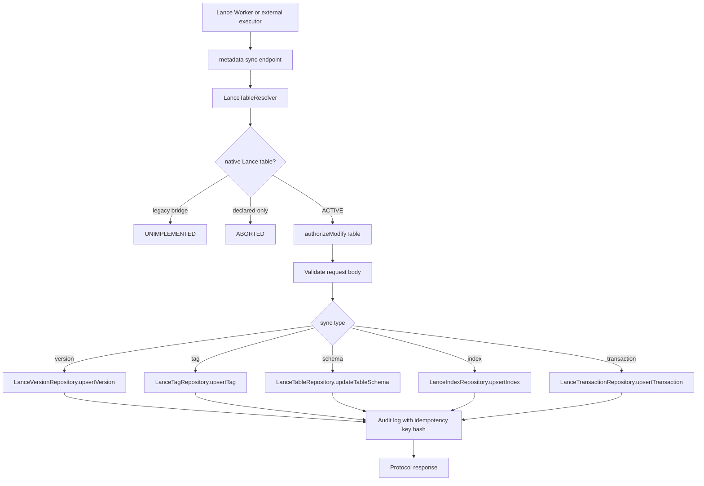

# Unity Catalog Lance Phase 3 元数据同步详细设计

更新日期：2026-05-16

关联文档：

- `docs/lance/unitycatalog-lance-phase-3-analysis.md` - Phase 3 概念分析
- `docs/lance/unitycatalog-lancedb-rest-api-requirements.md` - 总体需求
- `docs/lance/unitycatalog-lancedb-rest-api-technical-design.md` - 总体技术设计
- `docs/lance/unitycatalog-lancedb-phase-2-data-plane-design.md` - Phase 2 数据面设计

## 1. 文档目标

本文档将 Phase 3 分析文档扩展为可直接进入开发的详细设计，明确：

- UC 作为 Catalog 层的元数据表设计与状态机
- Tag CRUD 端点的完整实现规格
- Index/Version/Transaction 查询 API 的实现规格
- 元数据同步 API（syncIndex/syncVersion/syncSchema/syncTransaction）的设计
- 协议转发层（Worker 执行后同步元数据）的扩展设计
- 模块、类、接口、测试和实施任务拆解

## 1.1 阶段定位

Phase 3 的核心目标是：

**UC 作为 Lance 的 Catalog 层（元数据治理），不是执行引擎。**

| 角色 | UC（Catalog 层） | 执行器（Lance SDK/Worker） |
|------|-----------------|----------------------------|
| 元数据发现 | ✅ 提供 namespace/table 定位 | 通过 UC 获取 |
| 凭证下发 | ✅ 提供 storage_options | 使用 UC 下发的凭证 |
| 数据读写 | ❌ 不执行 | ✅ 直连存储执行 |
| 索引创建 | ❌ 不执行 | ✅ Lance SDK 执行，完成后同步元数据到 UC |
| 版本产生 | ❌ 不产生（自动生成） | ✅ Lance 写入自动产生，同步到 UC |
| Tag 管理 | ✅ 可独立 CRUD | ✅ Lance SDK 也可管理并同步 |
| 事务执行 | ❌ 不执行 | ✅ Lance SDK 执行，同步状态到 UC |
| Schema 变更 | ❌ 不执行 | ✅ Lance SDK 执行，同步 schema 到 UC |

## 1.2 Phase 3 能力分类

### 1.2.1 UC 独立实现（纯 Metadata）

| API | 说明 | 实现方式 |
|-----|------|----------|
| `listTags` | 查询 `uc_lance_tags` 表 | ✅ UC 独立实现 |
| `getTagVersion` | 查询 Tag -> Version 映射 | ✅ UC 独立实现 |
| `createTag` | 创建 Tag 元数据 | ✅ UC 独立实现 |
| `updateTag` | 更新 Tag 元数据 | ✅ UC 独立实现 |
| `deleteTag` | 删除 Tag 元数据 | ✅ UC 独立实现 |

### 1.2.2 UC 提供查询 API（元数据来自执行器同步）

| API | 说明 | 数据来源 | UC 实现 |
|-----|------|----------|---------|
| `listVersions` | 查询版本历史 | 执行器写入后同步到 `uc_lance_versions` | ✅ UC 提供查询 |
| `describeVersion` | 查询版本详情 | 执行器写入后同步 | ✅ UC 提供查询 |
| `listIndices` | 查询索引列表 | 执行器创建索引后同步到 `uc_lance_indices` | ✅ UC 提供查询 |
| `describeIndexStats` | 查询索引统计 | 执行器创建索引后同步 | ✅ UC 提供查询 |
| `describeTransaction` | 查询事务状态 | 执行器执行事务后同步 | ✅ UC 提供查询 |

### 1.2.3 执行器执行后同步元数据（协议转发）

| 操作 | 执行方式 | UC 角色 |
|------|----------|---------|
| `createIndex` | Lance SDK/Worker 直连存储创建索引 | 接收执行器同步的索引元数据 |
| `dropIndex` | Lance SDK 删除索引 | 更新 UC 元数据表 |
| `deleteVersions` | Lance SDK 删除版本 | 更新 UC 元数据表 |
| `batchCommit` | Lance SDK 执行批量提交 | 接收执行器同步的结果 |
| `alterTransaction` | Lance SDK 操作事务 | 更新 UC 元数据表 |
| `addColumns` | Lance SDK 执行 | 同步 schema 到 UC |
| `alterColumns` | Lance SDK 执行 | 同步 schema 到 UC |
| `dropColumns` | Lance SDK 执行 | 同步 schema 到 UC |
| `restoreTable` | Lance SDK 执行 | Lance 文件格式操作 |

### 1.2.4 UC 拒绝的语义错误请求

| API | 原因 | UC 处理 |
|-----|------|---------|
| `createVersion` | Lance version 由写入自动产生，不能手动创建 | 400 BAD_REQUEST |
| `batchCreateVersions` | 同上 | 400 BAD_REQUEST |

## 1.3 阶段非目标

- 不在本阶段实现完整的事务原子性保证
- 不实现跨系统的强一致性（UC metadata 和物理 Lance 数据）
- 不实现生产级别的多云对象存储全矩阵验证
- 不实现 UC 主 UI 的 Lance 资产管理页面

---

## 2. 元数据表设计

## 2.1 Version 元数据表

### 2.1.1 表结构

```sql
CREATE TABLE uc_lance_versions (
  id UUID PRIMARY KEY,
  asset_id UUID NOT NULL REFERENCES uc_lance_assets(id),
  version BIGINT NOT NULL,
  operation VARCHAR(50) NOT NULL,  -- 'insert', 'update', 'delete', 'merge_insert', 'create_index', 'add_columns', etc.
  timestamp TIMESTAMP NOT NULL,
  manifest_path VARCHAR(500),
  manifest_size BIGINT,
  etag VARCHAR(255),
  metadata_json TEXT,              -- Lance manifest metadata 的 JSON snapshot
  stats_json TEXT,                 -- num_rows, num_deleted_rows, num_fragments, etc.
  created_by VARCHAR(255),
  created_at TIMESTAMP NOT NULL DEFAULT CURRENT_TIMESTAMP,
  UNIQUE(asset_id, version)
);

CREATE INDEX idx_lance_versions_asset ON uc_lance_versions(asset_id);
CREATE INDEX idx_lance_versions_timestamp ON uc_lance_versions(timestamp DESC);
```

### 2.1.2 字段说明

| 字段 | 类型 | 说明 |
|------|------|------|
| `id` | UUID | 主键 |
| `asset_id` | UUID | 关联的 table asset |
| `version` | BIGINT | Lance version 号（由写入自动产生） |
| `operation` | VARCHAR(50) | 产生该 version 的操作类型 |
| `timestamp` | TIMESTAMP | Lance manifest 中的时间戳 |
| `manifest_path` | VARCHAR(500) | Manifest 文件路径（可选） |
| `manifest_size` | BIGINT | Manifest 文件大小（可选） |
| `etag` | VARCHAR(255) | Lance manifest etag |
| `metadata_json` | TEXT | Lance manifest metadata snapshot |
| `stats_json` | TEXT | 统计信息 snapshot |
| `created_by` | VARCHAR(255) | 执行该操作的 principal |
| `created_at` | TIMESTAMP | UC 记录创建时间 |

### 2.1.3 元数据同步时机

```
执行器写入成功 ── 返回 version 信息 ── 执行器调用 syncVersion API ── UC 写入 uc_lance_versions
```

同步内容：
- version 号（必填）
- operation（必填）
- timestamp（必填）
- manifest_path/manifest_size/etag（可选）
- metadata_json/stats_json（可选）

---

## 2.2 Index 元数据表

### 2.2.1 表结构

```sql
CREATE TABLE uc_lance_indices (
  id UUID PRIMARY KEY,
  asset_id UUID NOT NULL REFERENCES uc_lance_assets(id),
  table_asset_id UUID NOT NULL REFERENCES uc_lance_assets(id),
  index_name VARCHAR(255) NOT NULL,
  index_type VARCHAR(50) NOT NULL,  -- 'vector', 'scalar', 'fts', 'btree', 'bitmap'
  target_columns_json TEXT NOT NULL, -- JSON array of column names
  distance_type VARCHAR(50),         -- 'l2', 'cosine', 'dot' (for vector index)
  build_params_json TEXT,            -- index build 参数
  stats_json TEXT,                   -- index statistics
  status VARCHAR(20) NOT NULL,       -- 'READY', 'BUILDING', 'FAILED', 'DROPPED'
  created_at TIMESTAMP NOT NULL,
  created_by VARCHAR(255),
  updated_at TIMESTAMP,
  updated_by VARCHAR(255),
  UNIQUE(table_asset_id, index_name)
);

CREATE INDEX idx_lance_indices_table ON uc_lance_indices(table_asset_id);
CREATE INDEX idx_lance_indices_status ON uc_lance_indices(status);
```

### 2.2.2 字段说明

| 字段 | 类型 | 说明 |
|------|------|------|
| `id` | UUID | 主键 |
| `asset_id` | UUID | Index asset 的主键 |
| `table_asset_id` | UUID | 关联的 table asset |
| `index_name` | VARCHAR(255) | 索引名称 |
| `index_type` | VARCHAR(50) | 索引类型 |
| `target_columns_json` | TEXT | 目标列 JSON 数组 |
| `distance_type` | VARCHAR(50) | 向量距离类型（仅 vector index） |
| `build_params_json` | TEXT | 索引构建参数 |
| `stats_json` | TEXT | 索引统计信息 |
| `status` | VARCHAR(20) | 索引状态 |

### 2.2.3 状态机

```
BUILDING ── 成功 ── READY
         │
         └─ 失败 ── FAILED

READY ── dropIndex 调用 ── DROPPED（删除记录或标记状态）
```

### 2.2.4 元数据同步时机

```
Lance SDK createIndex 成功 ── 调用 syncIndex API ── UC 写入 uc_lance_indices（status=READY）
Lance SDK dropIndex 成功 ── 调用 syncIndex API ── UC 删除记录或标记 status=DROPPED
```

---

## 2.3 Tag 元数据表

### 2.3.1 表结构

```sql
CREATE TABLE uc_lance_tags (
  id UUID PRIMARY KEY,
  asset_id UUID NOT NULL REFERENCES uc_lance_assets(id),
  table_asset_id UUID NOT NULL REFERENCES uc_lance_assets(id),
  tag_name VARCHAR(255) NOT NULL,
  version BIGINT NOT NULL,
  metadata_json TEXT,
  created_at TIMESTAMP NOT NULL,
  created_by VARCHAR(255),
  updated_at TIMESTAMP,
  updated_by VARCHAR(255),
  UNIQUE(table_asset_id, tag_name)
);

CREATE INDEX idx_lance_tags_table ON uc_lance_tags(table_asset_id);
CREATE INDEX idx_lance_tags_version ON uc_lance_tags(version);
```

### 2.3.2 字段说明

| 字段 | 类型 | 说明 |
|------|------|------|
| `id` | UUID | 主键 |
| `asset_id` | UUID | Tag asset 的主键 |
| `table_asset_id` | UUID | 关联的 table asset |
| `tag_name` | VARCHAR(255) | Tag 名称 |
| `version` | BIGINT | Tag 指向的 version |
| `metadata_json` | TEXT | Tag 元数据 |

### 2.3.3 Tag 管理模式

两种模式并存：

**模式 1：UC 独立管理**
- `createTag` / `updateTag` / `deleteTag` 为纯 metadata 操作
- UC 直接操作 `uc_lance_tags` 表
- 不需要 Backend 执行

**模式 2：Lance SDK 管理**
- Lance SDK 也可以创建/管理 tag
- 完成后调用 `syncTag` API 同步到 UC
- 结果与模式 1 一致：tag 存储在 UC 元数据表中

### 2.3.4 Tag 与 Version 的关系

```
Tag 是 Version 的命名别名：

uc_lance_versions: version=5
uc_lance_tags:     tag_name="release-1.0", version=5

查询 getTagVersion("release-1.0") → 返回 version=5
```

---

## 2.4 Transaction 元数据表

### 2.4.1 表结构

```sql
CREATE TABLE uc_lance_transactions (
  id UUID PRIMARY KEY,
  asset_id UUID NOT NULL REFERENCES uc_lance_assets(id),
  transaction_key VARCHAR(255) NOT NULL,
  table_asset_id UUID NOT NULL REFERENCES uc_lance_assets(id),
  status VARCHAR(20) NOT NULL,  -- 'QUEUED', 'RUNNING', 'SUCCEEDED', 'FAILED', 'CANCELED'
  actions_json TEXT,            -- Transaction actions 的 snapshot
  commit_metadata_json TEXT,    -- Commit metadata
  created_at TIMESTAMP NOT NULL,
  updated_at TIMESTAMP,
  created_by VARCHAR(255),
  updated_by VARCHAR(255),
  UNIQUE(transaction_key)
);

CREATE INDEX idx_lance_transactions_table ON uc_lance_transactions(table_asset_id);
CREATE INDEX idx_lance_transactions_status ON uc_lance_transactions(status);
```

### 2.4.2 字段说明

| 字段 | 类型 | 说明 |
|------|------|------|
| `id` | UUID | 主键 |
| `asset_id` | UUID | Transaction asset 的主键 |
| `transaction_key` | VARCHAR(255) | Transaction 唯一标识 |
| `table_asset_id` | UUID | 关联的 table asset |
| `status` | VARCHAR(20) | 事务状态 |
| `actions_json` | TEXT | 事务操作 snapshot |
| `commit_metadata_json` | TEXT | Commit metadata |

### 2.4.3 状态机

```
QUEUED ── Worker pickup ── RUNNING ── 成功 ── SUCCEEDED
                              │
                              └ 失败 ── FAILED

QUEUED/RUNNING ── cancel ── CANCELED
```

### 2.4.4 元数据同步时机

```
Lance SDK 开始事务 ── 调用 syncTransaction(status=QUEUED/RUNNING)
Lance SDK 完成事务 ── 调用 syncTransaction(status=SUCCEEDED/FAILED)
```

---

## 2.5 Schema History 表（可选）

用于记录 schema evolution 历史：

```sql
CREATE TABLE uc_lance_schema_history (
  id UUID PRIMARY KEY,
  table_asset_id UUID NOT NULL REFERENCES uc_lance_assets(id),
  version BIGINT NOT NULL,
  schema_json TEXT NOT NULL,
  operation VARCHAR(50) NOT NULL,  -- 'add_columns', 'alter_columns', 'drop_columns'
  columns_added_json TEXT,
  columns_altered_json TEXT,
  columns_dropped_json TEXT,
  created_at TIMESTAMP NOT NULL,
  created_by VARCHAR(255),
  UNIQUE(table_asset_id, version)
);
```

---

## 3. 元数据同步 API 设计

## 3.1 syncVersion API

### 3.1.1 端点规格

```
POST /v1/table/{id}/metadata/sync/version
```

### 3.1.2 请求体

```json
{
  "version": 5,
  "operation": "insert",
  "timestamp": "2026-05-16T10:30:00Z",
  "manifest_path": "s3://bucket/path/_versions/5.manifest",
  "manifest_size": 1024,
  "etag": "abc123",
  "metadata": {
    "num_rows": 10000,
    "num_fragments": 10
  },
  "stats": {
    "num_rows": 10000,
    "num_deleted_rows": 0
  }
}
```

### 3.1.3 响应体

```json
{
  "success": true,
  "version_id": "uuid-of-version-record",
  "request_id": "req-123"
}
```

### 3.1.4 调用时机

| 操作 | syncVersion 调用 |
|------|-----------------|
| insert | 执行器写入成功后调用 |
| merge_insert | 执行器写入成功后调用 |
| update | 执行器写入成功后调用 |
| delete | 执行器写入成功后调用 |
| create | 执行器建表成功后调用 |
| deleteVersions | 执行器删除版本后调用（更新/删除记录） |

---

## 3.2 syncIndex API

### 3.2.1 端点规格

```
POST /v1/table/{id}/metadata/sync/index
```

### 3.2.2 请求体

```json
{
  "index_name": "vector_idx",
  "index_type": "vector",
  "target_columns": ["embedding"],
  "distance_type": "cosine",
  "build_params": {
    "index_type": "IVF_PQ",
    "nlist": 100
  },
  "stats": {
    "num_indexed_rows": 10000,
    "index_size_bytes": 524288
  },
  "status": "READY"
}
```

### 3.2.3 响应体

```json
{
  "success": true,
  "index_id": "uuid-of-index-record",
  "request_id": "req-123"
}
```

### 3.2.4 调用时机

| 操作 | syncIndex 调用 |
|------|---------------|
| createIndex | 执行器创建索引成功后调用（status=READY） |
| dropIndex | 执行器删除索引后调用（删除记录或 status=DROPPED） |

---

## 3.3 syncSchema API

### 3.3.1 端点规格

```
POST /v1/table/{id}/metadata/sync/schema
```

### 3.3.2 请求体

```json
{
  "version": 6,
  "schema": {
    "fields": [
      {"name": "id", "type": "int64"},
      {"name": "name", "type": "string"},
      {"name": "embedding", "type": "fixed_size_list<float, 128>"}
    ]
  },
  "operation": "add_columns",
  "columns_added": [
    {"name": "embedding", "type": "fixed_size_list<float, 128>"}
  ]
}
```

### 3.3.3 调用时机

| 操作 | syncSchema 调用 |
|------|----------------|
| addColumns | 执行器添加列后调用 |
| alterColumns | 执行器修改列后调用 |
| dropColumns | 执行器删除列后调用 |

---

## 3.4 syncTransaction API

### 3.4.1 端点规格

```
POST /v1/table/{id}/metadata/sync/transaction
```

### 3.4.2 请求体

```json
{
  "transaction_key": "tx-abc123",
  "status": "SUCCEEDED",
  "actions": [
    {"type": "insert", "data": "..."}
  ],
  "commit_metadata": {
    "version": 5,
    "num_rows": 1000
  }
}
```

### 3.4.3 调用时机

| 操作 | syncTransaction 调用 |
|------|---------------------|
| batchCommit | 执行器执行批量提交后调用 |
| alterTransaction | 执行器操作事务后调用 |

---

## 4. Tag CRUD API 详细设计

## 4.1 listTags

### 4.1.1 端点规格

```
POST /v1/table/{id}/tags/list
```

### 4.1.2 请求体

```json
{
  "page_token": null,
  "page_size": 100
}
```

### 4.1.3 响应体

```json
{
  "tags": [
    {
      "name": "release-1.0",
      "version": 5
    },
    {
      "name": "dev-latest",
      "version": 10
    }
  ],
  "next_page_token": null
}
```

### 4.1.4 实现逻辑

1. 解析 table identifier，获取 table_asset_id
2. 查询 `uc_lance_tags` 表：`WHERE table_asset_id = ?`
3. 按 tag_name 排序返回
4. 支持分页（page_token/page_size）

---

## 4.2 getTagVersion

### 4.2.1 端点规格

```
POST /v1/table/{id}/tags/get
```

### 4.2.2 请求体

```json
{
  "tag_name": "release-1.0"
}
```

### 4.2.3 响应体

```json
{
  "tag_name": "release-1.0",
  "version": 5,
  "metadata": {
    "created_by": "user@example.com",
    "created_at": "2026-05-16T10:00:00Z"
  }
}
```

### 4.2.4 实现逻辑

1. 解析 table identifier
2. 查询 `uc_lance_tags`：`WHERE table_asset_id = ? AND tag_name = ?`
3. 返回 tag -> version 映射
4. Tag 不存在返回 404 NOT_FOUND

---

## 4.3 createTag

### 4.3.1 端点规格

```
POST /v1/table/{id}/tags/create
```

### 4.3.2 请求体

```json
{
  "tag_name": "release-1.0",
  "version": 5,
  "metadata": {
    "description": "First release"
  }
}
```

### 4.3.3 响应体

```json
{
  "tag_name": "release-1.0",
  "version": 5,
  "created_at": "2026-05-16T10:00:00Z",
  "created_by": "user@example.com"
}
```

### 4.3.4 实现逻辑

1. 解析 table identifier
2. 验证 table 存在且状态为 ACTIVE
3. 验证 version 存在（查询 `uc_lance_versions`）
4. 检查 tag_name 是否已存在（409 ALREADY_EXISTS）
5. 写入 `uc_lance_tags` 表
6. 记录审计日志

---

## 4.4 updateTag

### 4.4.1 端点规格

```
POST /v1/table/{id}/tags/update
```

### 4.4.2 请求体

```json
{
  "tag_name": "release-1.0",
  "new_version": 6,
  "new_metadata": {
    "description": "Updated release"
  }
}
```

### 4.4.3 实现逻辑

1. 解析 table identifier
2. 查询现有 tag
3. 验证 new_version 存在
4. 更新 `uc_lance_tags` 的 version 和 metadata_json
5. 更新 updated_at 和 updated_by
6. 记录审计日志

---

## 4.5 deleteTag

### 4.5.1 端点规格

```
POST /v1/table/{id}/tags/delete
```

### 4.5.2 请求体

```json
{
  "tag_name": "release-1.0"
}
```

### 4.5.3 实现逻辑

1. 解析 table identifier
2. 查询并删除 `uc_lance_tags` 记录
3. Tag 不存在返回 404 NOT_FOUND
4. 记录审计日志

---

## 5. Version/Index/Transaction 查询 API

## 5.1 listVersions

### 5.1.1 端点规格

```
POST /v1/table/{id}/version/list
```

### 5.1.2 请求体

```json
{
  "page_token": null,
  "page_size": 100,
  "start_version": null,
  "end_version": null
}
```

### 5.1.3 响应体

```json
{
  "versions": [
    {
      "version": 10,
      "operation": "insert",
      "timestamp": "2026-05-16T10:30:00Z",
      "created_by": "user@example.com"
    },
    {
      "version": 9,
      "operation": "update",
      "timestamp": "2026-05-16T09:00:00Z"
    }
  ],
  "next_page_token": null
}
```

### 5.1.4 实现逻辑

1. 解析 table identifier，获取 asset_id
2. 查询 `uc_lance_versions`：`WHERE asset_id = ? ORDER BY version DESC`
3. 支持版本范围过滤
4. 支持分页

---

## 5.2 describeVersion

### 5.2.1 端点规格

```
POST /v1/table/{id}/version/describe
```

### 5.2.2 请求体

```json
{
  "version": 5
}
```

### 5.2.3 响应体

```json
{
  "version": 5,
  "operation": "insert",
  "timestamp": "2026-05-16T10:30:00Z",
  "manifest_path": "s3://bucket/path/_versions/5.manifest",
  "manifest_size": 1024,
  "metadata": {
    "num_rows": 10000,
    "num_fragments": 10
  },
  "stats": {
    "num_rows": 10000
  },
  "created_by": "user@example.com"
}
```

---

## 5.3 listIndices

### 5.3.1 端点规格

```
POST /v1/table/{id}/index/list
```

### 5.3.2 响应体

```json
{
  "indices": [
    {
      "name": "vector_idx",
      "type": "vector",
      "columns": ["embedding"],
      "status": "READY"
    }
  ]
}
```

---

## 5.4 describeIndexStats

### 5.4.1 端点规格

```
POST /v1/table/{id}/index/describe
```

### 5.4.2 请求体

```json
{
  "index_name": "vector_idx"
}
```

### 5.4.3 响应体

```json
{
  "index_name": "vector_idx",
  "index_type": "vector",
  "target_columns": ["embedding"],
  "distance_type": "cosine",
  "stats": {
    "num_indexed_rows": 10000,
    "index_size_bytes": 524288
  },
  "status": "READY"
}
```

---

## 5.5 describeTransaction

### 5.5.1 端点规格

```
POST /v1/table/{id}/transaction/describe
```

### 5.5.2 请求体

```json
{
  "transaction_key": "tx-abc123"
}
```

### 5.5.3 响应体

```json
{
  "transaction_key": "tx-abc123",
  "status": "SUCCEEDED",
  "actions": [...],
  "commit_metadata": {
    "version": 5
  },
  "created_at": "2026-05-16T10:00:00Z",
  "updated_at": "2026-05-16T10:05:00Z"
}
```

---

## 6. 协议转发层扩展设计

## 6.1 Backend SPI 扩展

Phase 3 扩展 `LanceExecutionBackend` 接口：

### 6.1.1 扩展接口设计

**方案 A：子接口扩展**

```java
public interface LanceAdvancedExecutionBackend extends LanceExecutionBackend {
  // Index operations
  LanceExecutionResult createIndex(LanceExecutionCommand command);
  LanceExecutionResult dropIndex(LanceExecutionCommand command);

  // Version operations
  LanceExecutionResult deleteVersions(LanceExecutionCommand command);

  // Transaction operations
  LanceExecutionResult batchCommit(LanceExecutionCommand command);
  LanceExecutionResult alterTransaction(LanceExecutionCommand command);

  // Schema evolution
  LanceExecutionResult addColumns(LanceExecutionCommand command);
  LanceExecutionResult alterColumns(LanceExecutionCommand command);
  LanceExecutionResult dropColumns(LanceExecutionCommand command);

  // Restore
  LanceExecutionResult restoreTable(LanceExecutionCommand command);
}
```

**方案 B：直接扩展接口**

```java
public interface LanceExecutionBackend {
  // Phase 2 methods (existing)
  LanceExecutionResult query(LanceExecutionCommand command);
  LanceExecutionResult countRows(LanceExecutionCommand command);
  LanceExecutionResult stats(LanceExecutionCommand command);
  LanceExecutionResult insert(LanceExecutionCommand command);
  LanceExecutionResult mergeInsert(LanceExecutionCommand command);
  LanceExecutionResult update(LanceExecutionCommand command);
  LanceExecutionResult delete(LanceExecutionCommand command);
  LanceExecutionResult explainPlan(LanceExecutionCommand command);
  LanceExecutionResult analyzePlan(LanceExecutionCommand command);
  LanceExecutionResult create(LanceExecutionCommand command);

  // Phase 3 methods (new)
  // --- Index ---
  LanceExecutionResult createIndex(LanceExecutionCommand command);
  LanceExecutionResult dropIndex(LanceExecutionCommand command);

  // --- Version ---
  LanceExecutionResult deleteVersions(LanceExecutionCommand command);

  // --- Transaction ---
  LanceExecutionResult batchCommit(LanceExecutionCommand command);
  LanceExecutionResult alterTransaction(LanceExecutionCommand command);

  // --- Schema Evolution ---
  LanceExecutionResult addColumns(LanceExecutionCommand command);
  LanceExecutionResult alterColumns(LanceExecutionCommand command);
  LanceExecutionResult dropColumns(LanceExecutionCommand command);

  // --- Restore ---
  LanceExecutionResult restoreTable(LanceExecutionCommand command);
}
```

**推荐方案 A**：保持 Phase 2 接口稳定，通过子接口扩展。

---

## 6.2 Worker HTTP Backend 扩展

### 6.2.1 新增内部 API

```
POST /internal/lance/v1/commands/create_index
POST /internal/lance/v1/commands/drop_index
POST /internal/lance/v1/commands/delete_versions
POST /internal/lance/v1/commands/batch_commit
POST /internal/lance/v1/commands/alter_transaction
POST /internal/lance/v1/commands/add_columns
POST /internal/lance/v1/commands/alter_columns
POST /internal/lance/v1/commands/drop_columns
POST /internal/lance/v1/commands/restore_table
```

### 6.2.2 执行流程

```
UC REST endpoint ── LanceDataPlaneService ── WorkerHttpBackend ── Worker 执行
                                                                    ↓
                                                               成功后返回结果
                                                                    ↓
UC MetadataUpdater ── 调用 sync API ── 写入 UC 元数据表 ←──────────┘
```

---

## 6.3 Metadata Sync Service

### 6.3.1 服务职责

负责接收执行器同步的元数据并写入 UC 元数据表。

### 6.3.2 类设计

```java
public class LanceMetadataSyncService {
  private final LanceVersionRepository versionRepository;
  private final LanceIndexRepository indexRepository;
  private final LanceTagRepository tagRepository;
  private final LanceTransactionRepository transactionRepository;
  private final LanceTableRepository tableRepository;

  public SyncResult syncVersion(String tableId, SyncVersionRequest request);
  public SyncResult syncIndex(String tableId, SyncIndexRequest request);
  public SyncResult syncSchema(String tableId, SyncSchemaRequest request);
  public SyncResult syncTransaction(String tableId, SyncTransactionRequest request);
  public SyncResult syncTag(String tableId, SyncTagRequest request);
}
```

---

## 7. 模块设计

## 7.1 新增模块列表

| 模块路径 | 职责 |
|---------|------|
| `service/lance/LanceRestTagService.java` | Tag CRUD REST endpoint |
| `service/lance/LanceRestVersionService.java` | Version 查询 REST endpoint |
| `service/lance/LanceRestIndexService.java` | Index 查询 REST endpoint |
| `service/lance/LanceRestTransactionService.java` | Transaction 查询 REST endpoint |
| `service/lance/LanceMetadataSyncService.java` | 元数据同步服务 |
| `service/lance/LanceDataPlaneProtocolForwarder.java` | Phase 3 协议转发服务 |
| `persist/LanceVersionRepository.java` | Version 元数据持久化 |
| `persist/LanceIndexRepository.java` | Index 元数据持久化 |
| `persist/LanceTagRepository.java` | Tag 元数据持久化 |
| `persist/LanceTransactionRepository.java` | Transaction 元数据持久化 |
| `persist/dao/LanceVersionDAO.java` | Version DAO |
| `persist/dao/LanceIndexDAO.java` | Index DAO |
| `persist/dao/LanceTagDAO.java` | Tag DAO |
| `persist/dao/LanceTransactionDAO.java` | Transaction DAO |

---

## 7.2 REST 服务类设计

### 7.2.1 LanceRestTagService

```java
@ExceptionHandler(LanceExceptionHandler.class)
public class LanceRestTagService {
  private final LanceMetadataService metadataService;
  private final LanceTagRepository tagRepository;

  @Post("/v1/table/{id}/tags/list")
  public HttpResponse listTags(@Param("id") String id, AggregatedHttpRequest request);

  @Post("/v1/table/{id}/tags/get")
  public HttpResponse getTagVersion(@Param("id") String id, AggregatedHttpRequest request);

  @Post("/v1/table/{id}/tags/create")
  public HttpResponse createTag(@Param("id") String id, AggregatedHttpRequest request);

  @Post("/v1/table/{id}/tags/update")
  public HttpResponse updateTag(@Param("id") String id, AggregatedHttpRequest request);

  @Post("/v1/table/{id}/tags/delete")
  public HttpResponse deleteTag(@Param("id") String id, AggregatedHttpRequest request);
}
```

---

## 8. 实施任务拆解

## 8.1 W3-0 准备与 DDL

**目标**：创建 Phase 3 元数据表

| 任务 | 说明 |
|------|------|
| 创建 `uc_lance_versions` DDL | H2 + PostgreSQL migration |
| 创建 `uc_lance_indices` DDL | H2 + PostgreSQL migration |
| 创建 `uc_lance_tags` DDL | H2 + PostgreSQL migration |
| 创建 `uc_lance_transactions` DDL | H2 + PostgreSQL migration |
| 创建 `uc_lance_schema_history` DDL（可选） | H2 + PostgreSQL migration |

**准出**：所有表可在 H2/PostgreSQL 中正常创建和 CRUD

---

## 8.2 W3-1 Tag CRUD 实现

**目标**：实现 Tag CRUD 端点（纯 metadata）

| 任务 | 说明 |
|------|------|
| `LanceTagRepository` | Tag 持久化操作 |
| `LanceTagDAO` | DAO 类 |
| `LanceRestTagService` | REST endpoint |
| `listTags` 实现 | 查询 uc_lance_tags |
| `getTagVersion` 实现 | 查询 tag -> version 映射 |
| `createTag` 实现 | 创建 tag，验证 version 存在 |
| `updateTag` 实现 | 更新 tag，验证 new_version 存在 |
| `deleteTag` 实现 | 删除 tag |

**准出**：Tag CRUD 测试全部通过

---

## 8.3 W3-2 Metadata Sync API 实现

**目标**：实现元数据同步 API

| 任务 | 说明 |
|------|------|
| `LanceVersionRepository` | Version 持久化 |
| `LanceIndexRepository` | Index 持久化 |
| `LanceTransactionRepository` | Transaction 持久化 |
| `LanceMetadataSyncService` | 同步服务 |
| `syncVersion` API | 接收 version 同步 |
| `syncIndex` API | 接收 index 同步 |
| `syncSchema` API | 接收 schema 同步 |
| `syncTransaction` API | 接收 transaction 同步 |

**准出**：同步 API 测试通过，元数据正确写入

---

## 8.4 W3-3 Version/Index/Transaction 查询 API

**目标**：实现查询 API

| 任务 | 说明 |
|------|------|
| `LanceRestVersionService` | Version 查询 endpoint |
| `listVersions` 实现 | 查询 uc_lance_versions |
| `describeVersion` 实现 | 查询 version 详情 |
| `LanceRestIndexService` | Index 查询 endpoint |
| `listIndices` 实现 | 查询 uc_lance_indices |
| `describeIndexStats` 实现 | 查询 index 详情 |
| `LanceRestTransactionService` | Transaction 查询 endpoint |
| `describeTransaction` 实现 | 查询 transaction 详情 |

**准出**：查询 API 测试通过

---

## 8.5 W3-4 Backend SPI 扩展

**目标**：扩展 Backend 接口支持 Phase 3 操作

| 任务 | 说明 |
|------|------|
| `LanceAdvancedExecutionBackend` 接口 | 子接口扩展 |
| `WorkerHttpBackend` 扩展 | 实现新增方法 |
| `DisabledBackend` 扩展 | 返回 UNIMPLEMENTED |
| createIndex/dropIndex 实现 | Worker 执行后同步 |
| deleteVersions 实现 | Worker 执行后同步 |
| batchCommit 实现 | Worker 执行后同步 |

**准出**：Backend 扩展测试通过

---

## 8.6 W3-5 协议转发 REST Endpoint

**目标**：暴露协议转发 endpoint

| 任务 | 说明 |
|------|------|
| `createIndex` REST endpoint | 转发到 Worker |
| `dropIndex` REST endpoint | 转发到 Worker |
| `deleteVersions` REST endpoint | 转发到 Worker |
| `batchCommit` REST endpoint | 转发到 Worker |
| `alterTransaction` REST endpoint | 转发到 Worker |
| Schema evolution endpoint | 转发到 Worker |

**准出**：协议转发链路测试通过

---

## 8.7 W3-6 语义错误拒绝

**目标**：拒绝语义错误的请求

| 任务 | 说明 |
|------|------|
| `createVersion` 拒绝 | 400 BAD_REQUEST |
| `batchCreateVersions` 拒绝 | 400 BAD_REQUEST |

---

## 9. 测试策略

## 9.1 测试范围

| 类别 | 测试重点 |
|------|----------|
| Tag CRUD | 纯 metadata CRUD，权限，审计 |
| Version/Index/Transaction 查询 | 查询 API，分页，权限 |
| Metadata Sync | 同步 API，元数据写入，并发 |
| Protocol Forwarding | Backend 执行后同步，Worker 链路 |
| Semantic Error | createVersion 拒绝 |
| Regression | Phase 2 不受影响 |

---

## 9.2 测试套件

| 套件编号 | 覆盖范围 |
|---------|----------|
| `TD-TAG` | Tag CRUD 测试 |
| `TD-ADV-001~005` | 查询 API 测试 |
| `TD-ADV-006~014` | 协议转发测试 |
| `TD-ADV-015~016` | 语义错误拒绝测试 |
| `TD-ADV-017~020` | 元数据同步 API 测试 |
| `TD-REG-PHASE2` | Phase 2 回归 |

---

## 10. 准出标准

| 标准 | 说明 |
|------|------|
| Tag CRUD 可用 | list/get/create/update/delete 全部通过 |
| Version/Index/Transaction 查询可用 | 查询 API 测试通过 |
| Metadata Sync API 可用 | sync API 测试通过 |
| 协议转发链路可用 | Worker 执行后同步元数据 |
| 语义错误正确拒绝 | createVersion 返回 400 |
| Phase 2 回归通过 | 不影响现有功能 |
| 审计与权限完整 | 所有操作可审计和授权 |

---

## 11. 与 Gravitino 对比

| 能力 | Gravitino Lance | UC Lance (本设计) |
|------|-----------------|-------------------|
| Namespace API | ✅ 已实现 | ✅ Phase 1 实现 |
| Table Metadata API | ✅ 已实现 | ✅ Phase 1 实现 |
| Schema Evolution | ✅ dropColumns/alterColumns | ✅ 协议转发 + 同步 |
| Index API | ❌ 未实现 | ✅ 查询 API + 协议转发 |
| Version API | ❌ 未实现 | ✅ 查询 API + 协议转发 |
| Tag API | ❌ 未实现 | ✅ UC 独立实现 CRUD |
| Transaction API | ❌ 未实现 | ✅ 查询 API + 协议转发 |
| Batch Commit | ❌ 未实现 | ✅ 协议转发 |
| 元数据同步机制 | ❌ 未实现 | ✅ syncIndex/syncVersion/syncSchema/syncTransaction |

---

## 12. 风险与待决问题

| 风险 | 影响 | 建议 |
|------|------|------|
| 元数据同步延迟 | UC 和物理数据短期不一致 | 提供 reconcile 机制 |
| 并发同步冲突 | 多个执行器同时同步 | 使用 version/timestamp 端点去重 |
| Worker 不可用 | 协议转发失败 | 返回稳定 503 SERVICE_UNAVAILABLE |
| 大量 version 历史 | 查询性能 | 支持分页和版本范围过滤 |

---

## 13. 总结

**Phase 3 核心设计结论**：

1. **UC 是 Catalog 层**：元数据治理、凭证下发、查询 API
2. **执行器同步元数据**：Lance SDK/Worker 执行操作后调用 sync API
3. **Tag CRUD UC 独立实现**：纯 metadata 操作
4. **Version/Index/Transaction 查询 API**：UC 提供，数据来自执行器同步
5. **协议转发执行类操作**：Worker 执行后同步元数据到 UC
6. **语义错误明确拒绝**：createVersion/batchCreateVersions 返回 400

**实施顺序**：

1. W3-0：DDL 创建元数据表
2. W3-1：Tag CRUD 实现
3. W3-2：Metadata Sync API 实现
4. W3-3：Version/Index/Transaction 查询 API
5. W3-4：Backend SPI 扩展
6. W3-5：协议转发 REST Endpoint
7. W3-6：语义错误拒绝

## 14. 当前实现对照（2026-05-26）

本节补充当前代码已经落地的第三阶段实现，并把“已实现 API”“已具备扩展点但未完全暴露”“当前阶段暂不实现”的边界拆开说明。

## 14.1 开发情况摘要

当前第三阶段已经落地以下内容：

- `UnityCatalogServer` 已注册 `LanceRestVersionService`、`LanceRestTagService`、`LanceRestMetadataSyncService`、`LanceRestIndexService`、`LanceRestTransactionService`。
- `Repositories` 已初始化 `LanceVersionRepository`、`LanceTagRepository`、`LanceIndexRepository`、`LanceTransactionRepository`。
- 持久化 DAO 已覆盖 `uc_lance_versions`、`uc_lance_tags`、`uc_lance_indices`、`uc_lance_transactions`。
- Tag 作为纯 metadata 能力已由 UC 独立实现 list/get/create/update/delete，并校验目标 version 已存在。
- Version 已实现 list/describe，拒绝 create/batch-create；`delete_versions` 已接入数据面编排和 Worker backend。
- Index 已实现 list/describe 以及 `metadata/sync/index` upsert。
- Transaction 已实现 list/describe 以及 `metadata/sync/transaction` upsert。
- `metadata/sync/version`、`metadata/sync/tag`、`metadata/sync/schema` 已实现；schema sync 当前更新 `uc_lance_tables.arrow_schema_json/current_version/stats_json`，还没有独立 `uc_lance_schema_history` 表。
- `LanceAdvancedExecutionBackend` 和 `WorkerHttpLanceExecutionBackend` 已定义 Phase 3 高级 Worker 命令扩展点，包括 index、version delete、batch commit、transaction、schema evolution、restore。

## 14.2 第三阶段类图

```mermaid
classDiagram
  class UnityCatalogServer
  class LanceRestVersionService
  class LanceRestTagService
  class LanceRestMetadataSyncService
  class LanceRestIndexService
  class LanceRestTransactionService
  class LanceDataPlaneService
  class LanceTableResolver
  class LanceAuthorizationService
  class LanceVersionRepository
  class LanceTagRepository
  class LanceIndexRepository
  class LanceTransactionRepository
  class LanceTableRepository
  class LanceVersionDAO
  class LanceTagDAO
  class LanceIndexDAO
  class LanceTransactionDAO
  class LanceAdvancedExecutionBackend
  class WorkerHttpLanceExecutionBackend
  class DisabledLanceExecutionBackend

  UnityCatalogServer --> LanceRestVersionService
  UnityCatalogServer --> LanceRestTagService
  UnityCatalogServer --> LanceRestMetadataSyncService
  UnityCatalogServer --> LanceRestIndexService
  UnityCatalogServer --> LanceRestTransactionService

  LanceRestVersionService --> LanceTableResolver
  LanceRestVersionService --> LanceAuthorizationService
  LanceRestVersionService --> LanceVersionRepository
  LanceRestVersionService --> LanceDataPlaneService : delete_versions

  LanceRestTagService --> LanceTableResolver
  LanceRestTagService --> LanceAuthorizationService
  LanceRestTagService --> LanceTagRepository
  LanceRestTagService --> LanceVersionRepository : version validation

  LanceRestMetadataSyncService --> LanceTableResolver
  LanceRestMetadataSyncService --> LanceAuthorizationService
  LanceRestMetadataSyncService --> LanceVersionRepository
  LanceRestMetadataSyncService --> LanceTagRepository
  LanceRestMetadataSyncService --> LanceTableRepository

  LanceRestIndexService --> LanceTableResolver
  LanceRestIndexService --> LanceAuthorizationService
  LanceRestIndexService --> LanceIndexRepository

  LanceRestTransactionService --> LanceTableResolver
  LanceRestTransactionService --> LanceAuthorizationService
  LanceRestTransactionService --> LanceTransactionRepository

  LanceVersionRepository --> LanceVersionDAO
  LanceTagRepository --> LanceTagDAO
  LanceIndexRepository --> LanceIndexDAO
  LanceTransactionRepository --> LanceTransactionDAO
  LanceAdvancedExecutionBackend <|.. WorkerHttpLanceExecutionBackend
  LanceAdvancedExecutionBackend <|.. DisabledLanceExecutionBackend
```



## 14.3 元数据同步结构图



同步入口统一只接受 ACTIVE 原生 Lance table。这样可以避免 legacy bridge 或 declared-only 元数据被 Worker 同步结果错误推进。

## 14.4 当前 endpoint 完成度

| 能力 | 路由 | 当前状态 | 实现类 |
|------|------|----------|--------|
| listVersions | `POST /v1/table/{id}/version/list` | 已实现，支持 `start_version`、`end_version`、`page_size`、`page_token` | `LanceRestVersionService` |
| describeVersion | `POST /v1/table/{id}/version/describe` | 已实现，按 table asset + version 查询 | `LanceRestVersionService` |
| createVersion | `POST /v1/table/{id}/version/create` | 已实现语义拒绝，version 只能由写入产生 | `LanceRestVersionService` |
| batchCreateVersions | `POST /v1/table/batch-create-versions` | 已实现语义拒绝 | `LanceRestVersionService` |
| deleteVersions | `POST /v1/table/{id}/version/delete` | 已接入数据面和 Worker `delete_versions` 命令；UC 侧只更新 stats，删除后的 version 记录同步需由调用方继续处理 | `LanceRestVersionService` + `LanceDataPlaneService` |
| listTags | `POST /v1/table/{id}/tags/list` | 已实现，支持分页 | `LanceRestTagService` |
| getTag | `POST /v1/table/{id}/tags/get` | 已实现 | `LanceRestTagService` |
| getTagVersion | `POST /v1/table/{id}/tags/get-version`、`POST /v1/table/{id}/tags/version` | 已实现 alias | `LanceRestTagService` |
| createTag | `POST /v1/table/{id}/tags/create` | 已实现，校验 version 存在 | `LanceRestTagService` |
| updateTag | `POST /v1/table/{id}/tags/update` | 已实现，支持 `new_version`/`version` 和 `new_metadata`/`metadata` | `LanceRestTagService` |
| deleteTag | `POST /v1/table/{id}/tags/delete` | 已实现 | `LanceRestTagService` |
| listIndex | `POST /v1/table/{id}/index/list` | 已实现，支持 status/page_size 过滤 | `LanceRestIndexService` |
| describeIndex | `POST /v1/table/{id}/index/describe` | 已实现，支持 `index_name` 或 `name` | `LanceRestIndexService` |
| syncIndex | `POST /v1/table/{id}/metadata/sync/index` | 已实现 upsert，默认 status 为 `READY` | `LanceRestIndexService` |
| listTransaction | `POST /v1/table/{id}/transaction/list` | 已实现，支持 status/page_size 过滤 | `LanceRestTransactionService` |
| describeTransaction | `POST /v1/table/{id}/transaction/describe` | 已实现，支持 `transaction_key` 或 `key` | `LanceRestTransactionService` |
| syncTransaction | `POST /v1/table/{id}/metadata/sync/transaction` | 已实现 upsert，status 校验在 repository 层完成 | `LanceRestTransactionService` |
| syncVersion | `POST /v1/table/{id}/metadata/sync/version` | 已实现 upsert | `LanceRestMetadataSyncService` |
| syncTag | `POST /v1/table/{id}/metadata/sync/tag` | 已实现 upsert | `LanceRestMetadataSyncService` |
| syncSchema | `POST /v1/table/{id}/metadata/sync/schema` | 已实现当前 schema/stats/version 更新；未写 schema history 独立表 | `LanceRestMetadataSyncService` |

## 14.5 元数据表与 Repository 对照

| 表 | DAO | Repository | 唯一约束/查询方式 | 当前写入来源 |
|----|-----|------------|-------------------|--------------|
| `uc_lance_versions` | `LanceVersionDAO` | `LanceVersionRepository` | `UNIQUE(asset_id, version)`；按 version 倒序分页 | 数据面写入后自动 upsert，或 `syncVersion` |
| `uc_lance_tags` | `LanceTagDAO` | `LanceTagRepository` | `UNIQUE(table_asset_id, tag_name)`；按 tag_name 分页 | Tag CRUD 或 `syncTag` |
| `uc_lance_indices` | `LanceIndexDAO` | `LanceIndexRepository` | `UNIQUE(table_asset_id, index_name)`；按 status 过滤 | `syncIndex` |
| `uc_lance_transactions` | `LanceTransactionDAO` | `LanceTransactionRepository` | `UNIQUE(transaction_key)`；按 table/status 查询 | `syncTransaction` |
| `uc_lance_tables` | `LanceTableDAO` | `LanceTableRepository` | `asset_id` 主键 | `syncSchema`、数据面写入/stats 状态推进 |

## 14.6 Worker 扩展点完成度

`LanceAdvancedExecutionBackend` 当前已经定义以下高级执行接口，`WorkerHttpLanceExecutionBackend` 会转发到对应 Worker 内部命令：

| Backend 方法 | Worker operation | 当前公开 REST 暴露情况 |
|--------------|------------------|------------------------|
| `createIndex` | `create_index` | 后端扩展点已实现；公开 REST 转发 endpoint 仍需补齐 |
| `dropIndex` | `drop_index` | 后端扩展点已实现；公开 REST 转发 endpoint 仍需补齐 |
| `deleteVersions` | `delete_versions` | 已通过 `POST /v1/table/{id}/version/delete` 暴露 |
| `batchCommit` | `batch_commit` | 后端扩展点已实现；公开 REST 转发 endpoint 仍需补齐 |
| `alterTransaction` | `alter_transaction` | 后端扩展点已实现；公开 REST 转发 endpoint 仍需补齐 |
| `addColumns` | `add_columns` | 后端扩展点已实现；公开 REST 转发 endpoint 仍需补齐 |
| `alterColumns` | `alter_columns` | 后端扩展点已实现；公开 REST 转发 endpoint 仍需补齐 |
| `dropColumns` | `drop_columns` | 后端扩展点已实现；公开 REST 转发 endpoint 仍需补齐 |
| `restoreTable` | `restore_table` | 后端扩展点已实现；当前 `LanceRestTableService.restoreTable` 仍返回 `NOT_IMPLEMENTED` |

这意味着第三阶段当前已经具备 Worker command 层扩展基础，但除 `delete_versions` 外，多数执行类操作还没有完整贯通为 Lance REST 对外 endpoint。

## 14.7 当前实现边界与后续演进要求

- 目标仍是后续完全兼容 Lance API。对于只涉及 UC 可管理元数据的能力，即使当前 UC 原生模型不能一次性覆盖，也应保留可演进的表结构和服务边界。
- 已实现的纯 metadata 能力包括 Tag CRUD、version/tag/index/transaction 查询、metadata sync upsert。
- 依赖 LanceDB 物理存储或 Lance 文件格式操作的能力由 Worker 后端负责；UC 不直接操作 Lance 文件。
- `syncSchema` 当前只维护 table 当前 schema，没有实现 `uc_lance_schema_history`。如果后续需要按 version 查询 schema，需要补充 schema history DAO/repository/API，而不是复用 `uc_lance_tables` 当前值。
- `deleteVersions` 当前执行后只更新 table stats；version 记录删除、标记 tombstone 或保留历史，需要在后续设计中明确语义。
- Index drop 当前 repository 有 `deleteIndex` 能力，但公开 sync/drop 语义还没有完整 endpoint；后续需要明确是物理 drop 后删除 metadata，还是保留 `DROPPED` 状态。
- Transaction 当前状态限制为 `QUEUED`、`RUNNING`、`SUCCEEDED`、`FAILED`、`CANCELED`；如 Lance 上游状态集合变化，需要在 repository 层同步扩展。
- 所有 sync endpoint 当前都拒绝 legacy bridge 和 declared-only table，避免把非原生或未物理化资产推进到不一致状态。
- 幂等性当前主要依赖 repository upsert 和 audit 中记录 idempotency key hash；还没有独立的 idempotency 记录表。
