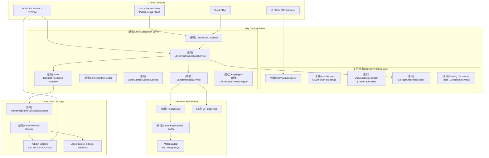
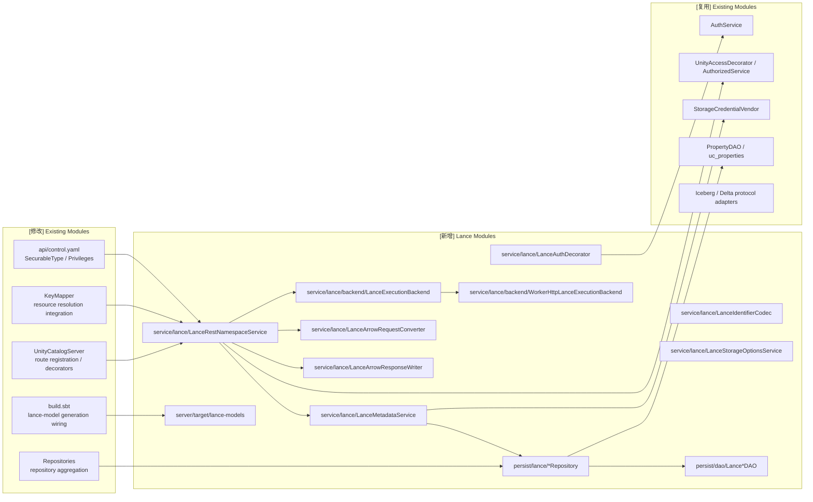
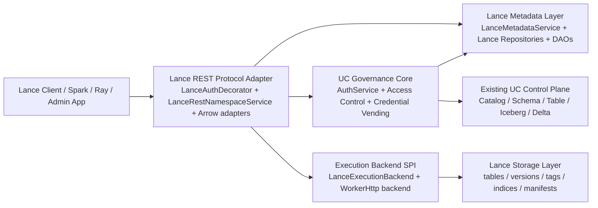
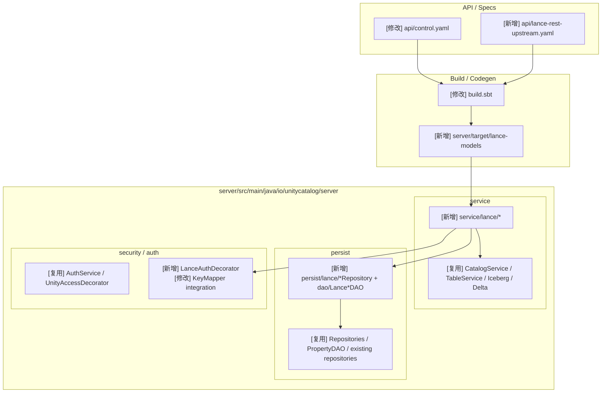
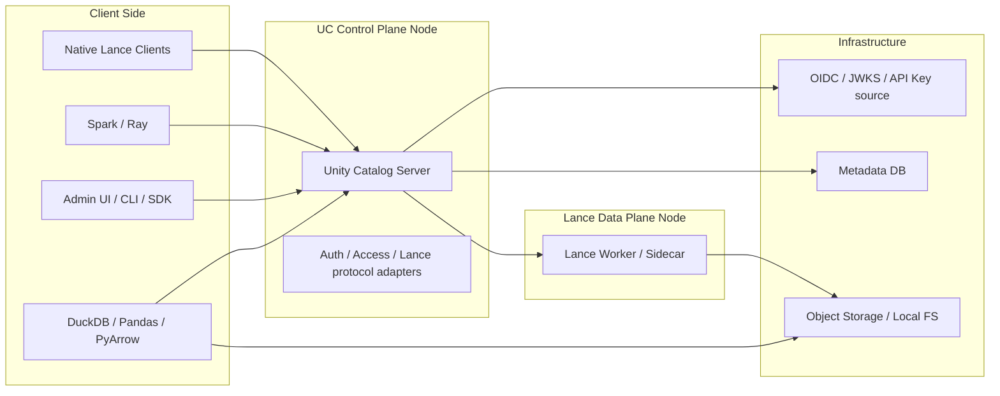
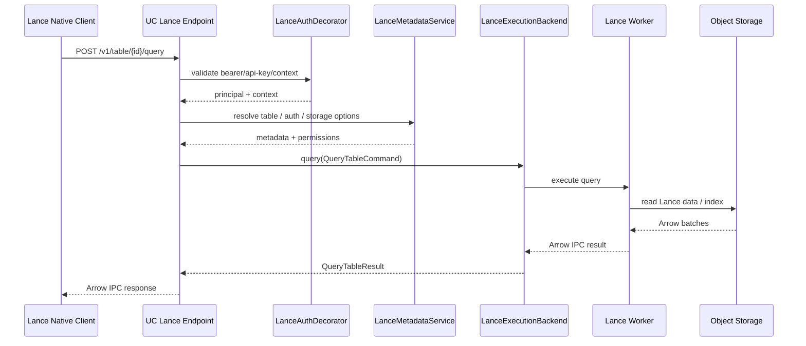
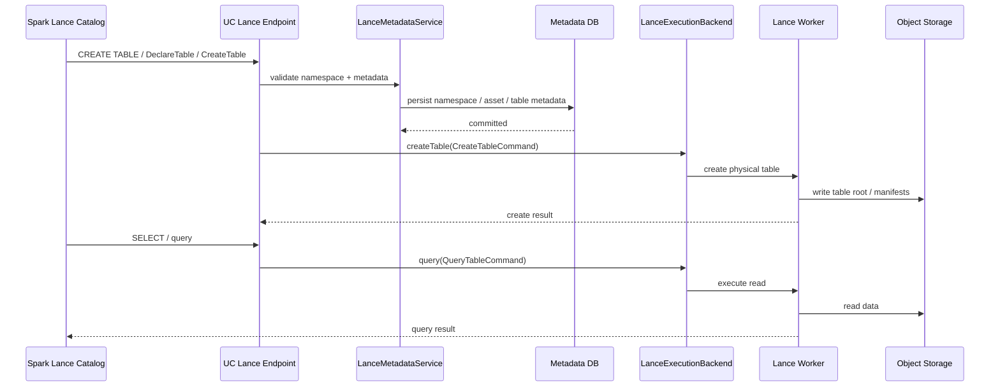
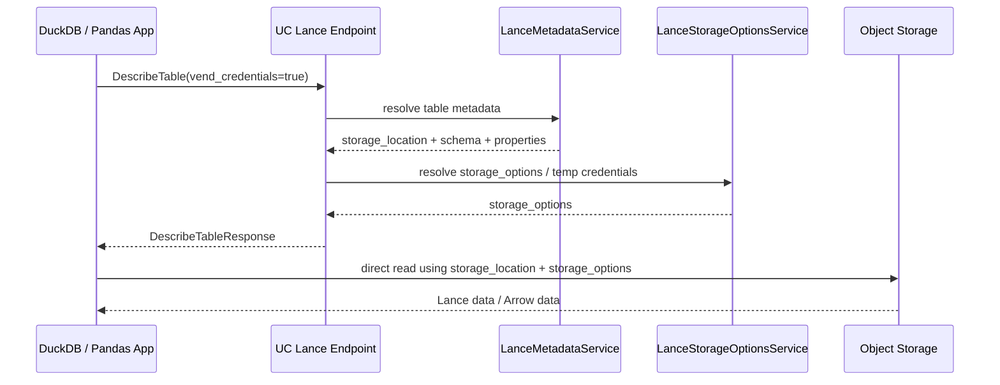

# Unity Catalog 支持 LanceDB REST API 的技术设计

更新日期：2026-05-12

关联需求文档：`docs/unitycatalog-lancedb-rest-api-requirements.md`

## 1. 设计目标

本文档基于当前 Unity Catalog（以下简称 UC）代码结构，给出一版可落地的 LanceDB REST API 技术设计。目标不是只做一个“表接口兼容层”，而是让 UC 具备以下能力：

- 作为 Lance 原生 Client 可直接接入的 REST namespace 服务端
- 支持任意深度 namespace / path
- 管理 Lance 的全量资产，而不仅是 table
- 保持 UC 现有认证、授权、审计、凭证下发与外部位置治理能力
- 尽量复用 UC 当前的协议适配、仓储、授权和服务注册机制

## 2. 当前代码基础

本设计直接建立在以下现有实现之上：

- 协议服务注册入口：`server/src/main/java/io/unitycatalog/server/UnityCatalogServer.java`
- UC 原生表控制面：`server/src/main/java/io/unitycatalog/server/service/TableService.java`
- Iceberg 协议适配：`server/src/main/java/io/unitycatalog/server/service/IcebergRestCatalogService.java`
- Delta 协议适配：`server/src/main/java/io/unitycatalog/server/service/delta/DeltaRestCatalogService.java`
- OAuth token exchange：`server/src/main/java/io/unitycatalog/server/service/AuthService.java`
- 当前 Bearer 校验装饰器：`server/src/main/java/io/unitycatalog/server/service/AuthDecorator.java`
- 授权公共基类：`server/src/main/java/io/unitycatalog/server/service/AuthorizedService.java`
- 资源键解析：`server/src/main/java/io/unitycatalog/server/auth/decorator/KeyMapper.java`
- 当前三层表仓储：`server/src/main/java/io/unitycatalog/server/persist/TableRepository.java`
- 通用属性表：`server/src/main/java/io/unitycatalog/server/persist/dao/PropertyDAO.java`

当前代码已经证明三件事：

1. UC 已支持“协议适配服务”模式，而不仅是 `api/all.yaml` 驱动的控制面。
2. UC 已有可复用的 OAuth token exchange 和内部访问令牌体系。
3. UC 当前持久层和授权键解析都默认围绕 `catalog -> schema -> table` 工作，无法原样承载 Lance 的多层 namespace。

## 3. 关键设计决策

### 3.1 不把 Lance 直接塞回 `TableService`

Lance 端点不应直接落在现有 `TableService` / `SchemaService` 上，而应新增一组协议服务，原因有三点：

- Lance REST 路由形态、输入输出模型和 Arrow IPC 语义与 UC 控制面不同
- Lance 需要任意深度 namespace，现有 `TableRepository` 强依赖三段式全名
- Lance 存在 index / version / tag / transaction 等非 table 资产

因此，技术上应复用 `IcebergRestCatalogService` 的思路，而不是继续扩张 `TableService`

### 3.2 不以 `DataSourceFormat=LANCE` 作为主设计

`DataSourceFormat` 可以作为兼容字段，但不能承担 Lance 全量建模职责。主设计必须是：

- Lance 协议适配层
- Lance 专用元数据模型
- Lance 执行后端 SPI

### 3.3 保留与官方 Lance Unity 兼容文档的桥接能力

Lance 官方当前的 Unity 集成文档仍基于 UC 的固定三层模型，使用：

- `table_type=EXTERNAL`
- `properties.table_type=lance`
- `data_source_format=TEXT`

该模式适合作为“legacy bridge”，用于识别和迁移已有基于旧约束写入 UC 的 Lance table，但不应作为最终主模型。

## 4. 目标架构

## 4.1 分层结构

建议采用四层结构：

1. UC Unified Governance Core
2. Lance Metadata Layer
3. Lance REST Protocol Adapter
4. Lance Execution Backend

职责如下：

- UC Unified Governance Core
  - 认证
  - 授权
  - 审计
  - 凭证下发
  - 外部位置与存储策略
- Lance Metadata Layer
  - 任意深度 namespace
  - Lance 资产元数据
  - 属性、版本与状态信息
- Lance REST Protocol Adapter
  - 暴露 Lance 规范端点
  - 处理 identifier 编解码
  - 处理 header / auth / Arrow IPC 适配
- Lance Execution Backend
  - query
  - insert / merge / update / delete
  - index
  - version / tag / transaction

## 4.2 路由与服务注册

建议新增 UC 内部挂载点：

- `/api/2.1/unity-catalog/lance/v1/...`

这样有两个好处：

- 复用 `BASE_PATH` 下现有的装饰器与部署方式
- 对外仍然是单一 UC 服务，只是增加了 Lance 协议面

在 `UnityCatalogServer` 中新增：

- `addLanceApiServices(...)`

并在其中注册新的 annotated services。

这里需要明确遵循 UC 现有 API 架构约束：

- Lance 路由必须由 `UnityCatalogServer` 手写挂载
- Lance 业务入口必须是手写 annotated service
- 不能把 Lance OpenAPI 直接当成“生成 controller / route”的来源
- Lance 协议 YAML 的职责是契约、模型和文档，而不是运行时路由配置

## 4.2.1 上游协议基线

为避免后续实现偏离上游真实语义，Lance 路由设计需要固定一份“协议优先级”：

1. 以 `lancedb-docs/docs/api-reference/rest/openapi.yml` 为正式 REST 契约基线
2. 以 `lancedb` 仓库中的 Rust / Python / Java 客户端实现作为客户端行为校验基线
3. 如果客户端便利方法与 OpenAPI 快照存在差异，服务端以 OpenAPI 契约为准，同时在兼容测试中记录客户端的实际调用路径

本次本地分析使用的快照为：

- `lancedb`：`a92ae0ded522`
- `lancedb-docs`：`6c0ccc001e6b`

其中 namespace 相关 endpoint 和 HTTP 方法需要明确按上游契约实现：

- `GET /v1/namespace/{id}/list`
- `POST /v1/namespace/{id}/create`
- `POST /v1/namespace/{id}/describe`
- `POST /v1/namespace/{id}/drop`
- `POST /v1/namespace/{id}/exists`
- `GET /v1/namespace/{id}/table/list`

说明：

- `namespace exists` 在正式 REST OpenAPI 中是存在的
- 当前本地 Python namespace 包装层并没有把 `namespace_exists` 暴露成单独的高层便利方法，因此客户端兼容测试需要区分“协议契约存在”和“某语言包装层是否直接暴露该方法”这两个层次

## 4.3 实施后高层架构图

基于 `docs/unitycatalog-project-analysis.md` 中现有 UC 高层架构，需求实现后的目标架构应演进为“统一治理核心 + Lance 协议适配层 + Lance 元数据层 + 可插拔执行后端”的形态。



与现有架构相比，新增的关键变化是：

- 增加 Lance 协议适配层，而不是继续扩张现有 `TableService`
- 增加 Lance 专用元数据层，而不是强行复用三层表模型
- 增加可插拔执行后端与 worker/sidecar 路径，承接 Arrow IPC、索引、事务等数据面能力

## 4.4 实施后模块图

模块标注约定：

- `[新增]`：当前 UC 仓库中不存在，需要新建的模块
- `[修改]`：当前存在，但需要调整职责、路由、字段或接线方式的模块
- `[复用]`：当前存在，且整体可直接复用的模块



建议按下表追踪模块实施范围：

| 状态 | 模块 | 代码位置 | 职责 |
|---|---|---|---|
| `[修改]` | `UnityCatalogServer` | `server/.../UnityCatalogServer.java` | 注册 Lance 路由、decorator、worker backend |
| `[修改]` | `Repositories` | `server/.../persist/Repositories.java` | 聚合 Lance repositories |
| `[修改]` | `KeyMapper` | `server/.../auth/decorator/KeyMapper.java` | 接入 Lance 资源键解析 |
| `[修改]` | `api/control.yaml` | `api/control.yaml` | 扩充 `SecurableType` / `Privilege` |
| `[修改]` | `build.sbt` | `build.sbt` | 增加 Lance OpenAPI 模型生成任务 |
| `[新增]` | `LanceRestNamespaceService` | `server/.../service/lance/` | Lance REST namespace / table / tag / version / transaction 入口 |
| `[新增]` | `LanceMetadataService` | `server/.../service/lance/` | 统一封装 Lance 元数据语义 |
| `[新增]` | `LanceAuthDecorator` | `server/.../service/lance/` | Bearer / OAuth2 / API key / context 适配 |
| `[新增]` | `LanceIdentifierCodec` | `server/.../service/lance/` | namespace path / delimiter 编解码 |
| `[新增]` | `LanceStorageOptionsService` | `server/.../service/lance/` | 生成 Lance `storage_options` |
| `[新增]` | `LanceExecutionBackend` | `server/.../service/lance/backend/` | 数据面 SPI |
| `[新增]` | `WorkerHttpLanceExecutionBackend` | `server/.../service/lance/backend/` | 代理 worker/sidecar 的 HTTP backend |
| `[新增]` | `Lance repositories / DAOs` | `server/.../persist/` | 持久化 namespace / asset / index / version / tag / transaction |
| `[新增]` | `lance-models` | `server/target/lance-models` | 生成 Lance DTO 模型 |

## 4.5 4+1 视图

本节基于 `docs/unitycatalog-project-analysis.md` 中已有的 UC 系统架构理解，给出需求实现之后的完整 `4+1` 视图。

## 4.5.1 逻辑视图

逻辑视图回答“系统由哪些逻辑职责块组成，以及它们如何协作”。



逻辑要点：

- Lance 协议面是 UC 控制平面的新增逻辑入口，而不是替代现有 `/tables`、Iceberg、Delta 能力
- 治理核心仍由 UC 统一负责，Lance 只是在其上暴露新的协议面
- 数据面与元数据面通过 `LanceExecutionBackend` 解耦

## 4.5.2 开发视图

开发视图回答“代码如何按包、模块、生成产物和依赖关系组织”。



开发要点：

- 协议 DTO 尽量走 codegen
- Lance 逻辑聚焦在 `service/lance` 与 `persist/lance`
- 现有 UC 服务保留，只通过 `UnityCatalogServer`、`Repositories`、`KeyMapper` 等少数聚合点接入

## 4.5.3 进程视图

进程视图回答“运行时有哪些活动进程、同步调用和异步任务”。

```mermaid
flowchart TB
    subgraph SyncPath["Synchronous Request Path"]
        C1["Client request"]
        R1["Armeria route match"]
        R2["LanceAuthDecorator"]
        R3["UnityAccessDecorator"]
        R4["LanceRestNamespaceService"]
        R5["Metadata transaction"]
        R6{"Metadata-only?"}
        R7["DB write / read and return"]
        R8["Execution backend call"]
        R9["Worker / storage I/O"]
        R10["HTTP response"]

        C1 --> R1 --> R2 --> R3 --> R4 --> R5 --> R6
        R6 -- Yes --> R7 --> R10
        R6 -- No --> R8 --> R9 --> R10
    end

    subgraph AsyncPath["Asynchronous Build / Transaction Path"]
        A1["CreateIndex / BatchCommit request"]
        A2["Persist QUEUED status / transaction_id"]
        A3["Worker picks task"]
        A4["Worker updates progress / status"]
        A5["Client polls DescribeTransaction / index stats"]

        A1 --> A2 --> A3 --> A4
        A5 -.-> A4
    end
```



进程要点：

- metadata-only 请求不必穿过执行后端
- query / insert / merge / index 等数据面请求需走 `LanceExecutionBackend`
- index build 和部分 batch/transaction 操作天然适合异步化

## 4.5.4 物理视图

物理视图回答“系统最终部署在哪些节点上，以及节点之间怎么连”。



物理要点：

- UC server 仍是控制平面入口
- Lance worker / sidecar 是可独立扩缩的执行节点
- DuckDB / Pandas 这类非 REST 原生引擎可能在拿到 `storage_location` / `storage_options` 后直接访问存储

## 4.5.5 场景视图

场景视图回答“关键用例在这些模块之间如何实际流转”。

### 场景 A：原生 Lance Client 查询表



### 场景 B：Spark 通过 Lance catalog 创建并查询表



### 场景 C：DuckDB / Pandas 通过 UC 解析元数据后直连存储



场景要点：

- 原生 Lance client 走完整协议面与数据面
- Spark / Ray 走官方 catalog / namespace 接入面
- DuckDB / Pandas 这类非 REST 原生引擎主要消费 UC 提供的元数据和凭证，而不是直接依赖 UC 代执行查询

## 5. 模块设计

## 5.1 服务层

建议新增包：

- `server/src/main/java/io/unitycatalog/server/service/lance`

首批类建议如下：

- `LanceRestNamespaceService`
  - namespace CRUD
  - table metadata lifecycle
  - index / version / tag / transaction 元数据端点
- `LanceIdentifierCodec`
  - 负责 `$` 分隔符与 list-style path 的互转
  - 负责 namespace / table id 解析
- `LanceStorageOptionsService`
  - 负责根据 UC 的 `StorageCredentialVendor` 生成 Lance 所需 `storage_options`
- `LanceMetadataService`
  - 对上封装业务语义
  - 对下调用仓储
- `LanceExecutionBackend`
  - 数据面 SPI
- `WorkerHttpLanceExecutionBackend`
  - 面向独立 Lance worker 的 HTTP 代理实现
- `LanceArrowRequestConverter`
  - 处理 `application/vnd.apache.arrow.stream`
- `LanceArrowResponseWriter`
  - 输出 Arrow IPC file/stream

与服务层直接协作、需要在设计中同步明确职责的 repository：

- `LanceApiKeyRepository`
  - 负责按 `key_hash` 查询 API key 绑定的 principal、状态与有效期
  - 负责校验 key 是否处于可用状态，例如 active / expired / revoked
  - 负责记录 `last_used_at` 等使用痕迹，供审计与风控使用
  - 供 `LanceAuthDecorator` 在 `x-api-key` 鉴权分支中直接调用

说明：

- `LanceApiKeyRepository` 从分层上属于持久化层，而不是 service 层本身
- 但由于它是 `LanceAuthDecorator` 的关键依赖，为避免实现时遗漏，这里在服务设计中显式列出其职责

## 5.2 认证与鉴权

当前 `AuthDecorator` 只接受 UC 内部 issuer 的 Bearer token，不适合直接用于 Lance 路由。

因此建议新增：

- `LanceAuthDecorator`

其处理顺序建议为：

1. 如果是 UC 内部 Bearer token，沿用当前内部校验逻辑
2. 如果是外部 Bearer token，按 OAuth token exchange 规则转换为 UC 内部 principal
3. 如果是 `x-api-key`，映射到 UC service principal 或 user principal
4. 解析并保存 Lance context headers

需要同步调整 `UnityCatalogServer.addSecurityDecorators(...)`：

- 让当前 `AuthDecorator` 排除 `/api/2.1/unity-catalog/lance/**`
- 只在 Lance 路由上应用 `LanceAuthDecorator`
- 保持 `UnityAccessDecorator` 仍覆盖 Lance 路由，以复用授权表达式框架

## 5.3 认证映射规则

建议明确使用 UC 已有的 `/api/1.0/unity-control/auth/tokens` 能力承接外部 Bearer token 的 token exchange。

推荐映射：

- OAuth2 / BearerAuth
  - 进入 `LanceAuthDecorator`
  - 对外部 token 做 issuer / audience / signature 校验
  - 复用 `AuthService.grantToken()` 语义生成 UC 内部 access token
  - 将内部 principal 挂到请求上下文
- ApiKeyAuth
  - 通过新建 `LanceApiKeyRepository` 完成映射
  - 将 key 绑定到 user 或 service principal

Lance context headers 需要单独保存在请求上下文中，供：

- 多租户路由
- namespace root 选择
- 审计日志
- 后端执行 SPI

实现补充：

- 外部 Bearer token 的 issuer 白名单与 audience 校验直接复用 UC 现有配置：
  - `server.allowed-issuers`
  - `server.audiences`
- `LanceAuthDecorator` 不应通过回环 HTTP 再调用 `/tokens`，而应把 `AuthService.grantToken()` 中的核心 token exchange 逻辑下沉到可复用的内部 helper / service，由 decorator 直接调用
- `x-api-key` 不建议复用现有 cloud credential 表语义，推荐新增：
  - `uc_lance_api_keys`
  - `LanceApiKeyRepository`
- `uc_lance_api_keys` 最小字段建议包括：
  - `id`
  - `key_hash`
  - `principal_id`
  - `principal_type`
  - `status`
  - `created_at`
  - `created_by`
  - `last_used_at`
- API key 在数据库中只保存哈希，不保存明文

## 5.4 OpenAPI 与模型策略

Lance 协议面不建议直接并入 `api/all.yaml`，因为它不是 UC 原生控制面 API，而是一个协议兼容面。

建议采用两套规范：

- `api/control.yaml`
  - 继续描述 UC 控制面
  - 仅扩充 `SecurableType`、`Privilege` 等治理相关枚举
- 新增 `api/lance-rest-upstream.yaml`
  - 固定一份上游 Lance OpenAPI 快照
  - 用于生成 Lance 请求/响应 DTO

建议新增一个类似 `serverModels` 的生成目标，例如：

- `server/target/lance-models`

生成包建议：

- `io.unitycatalog.lance.model`

说明：

- JSON 请求/响应对象使用 codegen 生成
- Arrow IPC 请求体与响应体仍由自定义 converter / writer 处理

### 5.4.1 与 UC API 架构的一致性要求

根据 `docs/unitycatalog-api-architecture-analysis.md`，UC 当前 API 架构的基本原则是：

- OpenAPI YAML 是统一契约与模型源头
- `sbt` 负责围绕契约生成模型、SDK、文档
- 后端 Route / Service / Repository / DAO 仍然是手写实现

因此 Lance 设计必须保持同样约束：

- `api/lance-rest-upstream.yaml` 只用于生成模型和文档，不生成 server 端业务实现
- `UnityCatalogServer.addLanceApiServices(...)` 手写挂载 Lance routes
- `LanceRestNamespaceService`、`LanceMetadataService`、`Lance repositories` 继续采用手写实现
- 生成模型用于：
  - service 入参
  - service 出参
  - 枚举
  - one-of / union DTO

### 5.4.2 Lance Server Models 的使用方式

建议让 `server/target/lance-models` 的生成产物扮演和当前 `server/target/models` 类似的角色，即：

- 生成请求对象
- 生成响应对象
- 生成协议枚举
- 生成 one-of DTO

而不是：

- 生成 controller
- 生成 route
- 生成 repository

服务端推荐链路应明确写成：

```text
HTTP request
  -> UnityCatalogServer 手写路由挂载
  -> LanceRestNamespaceService(生成模型入参)
  -> LanceMetadataService / LanceExecutionBackend
  -> Lance repositories / DAO
  -> 生成模型响应对象
```

### 5.4.3 Lance SDK 生成链策略

当前 UC 仓库里的 `clients/java`、`clients/python` 主要围绕：

- `api/all.yaml`
- `api/control.yaml`
- `api/delta.yaml`

生成 UC 自身控制面与协议面的 SDK。

对于 Lance，建议首阶段不要直接并入现有 UC SDK 主生成链，而采用更稳妥的策略：

- Phase 0 / Phase 1
  - 只生成 `lance-models`
  - 不强制生成新的 UC Java/Python Lance SDK
- 后续如确实需要 UC 自带 Lance SDK
  - 新增独立模块，例如 `clients/lance-java`、`clients/lance-python`
  - 明确区分“UC 控制面 SDK”和“Lance 协议兼容 SDK”

这样做的原因是：

- 现有 `clients/java` / `clients/python` 的定位是 UC 官方 API SDK
- Lance 原生生态已经有自己的 client 语义和实现
- 过早把 Lance 协议硬塞进现有 UC SDK 主链，会混淆“UC 原生 API”和“兼容协议 API”的边界

### 5.4.4 文档与前端类型生成边界

参照 UC 现有构建链，Lance 协议规范后续可以进入：

- Markdown API docs
- 可选的前端类型生成

但首阶段建议约束为：

- 先保证 server models 和设计文档一致
- 不把 Lance 协议默认暴露给现有 UI 的主类型生成链

原因是：

- 当前 UI 主要面向 UC 控制面对象
- Lance REST 更偏协议兼容层，不一定直接进入 UC 管理 UI
- 如果未来 UI 要增加 Lance 资产管理页，再单独引入 `lance` 相关 TS types 会更清晰

## 6. 元数据模型设计

## 6.1 总体原则

不改造现有 `uc_catalogs` / `uc_schemas` / `uc_tables` 作为 Lance 的主存储，而是新增 Lance 专用表。

原因：

- 现有表的主键和查询方式强绑定三层对象
- `KeyMapper` 和 `TableRepository.getTable(fullName)` 强依赖点号分隔三段式
- 直接重写现有模型会让 UC 其他对象全面受影响

因此推荐“并行元数据模型 + 兼容桥接层”。

## 6.2 命名空间表

建议新增：

- `uc_lance_namespaces`

字段建议：

- `id`
- `name`
- `parent_namespace_id`
- `root_scope_id`
- `depth`
- `path_key`
- `display_name`
- `owner`
- `created_at`
- `created_by`
- `updated_at`
- `updated_by`

关键约束：

- `(parent_namespace_id, name)` 唯一
- `(root_scope_id, path_key)` 唯一

说明：

- `name` 只保存当前 segment
- `parent_namespace_id` 建树
- `path_key` 作为快速查找键，使用“按 segment 百分号编码后用 `/` 拼接”的内部 canonical 形式
- namespace properties 直接复用 `uc_properties`
  - `entity_type = lance_namespace`
- `root_scope_id` 表示 Lance 命名空间树的根锚点
  - 在当前 UC OSS 单 metastore 形态下，`root_scope_id` 推荐直接取 UC `metastore_id`
  - 后续如果要支持多 root / 多 tenant Lance tree，可再把它演进为指向独立 `uc_lance_roots` 之类的根作用域表

示例：

- namespace path：`["ml", "team", "embeddings"]`
- canonical `path_key`：`ml/team/embeddings`
- 默认外部 delimiter 为 `$` 时，对外 identifier：`ml$team$embeddings`
- 自定义 delimiter 为 `.` 时，对外 identifier：`ml.team.embeddings`

设计约束：

- `path_key` 只保存“规范化后的 path segments”，不保存客户端选择的 delimiter 语义
- 同一条 namespace path 可以通过不同 delimiter 表达，因此 delimiter 属于请求级协议表示，不属于持久化主键的一部分

## 6.3 资产主表

建议新增：

- `uc_lance_assets`

字段建议：

- `id`
- `name`
- `namespace_id`
- `asset_type`
- `canonical_identifier`
- `state`
- `owner`
- `created_at`
- `created_by`
- `updated_at`
- `updated_by`

`asset_type` 最少包括：

- `TABLE`
- `INDEX`
- `VERSION`
- `TAG`
- `TRANSACTION`

不单独建模为 `asset_type` 的对象：

- `NAMESPACE`
  - namespace 使用独立的层级表 `uc_lance_namespaces`
- `SCHEMA`
  - Lance 的 schema 属于 table 元数据和 schema evolution 范畴，不作为独立治理资产
- `MANIFEST`
  - manifest 是 version 的物理明细，不作为一等治理资产

资产通用属性继续复用 `uc_properties`

- `entity_type = lance_asset`

## 6.4 表资产明细表

建议新增：

- `uc_lance_tables`

字段建议：

- `asset_id`
- `storage_location`
- `table_uri`
- `arrow_schema_json`
- `storage_options_template_json`
- `managed_versioning`
- `current_version`
- `stats_json`
- `legacy_uc_table_id` 可空

说明：

- `legacy_uc_table_id` 用于桥接旧的 `EXTERNAL + table_type=lance` 表
- `arrow_schema_json` 保留 Lance 原生 schema，不压缩成 UC `ColumnInfo`
- `storage_options_template_json` 只保存非敏感、可长期存在的存储配置模板，例如 endpoint、region、path-style、storage provider 类型
- 任何短期凭证、临时 session token、STS token、`expires_at_millis` 等信息都不能持久化到该字段
- `vend_credentials=true` 时返回的 `storage_options` 必须在请求时动态生成，并与模板字段合并后返回

## 6.5 索引、版本、标签、事务明细表

建议新增：

- `uc_lance_indices`
- `uc_lance_versions`
- `uc_lance_tags`
- `uc_lance_transactions`

DDL 时序建议：

- Phase 0 / Phase 1 只创建：
  - `uc_lance_namespaces`
  - `uc_lance_assets`
  - `uc_lance_tables`
- 以下 4 张表统一在 Phase 3 再创建：
  - `uc_lance_indices`
  - `uc_lance_versions`
  - `uc_lance_tags`
  - `uc_lance_transactions`
  - 避免在 metadata compatibility 阶段过早引入尚未消费的高级资产表

最小字段：

- 索引：`asset_id`、`table_asset_id`、`index_type`、`target_columns_json`、`distance_type`、`build_params_json`、`stats_json`、`status`、`build_progress`、`queued_at`、`started_at`、`finished_at`、`failure_reason`
- 版本：`asset_id`、`table_asset_id`、`version_number`、`manifest_path`、`manifest_size`、`etag`、`metadata_json`
- 标签：`asset_id`、`table_asset_id`、`tag_name`、`target_version`、`metadata_json`
- 事务：`asset_id`、`transaction_key`、`table_asset_id`、`status`、`actions_json`、`commit_metadata_json`

索引状态建议使用内部枚举 `IndexBuildStatus`：

- `QUEUED`
- `BUILDING`
- `READY`
- `FAILED`
- `CANCELED`

其中：

- `status` 用于对外协议映射和 UI / CLI 展示
- `build_progress` 取值范围建议定义为 `0..100`
- `queued_at` / `started_at` / `finished_at` 用于排障和审计
- `failure_reason` 用于记录异步构建失败原因

## 6.6 API Key 映射表

为承接 `x-api-key -> UC principal` 的认证映射，建议新增：

- `uc_lance_api_keys`

最小字段建议：

- `id`
- `key_hash`
- `principal_id`
- `principal_type`
- `status`
- `created_at`
- `created_by`
- `updated_at`
- `updated_by`
- `expires_at`
- `revoked_at`
- `last_used_at`

字段说明：

- `key_hash`
  - 只保存 API key 哈希，不保存明文
  - 查询时由 `LanceAuthDecorator` 对传入 key 做同样哈希后匹配
- `principal_id`
  - 指向绑定的 user principal 或 service principal
- `principal_type`
  - 标识 principal 类型，至少支持 user / service principal
- `status`
  - 建议至少支持 `ACTIVE`、`EXPIRED`、`REVOKED`
- `expires_at`
  - 表示 key 的到期时间；为空时表示长期有效，但仍可被 `revoked_at` 撤销
- `revoked_at`
  - 表示 key 被主动吊销的时间
- `last_used_at`
  - 用于审计、风控与过期清理分析

设计约束：

- `key_hash` 需要全局唯一
- API key 不属于 Lance 治理资产，不进入 `uc_lance_assets`
- `uc_lance_api_keys` 属于认证辅助表，因此应在 Phase 0 / Phase 1 随基础模型一并落地
- 如后续需要支持 key 轮换、前缀展示或多重哈希算法，可在不破坏主键模型的前提下扩展 `key_id`、`key_prefix`、`hash_algorithm` 等字段

## 6.7 Tag / Version 协议覆盖要求

技术设计中必须显式覆盖 Lance 的版本与标签端点，而不能只在资产模型里抽象提到 `version` / `tag`。

Version 端点至少包括：

- `/v1/table/{id}/version/list`
- `/v1/table/{id}/version/create`
- `/v1/table/{id}/version/describe`
- `/v1/table/{id}/version/delete`
- `/v1/table/version/batch-create`

Tag 端点至少包括：

- `/v1/table/{id}/tags/list`
- `/v1/table/{id}/tags/version`
- `/v1/table/{id}/tags/create`
- `/v1/table/{id}/tags/delete`
- `/v1/table/{id}/tags/update`

设计约束：

- `version` 与 `tag` 既是协议对象，也是 UC 可治理资产
- 元数据层需要能索引与审计这些对象
- 执行后端需要对变更类操作保持物理状态一致性
- `batch-create versions` 与 `batch-commit tables` 必须分开建模

## 6.8 Transaction 状态枚举

事务状态应直接对齐 Lance 协议中的 `TransactionStatus`，并在 UC 内部保存一份规范化枚举：

- `QUEUED`
- `RUNNING`
- `SUCCEEDED`
- `FAILED`
- `CANCELED`

兼容要求：

- 对外协议层应接受 Lance 定义的 PascalCase / snake_case 变体
- 对内持久化统一规范为大写枚举值
- `DescribeTransactionResponse` 与 `AlterTransactionResponse` 必须返回可映射回 Lance 协议的状态值
- 审计日志中应同时保留状态变更前后值

## 7. 授权模型设计

## 7.1 新增资源类型

当前 `SecurableType` 不足以表达 Lance 资产。建议扩充 `api/control.yaml`，并重新生成模型，新增：

- `lance_namespace`
- `lance_table`
- `lance_index`
- `lance_version`
- `lance_tag`
- `lance_transaction`

## 7.2 新增权限类型

建议把 Lance 相关权限分成“首阶段最小集合”和“后续扩展集合”两层。

Phase 1 最小集合：

- `CREATE_NAMESPACE`
- `USE_NAMESPACE`
- `READ_METADATA`
- `MODIFY`

数据面继续复用：

- `SELECT`
- `MODIFY`

Phase 3 扩展集合：

- `CREATE_INDEX`
- `MANAGE_VERSION`
- `MANAGE_TAG`
- `MANAGE_TRANSACTION`

说明：

- Lance REST 协议本身不定义这些 UC 内部 privilege 名称
- 这些权限是 UC 为了接入统一治理、审计和授权体系而增加的内部权限语义
- 因此不应把它们表述成“Lance 官方权限模型”，而应表述成“UC 对 Lance 资产的治理权限扩展”

## 7.3 层级关系

建议授权继承树如下：

- `METASTORE`
  - `CATALOG` 或 Lance root
    - `LANCE_NAMESPACE`
      - 子 `LANCE_NAMESPACE`
        - `LANCE_TABLE`
          - `LANCE_INDEX`
          - `LANCE_VERSION`
          - `LANCE_TAG`
          - `LANCE_TRANSACTION`

`AuthorizedService` 的层级授权初始化模式可以继续复用：

- 创建 namespace 时，把 parent namespace 设为父资源
- 创建 asset 时，把所属 namespace 设为父资源

## 7.4 资源键解析

需要扩展 `KeyMapper`，使其支持：

- Lance namespace identifier -> `LANCE_NAMESPACE` UUID
- Lance table identifier -> `LANCE_TABLE` UUID
- Lance index / version / tag / transaction -> 对应 asset UUID

建议新增：

- `LanceResourceKeyMapper`

并由 `KeyMapper` 组合调用，而不是把 Lance 逻辑继续堆进三段式解析分支。

关系建议：

- `KeyMapper` 保留为统一入口
- `LanceResourceKeyMapper` 作为 `KeyMapper` 的专用委托组件
- 当 `resourceKeys` 中出现 `LANCE_*` 类型时，`KeyMapper` 将请求转交给 `LanceResourceKeyMapper`
- 原有 `CATALOG / SCHEMA / TABLE / VOLUME ...` 逻辑保持不变

任意深度 namespace 的处理方式：

- 鉴权检查时不需要在 `Map<SecurableType, Object>` 中展开“所有父 namespace UUID”
- 对“已有对象”的授权：
  - 只需要解析当前目标资源 UUID
  - 父级继承关系通过 `AuthorizedService` / authorizer 中持久化的 parent-child 关系表达
- 对“创建子对象”的授权：
  - 解析父 namespace UUID 作为授权目标
  - 例如创建 `["ml", "team", "embeddings"]` 时，检查父 namespace `["ml", "team"]`

这样可以避免因为 `Map<SecurableType, Object>` 不能同时容纳多层重复 `LANCE_NAMESPACE` 键而扭曲模型。

## 8. 协议与请求流设计

## 8.1 Identifier 编解码

新增 `LanceIdentifierCodec`，负责：

- 默认 `$` 分隔
- 可配置自定义 `delimiter`
- 路由 path string -> `List<String> pathSegments`
- namespace id / table id 的合法性校验

建议统一内部形式：

- namespace：`List<String> namespacePath`
- table：`namespacePath + tableName`

补充约束：

- 协议层必须严格按上游 OpenAPI 定义的 HTTP 方法实现
- `namespace/list` 和 `namespace/table/list` 使用 `GET`
- `namespace/create` / `namespace/describe` / `namespace/drop` / `namespace/exists` 使用 `POST`
- `table/register` / `table/describe` / `table/exists` / `table/drop` / `table/deregister` / `table/declare` / `table/create-empty` 使用上游定义的方法，不得自行改为“更 RESTful 的替代形态”

## 8.2 Legacy bridge

为了兼容官方当前 Unity 集成规范，新增只读/可迁移桥接逻辑：

- 识别 UC 原生 `TableInfo`
- 满足以下条件时视为 legacy Lance table
  - `table_type = EXTERNAL`
  - `properties.table_type = lance`
  - `data_source_format = TEXT`

该桥接层的职责：

- 让已有 legacy Lance 表可被 `DescribeTable` / `ListTables` 读到
- 提供迁移命令或后台任务，将其导入 `uc_lance_assets` / `uc_lance_tables`

### 8.2.1 与 Lance 官方 Unity 集成规范的具体核对

根据 Lance 官方当前 Unity 集成规范，legacy Unity namespace 的行为边界应视为已知事实，而不是推测：

- 配置项以 `endpoint`、`auth_token`、`connect_timeout`、`read_timeout`、`max_retries`、`root` 为主
- namespace 只支持两级标识：`[catalog, schema]`
- table 只支持三级标识：`catalog.schema.table`
- table 在 UC 中按 `EXTERNAL` 表示
- `data_source_format` 使用 `TEXT`
- `properties.table_type=lance` 用于识别 Lance table
- `storage_location` 指向 Lance table root
- `columns` 保存从 Arrow schema 转换来的 UC column 结构

按官方文档，目前 Unity 集成公开定义的基本操作仅包括：

- `CreateNamespace`
- `ListNamespaces`
- `DescribeNamespace`
- `DropNamespace`
- `DeclareTable`
- `ListTables`
- `DescribeTable`
- `DeregisterTable`

并且还带有几个明确限制：

- `DropNamespace` 只支持 `RESTRICT`，未实现 `CASCADE`
- `DescribeTable` 只公开 `load_detailed_metadata=false` 行为
- `DescribeTable` 在该模式下只保证 location 和 storage options，其他字段可为空
- 该规范并未覆盖多层 namespace、query、index、tag、version、transaction 等完整 Lance REST 语义

### 8.2.2 本设计对官方 Unity 集成规范的处理方式

因此本设计对官方 Unity 集成规范的态度是：

- 将其视作 `legacy bridge` 的来源规范
- 保证对现有三层 UC 映射的识别与迁移能力
- 不把它当成最终外部行为上限

具体落地要求：

- `legacy bridge` 必须完整识别官方规范定义的 Lance table 条件
- 迁移工具必须能够从 legacy Unity table 自动构造 Lance namespace / asset 记录
- 对外主协议仍以 Lance REST Namespace API 为准，而不是以 legacy Unity 约束为准
- 对 Spark / Ray / 原生 namespace client 的兼容测试，应优先验证新 Lance REST 面，而不是只验证 legacy Unity bridge

## 8.3 凭证与 `storage_options`

建议复用现有 `StorageCredentialVendor`，新增 `LanceStorageOptionsService` 将 UC 的云凭证转换成 Lance 客户端能理解的 `storage_options`。

触发场景：

- `DescribeTable(vend_credentials=true)`
- `DeclareTable`
- query / insert / create 等需要把存储配置透传给执行后端的场景

## 8.4 执行后端 SPI

由于 UC 当前是 Java 服务，而 Lance 的完整数据面和索引能力主要不在 UC 现有核心里，建议不要在首版中把全部执行逻辑直接塞进 UC 主进程。

新增接口：

- `LanceExecutionBackend`

### 8.4.1 建议接口签名

建议接口形态如下：

```java
public interface LanceExecutionBackend {
  CreateTableResult createTable(CreateTableCommand cmd);
  CreateEmptyTableResult createEmptyTable(CreateEmptyTableCommand cmd);
  UpdateTableSchemaMetadataResult updateTableSchemaMetadata(UpdateTableSchemaMetadataCommand cmd);
  AlterTableAddColumnsResult addColumns(AlterTableAddColumnsCommand cmd);
  AlterTableAlterColumnsResult alterColumns(AlterTableAlterColumnsCommand cmd);
  AlterTableDropColumnsResult dropColumns(AlterTableDropColumnsCommand cmd);
  RestoreTableResult restoreTable(RestoreTableCommand cmd);
  RenameTableResult renameTable(RenameTableCommand cmd);
  InsertRowsResult insert(InsertRowsCommand cmd);
  MergeInsertRowsResult mergeInsert(MergeInsertRowsCommand cmd);
  UpdateRowsResult update(UpdateRowsCommand cmd);
  DeleteRowsResult delete(DeleteRowsCommand cmd);
  QueryTableResult query(QueryTableCommand cmd);
  ExplainPlanResult explainPlan(ExplainPlanCommand cmd);
  AnalyzePlanResult analyzePlan(AnalyzePlanCommand cmd);
  CountRowsResult countRows(CountRowsCommand cmd);
  GetTableStatsResult getTableStats(GetTableStatsCommand cmd);
  CreateIndexResult createIndex(CreateIndexCommand cmd);
  ListIndicesResult listIndices(ListIndicesCommand cmd);
  DescribeIndexStatsResult describeIndexStats(DescribeIndexStatsCommand cmd);
  DropIndexResult dropIndex(DropIndexCommand cmd);
  ListVersionsResult listVersions(ListTableVersionsCommand cmd);
  CreateVersionResult createVersion(CreateTableVersionCommand cmd);
  DescribeVersionResult describeVersion(DescribeTableVersionCommand cmd);
  DeleteVersionsResult deleteVersions(DeleteTableVersionsCommand cmd);
  BatchCreateVersionsResult batchCreateVersions(BatchCreateTableVersionsCommand cmd);
  ListTagsResult listTags(ListTableTagsCommand cmd);
  GetTagVersionResult getTagVersion(GetTableTagVersionCommand cmd);
  CreateTagResult createTag(CreateTableTagCommand cmd);
  UpdateTagResult updateTag(UpdateTableTagCommand cmd);
  DeleteTagResult deleteTag(DeleteTableTagCommand cmd);
  DescribeTransactionResult describeTransaction(DescribeTransactionCommand cmd);
  AlterTransactionResult alterTransaction(AlterTransactionCommand cmd);
  BatchCommitResult batchCommit(BatchCommitTablesCommand cmd);
}
```

补充说明：

- `explainPlan` 与 `analyzePlan` 应作为独立执行入口显式保留，而不是隐含在 `query` 的某个模式参数中。
- 这样可以与 Phase 2 的数据面范围、上层错误语义和测试设计中的独立验收点保持一致。
- `restoreTable` 与 `renameTable` 在接口中列出但实际实现状态不同：
  - `renameTable`：Phase 2 已实现为纯 metadata 操作，不经过 backend（UC 直接更新 metadata）
  - `restoreTable`：Phase 2 返回 501 UNIMPLEMENTED，因需要 Lance 文件格式操作；完整实现延后到 Phase 3

### 8.4.2 通用参数对象

为了避免接口方法继续堆叠零散参数，建议先定义一组通用参数对象：

- `LanceExecutionContext`
  - `requestId`
  - `principalId`
  - `principalType`
  - `authType`
  - `headers`
  - `lanceContext`
  - `deadlineMs`
- `LanceNamespaceRef`
  - `pathSegments`
  - `delimiter`
- `LanceTableRef`
  - `namespacePath`
  - `tableName`
  - `tableId`
  - `storageLocation`
- `LanceStorageBinding`
  - `storageLocation`
  - `storageOptions`
  - `vendCredentials`
- `ArrowPayloadRef`
  - `mediaType`
  - `contentLength`
  - `inputStream` 或 `byte[]`
- `LanceQuerySpec`
  - `vector`
  - `vectorColumn`
  - `distanceType`
  - `fullTextQuery`
  - `filter`
  - `prefilter`
  - `columns`
  - `k`
  - `offset`
  - `version`
  - `ef`
  - `nprobes`
  - `lowerBound`
  - `upperBound`
  - `refineFactor`
  - `fastSearch`
  - `bypassVectorIndex`
  - `withRowId`

### 8.4.3 关键命令对象定义

建议关键命令对象至少包括：

- `CreateTableCommand`
  - `context`
  - `table`
  - `schemaJson`
  - `storage`
  - `initialData`
  - `tableProperties`
  - `isOnlyDeclared`
- `CreateEmptyTableCommand`
  - `context`
  - `table`
  - `schemaJson`
  - `storage`
  - `tableProperties`
- `UpdateTableSchemaMetadataCommand`
  - `context`
  - `table`
  - `schemaMetadata`
  - `updateMode`
- `AlterTableAddColumnsCommand`
  - `context`
  - `table`
  - `columnsToAdd`
  - `defaultExpressions`
- `AlterTableAlterColumnsCommand`
  - `context`
  - `table`
  - `alterations`
- `AlterTableDropColumnsCommand`
  - `context`
  - `table`
  - `columnsToDrop`
- `RestoreTableCommand`
  - `context`
  - `table`
  - `targetVersion`
- `RenameTableCommand`
  - `context`
  - `table`
  - `newNamespacePath`
  - `newTableName`
- `InsertRowsCommand`
  - `context`
  - `table`
  - `inputData`
  - `writeMode`
- `MergeInsertRowsCommand`
  - `context`
  - `table`
  - `inputData`
  - `onColumns`
  - `whenMatchedUpdateAll`
  - `whenMatchedUpdateAllFilt`
  - `whenNotMatchedInsertAll`
  - `whenNotMatchedBySourceDelete`
  - `whenNotMatchedBySourceDeleteFilt`
  - `timeout`
  - `useIndex`
- `UpdateRowsCommand`
  - `context`
  - `table`
  - `updates`
  - `filter`
- `DeleteRowsCommand`
  - `context`
  - `table`
  - `filter`
- `QueryTableCommand`
  - `context`
  - `table`
  - `querySpec`
- `ExplainPlanCommand`
  - `context`
  - `table`
  - `querySpec`
- `AnalyzePlanCommand`
  - `context`
  - `table`
  - `querySpec`
- `CountRowsCommand`
  - `context`
  - `table`
  - `filter`
  - `version`
- `GetTableStatsCommand`
  - `context`
  - `table`
  - `version`
- `CreateIndexCommand`
  - `context`
  - `table`
  - `indexName`
  - `indexType`
  - `targetColumns`
  - `distanceType`
  - `indexParams`
- `ListIndicesCommand`
  - `context`
  - `table`
  - `statusFilter`
- `DescribeIndexStatsCommand`
  - `context`
  - `table`
  - `indexName`
- `DropIndexCommand`
  - `context`
  - `table`
  - `indexName`
  - `ifExists`
- `ListTableVersionsCommand`
  - `context`
  - `table`
  - `limit`
  - `pageToken`
- `CreateTableVersionCommand`
  - `context`
  - `table`
  - `versionEntry`
  - `metadata`
- `DescribeTableVersionCommand`
  - `context`
  - `table`
  - `versionNumber`
- `DeleteTableVersionsCommand`
  - `context`
  - `table`
  - `versionNumbers`
- `BatchCreateTableVersionsCommand`
  - `context`
  - `entries`
  - `atomicityToken`
- `ListTableTagsCommand`
  - `context`
  - `table`
- `GetTableTagVersionCommand`
  - `context`
  - `table`
  - `tagName`
- `CreateTableTagCommand`
  - `context`
  - `table`
  - `tagName`
  - `targetVersion`
  - `metadata`
- `UpdateTableTagCommand`
  - `context`
  - `table`
  - `tagName`
  - `targetVersion`
  - `metadataPatch`
- `DeleteTableTagCommand`
  - `context`
  - `table`
  - `tagName`
- `DescribeTransactionCommand`
  - `context`
  - `transactionId`
- `AlterTransactionCommand`
  - `context`
  - `transactionId`
  - `actions`
- `BatchCommitTablesCommand`
  - `context`
  - `operations`
  - `expectedVersions`
  - `commitProperties`

说明：

- 上述补充对象用于消除“接口签名已引用但命令对象未显式定义”的文档缺口。
- `UpdateRowsCommand`、`DeleteRowsCommand`、`CountRowsCommand`、`ListIndicesCommand`、`DescribeIndexStatsCommand`、`DropIndexCommand`、`ListTableVersionsCommand`、`ListTableTagsCommand`、`GetTableTagVersionCommand` 与新增的 `ExplainPlanCommand`、`AnalyzePlanCommand`，都应视为执行后端 SPI 的一等命令对象。

### 8.4.4 BatchCommit 操作类型枚举

`BatchCommitTablesCommand.operations` 不应只是无类型 JSON 列表，建议先定义显式操作类型枚举：

- `DECLARE_TABLE`
- `CREATE_TABLE_VERSION`
- `DELETE_TABLE_VERSIONS`
- `DEREGISTER_TABLE`

该枚举应直接对齐 Lance 当前 `CommitTableOperation` 的四种 one-of 操作。

建议增加：

- `BatchCommitOperationType`
- `BatchCommitOperation`

其中 `BatchCommitOperation` 至少包括：

- `operationType`
- `table`
- `payload`
- `idempotencyKey`

说明：

- `payload` 在实现层可以是 one-of DTO
- `operationType` 用于后端 dispatch、审计与回放
- 后续如果 Lance 上游扩展新的 commit operation，可在此枚举追加而不破坏现有接口

### 8.4.5 结果对象定义

建议所有执行结果对象至少统一包含：

- `status`
- `requestId`
- `tableVersion` 或 `affectedVersions`
- `metadata`
- `warnings`

其中：

- `QueryTableResult` 额外包含 Arrow IPC 输出流或可回放引用
- `GetTableStatsResult` 包含 `rowCount`、`dataSizeBytes`、`columnStats`
- `DescribeVersionResult` 包含 manifest 与 eTag 信息
- `GetTagVersionResult` 返回 tag -> version 解析结果
- `BatchCommitResult` 返回每个操作的 commit result 与整体原子提交状态

首选实现：

- `WorkerHttpLanceExecutionBackend`

设计理由：

- 与 Gravitino 的“独立协议服务 / 后端执行”思路一致
- 不阻塞 UC 控制面演进
- 后续可替换为嵌入式实现或 JNI 实现

## 9. 分阶段落地方案

## Phase 0：骨架与模型

代码改动：

- `UnityCatalogServer` 增加 `addLanceApiServices`
- 新增 `service/lance` 包
- 新增 Lance metadata DAO / Repository
- 扩展 `SecurableType` / `Privileges`
- 新增 `LanceAuthDecorator`
- 新增 `LanceApiKeyRepository`
- 新增 `LanceIdentifierCodec`

目标：

- 路由、鉴权、持久化、授权骨架跑通
- 仅落地 namespace / asset / table 三张基础表
- version / tag / transaction / index 相关物理表延后到 Phase 3

## Phase 1：Metadata Compatibility

支持：

- namespace CRUD
- table list / register / declare / create-empty / describe / exists / drop / deregister
- legacy bridge 识别
- `storage_options` / `vend_credentials`

实现重点：

- 只需要 metadata repository，不依赖完整执行后端

补充说明：

- `CreateEmptyTable` 在 Lance 上游规范中已经标记为 deprecated
- Phase 1 仍需要保留 `create-empty` 的协议兼容处理，以便兼容现有客户端
- 实现上应将 `CreateEmptyTable` 视为 `DeclareTable` 的兼容别名，而不是长期主路径
- 新增功能、示例代码和测试用例应优先围绕 `DeclareTable` 编写

## Phase 2：Data Plane Compatibility

支持：

- query
- stats
- insert
- merge insert
- update
- delete
- count rows
- explain / analyze
- rename table（纯 metadata 操作，见补充说明）

实现重点：

- 引入 `LanceExecutionBackend`
- 引入 Arrow IPC request/response converters

补充说明：

- `rename_table` 原计划属于 Phase 3，但经分析后可作为纯 metadata 操作在 Phase 2 实现
- `rename_table` 只更新 UC metadata（path_key、name、namespace_id），物理 storage_location 保持不变
- `restore_table` 仍属于 Phase 3，因需要 Lance 文件格式操作；Phase 2 返回 501 UNIMPLEMENTED

## Phase 3：高级资产

支持：

- index
- version
- tag
- transaction
- batch commit

实现重点：

- 资产子表与授权模型补齐
- 完善审计事件和状态机

## 10. 测试策略

建议分四层测试：

- Repository 单元测试
  - namespace 树创建、重命名、删除、路径解析
- Service 单元测试
  - auth、identifier、properties、legacy bridge
- 协议集成测试
  - 使用 Lance Python / Java / Rust 客户端直接对接 UC Lance endpoint
- 回归测试
  - 确认现有 UC `/tables`、`/schemas`、Iceberg、Delta 路由不受影响

P0 兼容测试至少覆盖：

- Python namespace client
- Java namespace client
- Rust namespace client

### 10.1 Spark connector 兼容测试

Spark 兼容测试必须基于官方 `LanceNamespaceSparkCatalog` 的 REST 模式来设计，而不是只用自定义测试代码伪造调用。

最小配置基线应覆盖：

- `spark.sql.catalog.lance=org.lance.spark.LanceNamespaceSparkCatalog`
- `spark.sql.catalog.lance.impl=rest`
- `spark.sql.catalog.lance.uri=<uc-lance-endpoint>`
- `spark.sql.catalog.lance.headers.Authorization=Bearer ...` 或 `headers.x-api-key=...`

说明：

- 官方 Spark 文档当前使用的 catalog 实现类仍然是 `org.lance.spark.LanceNamespaceSparkCatalog`
- 正式实施与测试时应以官方公开包名为准，不应擅自替换为其他未在官方文档中出现的包名

协议兼容矩阵建议至少覆盖：

- Namespace DDL
  - `CREATE NAMESPACE`
  - `SHOW NAMESPACES`
  - `DESCRIBE NAMESPACE`
  - `DROP NAMESPACE`
- Table DDL
  - `CREATE TABLE`
  - `SHOW TABLES`
  - `DESCRIBE TABLE`
  - `DROP TABLE`
- DML / DQL
  - `INSERT INTO`
  - `SELECT`
  - `UPDATE`
  - `DELETE`
- Index / maintenance
  - `CREATE INDEX`
  - `SHOW INDEXES`
  - 如当前版本可用，再补 `OPTIMIZE` / `VACUUM`

命名空间层级测试必须覆盖：

- 默认三层兼容场景
- `single_level_ns` 场景
- `parent` + `parent_delimiter` 场景

特别说明：

- 官方 Spark 文档指出，REST namespace 在 `ListNamespaces` 返回错误时可能自动进入 `single_level_ns=true`
- 因此 UC Lance endpoint 的 namespace list 语义必须稳定，不能因为多层路径实现不完整而意外触发 Spark 降级行为

### 10.2 Ray connector 兼容测试

Ray 当前官方文档的公开方式不是类似 Spark 的 catalog property 矩阵，而是通过 namespace 对象参与 `read_lance` / `write_lance` / `add_columns` 调用。

因此 Ray 兼容测试建议按 namespace-backed workflow 设计：

- 读取链路
  - `read_lance(namespace=namespace, table_id=[...], columns=[...], filter=...)`
- 写入链路
  - `write_lance(ds, namespace=namespace, table_id=[...], mode=create|append|overwrite)`
- 数据演进链路
  - `add_columns(namespace=namespace, table_id=[...], transform=...)`

测试场景建议至少包括：

- 基础 namespace-backed read/write
- filter 与 columns pushdown
- 多 segment `table_id` 映射
- 附带 `storage_options` 的对象存储访问
- 分布式并发参数下的稳定性验证

如果所选 Ray 版本暴露了 index / compaction 能力，再增加：

- namespace-backed index maintenance smoke test
- namespace-backed compaction smoke test

### 10.3 非 REST 原生引擎测试策略

DuckDB 与 Pandas 不应被当作 Lance REST 原生客户端来测试，而应按“UC 负责 metadata / credential resolution，引擎负责本地或对象存储访问”的方式设计验证。

#### DuckDB

DuckDB 官方接入方式基于 `lance-duckdb` 扩展和目录 namespace，而不是直接调用 Lance REST。

建议测试链路：

1. 通过 UC Lance endpoint 完成 table 的 `DescribeTable` / `vend_credentials`
2. 拿到 `storage_location` 与 `storage_options`
3. 在 DuckDB 中使用 Lance extension 访问对应 Lance table 或目录 namespace
4. 验证 SQL、vector search、FTS、hybrid search 等查询能力

建议最小测试集：

- 基于解析后的 `storage_location` 成功 attach / 读取
- DuckDB SQL `SELECT` 正常
- `lance_vector_search` 正常
- `lance_fts` 正常
- `prefilter=true|false` 行为与上层元数据一致

#### Pandas / PyArrow

Pandas / PyArrow 工作流本质上是 Arrow / Python 本地数据访问工作流，也不是 Lance REST 原生协议客户端。

建议测试链路：

1. 通过 UC 解析 table 元数据与对象存储凭证
2. 使用 LanceDB Python、PyArrow 或相关 path-based 方式访问目标 Lance table
3. 在 Pandas / Arrow 中验证读写与结果形状

建议最小测试集：

- 基于 `storage_location` + `storage_options` 能成功打开表
- 能读取为 Pandas DataFrame
- 向量查询结果可回到 DataFrame
- schema 演进后列映射仍正确

说明：

- 这类测试的重点不是验证 REST 协议兼容
- 而是验证 UC 作为治理 / metadata backend 时，能否正确把物理表位置与访问凭证交给非 REST 原生引擎

### 10.4 Connector 回归原则

Spark 与 Ray 的兼容测试都应使用官方公开接入面，不应使用 UC 内部 DTO 或测试专用后门绕过协议层。

测试验收标准建议为：

- 配置方式与官方文档一致
- namespace / table 标识方式与官方文档一致
- header / auth 透传方式与官方文档一致
- 失败时返回可被官方客户端正确识别的错误语义

## 11. 风险与待决问题

### 11.1 执行后端技术选型

待确定首版是否：

- 直接代理外部 Lance worker
- 使用本地 sidecar
- 在 Java 进程内嵌执行能力

当前建议优先 sidecar / worker。

### 11.2 控制面是否增加 UC 原生 Lance Admin API

当前设计优先做协议面和治理内核，不强依赖新增 UC 原生管理 API。

但如果后续要接 UI / CLI，建议增加：

- Lance namespace 管理 API
- Lance asset 查询 API
- Lance 迁移与导入 API

### 11.3 现有权限模型扩展成本

扩充 `SecurableType` 和 `Privileges` 会影响：

- model codegen
- permission API
- UI/CLI 枚举识别

但这是把 Lance 资产纳入统一治理所必须付出的改动。

## 12. 最终建议

建议按以下原则实施：

1. 采用“Lance 协议服务 + Lance 专用元数据表 + 执行后端 SPI”三段式设计。
2. 不重写现有 `TableRepository` 作为 Lance 主存储，而是新增并行 Lance repository。
3. 继续复用 UC 现有的 OAuth token exchange、授权表达式、属性表和凭证下发机制。
4. 用 legacy bridge 吸收官方当前基于三层对象的 Unity 集成模式，但不让它决定最终模型。

如果按这条路线推进，UC 可以在不推翻现有控制面的前提下，逐步演进到“支持 Lance 多层 namespace 与全量资产治理”的目标状态。

## 13. 参考资料

- [LanceDB REST API Reference](https://docs.lancedb.com/api-reference/rest)
- [LanceDB Namespaces and Catalog Model](https://docs.lancedb.com/namespaces/index)
- [Unity Catalog Lance Namespace Implementation Spec](https://lance.org/format/namespace/integrations/unity/)
- [Lance Spark Config](https://lance.org/integrations/spark/config/)
- [Lance Ray Overview](https://lance.org/integrations/ray/)
- [Lance Ray Read](https://lance.org/integrations/ray/read/)
- [Lance Ray Write](https://lance.org/integrations/ray/write/)
- [Lance Ray Examples](https://lance.org/integrations/ray/examples/)
