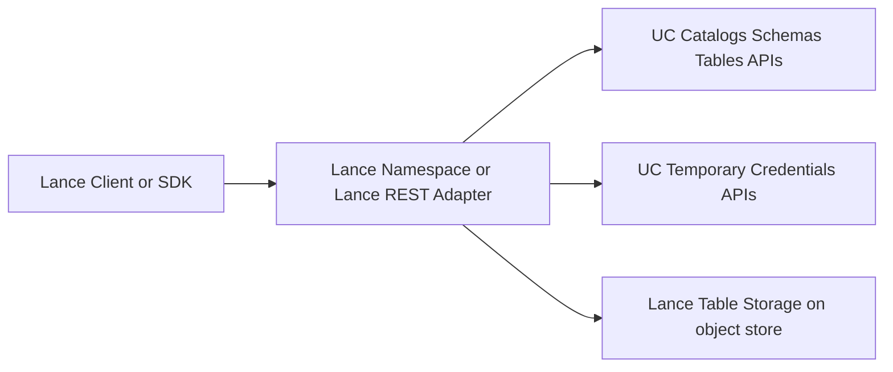

# Architecture Direction

This page answers the design question:

Should UC use the full Lance Namespace and Lance data-plane direction, or only a small metadata registration layer?

## Recommendation

Yes, the full Lance Namespace direction is the better long-term target.

But it should be adopted in phases:

- use UC as the metadata and governance control plane first
- keep the metadata model compatible with the upstream Lance Unity Namespace mapping
- add Lance REST data-plane operations only where they are needed

In other words:

- **north star**: Lance Namespace-compatible architecture
- **first implementation**: metadata-first UC integration
- **later expansion**: selective or full Lance data-plane service

## Why this direction fits your goal

Your stated goal is:

- let UC carry LanceDB metadata management
- stay aligned with Lance improvements over time

That aligns much better with Lance Namespace than with a one-off UC-only model, because Lance Namespace is the abstraction upstream Lance is already using to describe catalog integrations.

If UC speaks that shape, it will be easier to track future Lance changes in:

- namespace operations
- table identity rules
- storage options and credential flow
- version and tag operations
- query and index capabilities

## Why "metadata only forever" is too weak

A metadata-only design is a good first release, but a weak final architecture.

If UC only stores Lance table rows in `/tables` and nothing else:

- Lance clients still need custom UC-specific logic
- upstream Lance features such as query, versions, tags, and index management remain outside the contract
- every Lance change risks turning into another custom patch

That increases long-term integration drift.

## Why "full data plane now" is too heavy

A full data-plane implementation from day one would be expensive because UC does not yet model Lance-native:

- query execution
- vector indexing
- table versions and tags
- managed Lance lifecycle

Trying to land all of that immediately would couple too much new work into a single change set.

## Best practical path

### Phase 1: UC-backed Lance metadata

Implement the upstream Unity integration model:

- register Lance tables as UC `EXTERNAL` tables
- use `storage_location` as the Lance table root
- use `properties.table_type=lance`
- keep using UC authz and temporary credentials

This gives:

- UC-native governance
- clean Lance table discovery
- minimal change footprint

### Phase 2: Lance Namespace adapter on top of UC

Expose a Lance-facing namespace service that translates:

- Lance namespace operations
- Lance table registration and discovery

into:

- UC `/catalogs`
- UC `/schemas`
- UC `/tables`
- UC credentials APIs

This is the key step that keeps the integration aligned with upstream Lance.

### Phase 3: Selective Lance data-plane support

Add the operations that bring the most value first:

- describe table
- query
- count
- list versions
- create index

Not every Lance REST operation needs to ship at once, but the path structure and service boundaries should assume that more can be added later.

### Phase 4: Revisit managed Lance tables only if needed

Managed Lance tables should be treated as a separate design problem.

They likely need:

- table creation and staging rules
- commit and version ownership rules
- stronger reconciliation with Lance table semantics

This should not block external-table-based Lance support.

## Suggested service split

## Decision summary

If the question is "what should we optimize for?", the answer is:

- optimize for Lance Namespace compatibility
- implement it as a metadata-first adapter
- keep full Lance data-plane support as the expansion path

That gives you the best chance of making UC the durable metadata home for Lance tables without locking the design to today's limited feature subset.
