# Unity Catalog 项目分析

更新时间：2026-04-14

仓库：
- GitHub: https://github.com/unitycatalog/unitycatalog
- 本地路径：`/home/lei/data_ai/learning/codebase/unitycatalog`

当前分析基于本地仓库快照与公开资料交叉整理。当前本地代码版本处于 `0.5.0-SNAPSHOT` 开发线，不等同于最新稳定发布版。

## 1. 项目定位

Unity Catalog 是一个面向 Data + AI 资产的开源统一目录与治理平台。它试图解决的不只是“表元数据登记”，而是把数据资产、文件资产、函数资产、模型资产统一纳入一个开放的控制平面中，并通过标准 API、权限模型、临时凭证和多引擎适配，把治理能力真正延伸到执行链路里。

从仓库实现看，它同时覆盖：
- 元数据服务
- 认证与授权
- 临时存储凭证下发
- Spark / Delta / Iceberg 兼容接入
- Java / Python SDK
- CLI 与 UI
- Helm / Docker 部署
- 面向 Agent 的 AI Functions 能力

### 1.1 当前开发阶段与技术重心

当前本地代码版本处于 `0.5.0-SNAPSHOT`，说明这份代码更接近开发前沿线，而不是稳定发布快照。

结合 roadmap、本地近期提交和模块设计，当前技术重心主要集中在：
- Managed Delta Tables
- 认证模块化
- AI Functions 生态
- 多引擎开放协议兼容

其中最核心的主线是 Managed Delta Tables，原因是：
- roadmap 明确将其列为 0.5 优先事项
- Spark connector 中存在大量 staging、table ID、credential vending 逻辑
- 最近提交多次出现 Delta REST Catalog、managed table、cross-version test

### 1.2 项目优势

- API-first，边界清晰
- 模块划分好，服务端与执行侧职责明确
- 数据与 AI 资产统一建模
- 多云凭证体系较完整
- Spark / Delta / Iceberg 方向具备较强技术深度
- AI 集成生态广，叙事完整

### 1.3 项目风险

- API 仍在演进，稳定性不是当前优先目标
- 执行引擎兼容与依赖冲突复杂，尤其体现在 Spark/Jackson/Delta 组合上
- AI Functions 的执行点在客户端，安全边界依赖调用方环境
- 多协议、多云、多模块并行推进，长期维护复杂度高

## 2. 业务场景

### 2.1 统一管理数据资产

适用场景：
- 企业内部需要统一管理 catalog / schema / table
- 同时存在 Delta、Parquet、CSV、JSON 等多种数据格式
- 不同计算引擎需要访问同一套元数据

业务目标：
- 给数据资产提供统一命名空间
- 统一元数据查询与生命周期管理
- 降低“每个引擎各维护一套 catalog”的重复成本

核心对象：
- Catalog
- Schema
- Table
- Metastore

### 2.2 统一管理非表类资产

适用场景：
- 需要治理文件类资产，如 PDF、图片、音频、视频、模型工件、配置文件
- 需要为数据科学或 AI 工作流提供结构化的资产入口

业务目标：
- 用 Volumes 管理非结构化文件
- 用 Models / ModelVersions 管理模型资产
- 用 Functions 管理可调用逻辑

核心对象：
- Volume
- Function
- RegisteredModel
- ModelVersion

### 2.3 数据访问治理与权限控制

适用场景：
- 企业需要按照用户、组、服务身份控制访问权限
- 需要让数据“默认安全”，而不是靠下游引擎自行兜底

业务目标：
- 对 catalog/schema/table/volume/model/function 做统一授权
- 通过服务端权限判断约束数据访问行为
- 兼容外部身份系统与标准认证流程

核心能力：
- Permission API
- SCIM2 用户接口
- OAuth token exchange
- JCasbin 授权模型

### 2.4 临时凭证下发与多云访问

适用场景：
- 底层数据在 S3、ADLS、GCS
- 不希望把长期 AK/SK 或固定密钥散落到各个执行端

业务目标：
- 由目录服务按对象和操作下发短期凭证
- 把存储访问控制和对象权限绑定
- 支持跨云存储

核心能力：
- Temporary table credentials
- Temporary volume credentials
- Temporary model version credentials
- Temporary path credentials

### 2.5 多引擎与开放表格式接入

适用场景：
- Spark、DuckDB、Iceberg REST 客户端等都需要消费同一套目录信息
- 需要对 Delta managed tables、Iceberg REST catalog 等协议进行兼容

业务目标：
- 把 Unity Catalog 变成开放协议下的控制平面
- 支持 managed/external table 的元数据和读写协调
- 让执行引擎通过 UC 获取位置、配置、凭证

核心能力：
- Spark connector
- Iceberg REST catalog service
- Delta REST catalog service
- Delta commits API

### 2.6 AI / Agent 工具化集成

适用场景：
- 需要把函数资产作为 LLM/Agent 的 tools 使用
- 需要把函数定义、执行和治理纳入统一平台

业务目标：
- 把函数当成一等资产登记到目录里
- 由 SDK 和集成层把函数暴露给 AI 框架
- 支持 OpenAI、Anthropic、LangChain、LlamaIndex 等生态

核心能力：
- `unitycatalog-ai`
- Function create/get/list/execute
- 各类 AI integration packages

## 3. 核心技术点

### 3.1 API-first 架构

项目以 OpenAPI 规格驱动服务端模型、客户端 SDK 和 API 文档生成。`api/all.yaml` 与 `api/delta.yaml` 是核心协议源头，Java/Python SDK、服务端模型和 Markdown API 文档都从这些规格生成。

价值：
- 服务端、客户端、文档的边界一致
- 降低多语言 SDK 的维护成本
- 让 API 兼容性问题更容易被显式管理

### 3.2 控制平面 + 执行平面分离

Unity Catalog 本质上更像控制平面，不直接承担大规模数据计算，而是负责：
- 元数据存储与查询
- 权限判断
- 存储凭证下发
- 为 Spark / Iceberg / Delta 等执行侧提供配置与访问入口

这意味着：
- 服务端负责“允许什么”
- 执行引擎负责“如何读写”
- 两者通过 API、凭证和开放协议协同

### 3.3 统一资产模型

Unity Catalog 并不只围绕表设计，而是用统一 namespace 和权限模型覆盖：
- tables
- volumes
- functions
- models

这使它更接近“数据与 AI 资产目录”，而不是传统 metastore。

### 3.4 授权与身份集成

服务端内建：
- OAuth token exchange
- issuer / audience 校验
- JWKS 验签
- SCIM2 用户能力
- JCasbin 授权

这说明身份与授权不是外围插件，而是核心系统组成部分。

### 3.5 临时凭证架构

项目对 AWS / Azure / GCP 都做了凭证下发支持。Unity Catalog 服务端在权限校验后下发短期凭证，执行端用这些凭证访问底层存储。

技术意义：
- 避免长期密钥扩散
- 把对象级权限映射到存储访问
- 支持跨云和更细粒度的安全控制

### 3.6 对 Delta / Iceberg 的协议级兼容

Unity Catalog 正在从“管理元数据”往“参与开放表格式控制协议”演进，尤其体现在：
- Iceberg REST Catalog API
- Delta REST Catalog API
- Delta managed tables
- Delta commits / staging / credential vending

这部分是项目最有技术门槛、也最接近核心壁垒的能力。

### 3.7 面向 AI 的 Function 体系

AI Core 不是独立小工具，而是在把 UC Functions 变成标准化、可治理、可执行、可集成到 Agent 的工具资产。

技术关键点：
- 函数注册与元数据管理
- 函数同步 / 异步调用
- wrapped function 打包
- 本地或 sandbox 执行模式
- AI framework integration

## 4. 高层架构图

```text
                       +----------------------+
                       |   Users / Clients    |
                       |----------------------|
                       | UI / CLI / SDK / AI  |
                       +----------+-----------+
                                  |
                                  v
                 +--------------------------------------+
                 |     Unity Catalog Server             |
                 |--------------------------------------|
                 | Auth / Access / Metadata / Creds     |
                 | UC API / Control API / Iceberg /     |
                 | Delta REST Catalog                   |
                 +---------+-------------------+--------+
                           |                   |
                           v                   v
            +--------------------------+   +----------------------+
            | Metadata Persistence     |   | Auth / Policy Model  |
            |--------------------------|   |----------------------|
            | Hibernate + DB + DAO     |   | JCasbin / SCIM / JWT |
            +--------------------------+   +----------------------+
                           |
                           v
            +---------------------------------------------+
            | External Object Storage / Table Formats     |
            |---------------------------------------------|
            | S3 / ADLS / GCS / Delta / Iceberg / Files   |
            +---------------------------------------------+
                           ^
                           |
            +---------------------------------------------+
            | Execution Engines / Frameworks              |
            |---------------------------------------------|
            | Spark / DuckDB / Iceberg clients / AI apps  |
            +---------------------------------------------+
```

说明：
- UI、CLI、SDK、AI integrations 都是入口层
- Server 是核心控制平面
- 底层数据和模型工件在外部对象存储里
- Spark、DuckDB、Iceberg 客户端等通过协议和凭证接入

## 5. 模块架构分析与源码调用链对应关系

这一章不只列模块，还把“模块职责”和“源码调用链”对齐。阅读时可以按下表跳转：

| 模块 | 架构分析章节 | 对应源码调用链章节 | 对应图式章节 |
|---|---|---|---|
| `api` 与代码生成 | `5.1` | `7` | `13.14` |
| `server` 总入口与请求分发 | `5.2` | `11.1` | `13.3`, `13.4` |
| `server` 认证与授权 | `5.5` | `6.2`, `11.2`, `11.3` | `13.5` |
| `server` 资源服务层与持久化层 | `5.3`, `5.4` | `6.1`, `11.4` | `13.6`, `13.7` |
| `server` 凭证与协议兼容层 | `5.6`, `5.7` | `6.3`, `11.5` | `13.8`, `13.10` |
| `clients/java`, `clients/python` | `5.8`, `5.9` | `7` | `13.14` |
| `ai/core`, `ai/integrations/*` | `5.10`, `5.11` | `6.4`, `11.6` | `13.11`, `13.12`, `13.13` |
| `connectors/spark` | `5.12` | `6.3`, `11.5` | `13.8`, `13.9`, `13.10` |
| `cli`, `ui`, `helm`, `docker`, `docs`, `integration-tests` | `5.13` 到 `5.18` | `6`, `7` | `13.1`, `13.2`, `13.14` |

下面按“模块职责、功能、输入、输出、上下游依赖”拆解，并在每个模块下给出它对应的源码调用链章节。

### 5.1 `api`

路径：
- `api/all.yaml`
- `api/control.yaml`
- `api/delta.yaml`

功能：
- 定义 Unity Catalog 主 REST API
- 定义 control API
- 定义 Delta 相关 API
- 作为 Java client、Python client、server models、API docs 的生成源

输入：
- API 设计与对象模型定义
- 业务对象 schema
- Delta / control 协议扩展需求

输出：
- OpenAPI 规格文件
- 生成后的 API 文档
- 生成后的客户端 SDK 源码
- 生成后的服务端模型类

直接消费者：
- `clients/java`
- `clients/python`
- `serverModels`
- `controlModels`
- `apiDocs`

### 5.2 `server`

路径：
- `server/src/main/java/io/unitycatalog/server`

功能：
- 启动 UC 核心服务
- 挂载 UC API、control API、Iceberg REST、Delta REST
- 负责元数据管理、权限校验、认证、临时凭证下发
- 负责与持久化层、云凭证、协议适配层协同

输入：
- HTTP 请求
- `etc/conf/server.properties` 配置
- OpenAPI 生成模型
- 数据库中的元数据与权限状态
- 外部身份令牌

输出：
- REST 响应
- 元数据状态变更
- 短期凭证
- 授权结果
- 协议兼容层响应

内部子模块：
- Service layer
- Repository / DAO layer
- Auth / Security layer
- Exception handling
- Credential vendors
- Iceberg / Delta service adapters

### 5.3 `server` 内 Service Layer

代表服务：
- `CatalogService`
- `SchemaService`
- `TableService`
- `VolumeService`
- `FunctionService`
- `ModelService`
- `PermissionService`
- `CredentialService`
- `ExternalLocationService`
- `MetastoreService`
- `DeltaCommitsService`
- `Temporary*CredentialsService`
- `AuthService`
- `Scim2UserService`
- `Scim2SelfService`

功能：
- 承接 HTTP API
- 做参数校验、业务编排、权限控制入口
- 调用 repository 持久化
- 调用 cloud credential vendor 生成临时访问能力

输入：
- JSON 请求体
- query/path 参数
- 当前用户身份
- 当前授权状态

输出：
- 业务对象响应
- 错误码与异常响应
- 凭证响应

### 5.4 `server` 内 Repository / DAO Layer

代表组件：
- `CatalogRepository`
- `SchemaRepository`
- `TableRepository`
- `VolumeRepository`
- `FunctionRepository`
- `ModelRepository`
- `CredentialRepository`
- `ExternalLocationRepository`
- `MetastoreRepository`
- `UserRepository`
- `DeltaCommitRepository`
- `dao/*`

功能：
- 执行元数据读写
- 把服务层对象映射到数据库实体与 DAO
- 管理分页、事务、外部位置解析等存储侧逻辑

输入：
- 业务层传入的对象或标识符
- Hibernate session / transaction

输出：
- 持久化后的实体
- 查询结果
- 事务完成状态

### 5.5 `server` 内 Auth / Security Layer

代表组件：
- `AuthService`
- `AuthDecorator`
- `UnityAccessDecorator`
- `SecurityContext`
- `SecurityConfiguration`
- `JCasbinAuthorizer`
- `AllowingAuthorizer`

功能：
- 认证请求
- 从 JWT / cookie 提取身份
- 校验 issuer / audience / JWKS
- 在路由层实施认证和授权装饰器
- 计算资源访问权限

输入：
- OAuth token exchange 请求
- 访问令牌
- 用户信息
- policy 数据
- server security config

输出：
- UC access token
- cookie
- allow / deny 判定
- 认证失败 / 授权失败响应

### 5.6 `server` 内 Credential Vendors

代表组件：
- `CloudCredentialVendor`
- `StorageCredentialVendor`
- `AwsCredentialVendor`
- `AzureCredentialVendor`
- `GcpCredentialVendor`

功能：
- 为表、volume、model version、path 生成短期凭证
- 适配 AWS / Azure / GCP 的不同凭证语义

输入：
- 目标对象标识
- 操作类型，如 `READ`、`READ_WRITE`
- 外部位置与存储配置
- 服务端权限结果

输出：
- 云厂商特定的临时凭证对象
- 存储访问配置

### 5.7 `server` 内协议兼容层

代表组件：
- `IcebergRestCatalogService`
- `DeltaRestCatalogService`
- `DeltaCommitsService`
- `MetadataService`
- `TableConfigService`

功能：
- 向 Iceberg REST Catalog 客户端暴露兼容接口
- 向 Delta REST Catalog / managed tables 工作流暴露兼容接口
- 处理 commit coordination、metadata/config 响应等协议动作

输入：
- Iceberg / Delta 协议请求
- 表元数据
- 凭证与配置

输出：
- 协议兼容响应
- 表配置
- metadata payload
- commit 相关响应

### 5.8 `clients/java`

构建模块：
- `client`

功能：
- 生成 Java SDK
- 提供对 UC API 和 Delta API 的 Java 客户端访问

输入：
- `api/all.yaml`
- `api/delta.yaml`

输出：
- Java SDK 源码与打包产物
- 供 CLI、Spark、外部 Java 应用调用的 client classes

直接消费者：
- `cli`
- `spark`
- 外部 Java 应用

### 5.9 `clients/python`

构建模块：
- `pythonClient`

功能：
- 生成 Python SDK
- 提供异步 Python client
- 与 `unitycatalog-ai` 等共享 `unitycatalog.*` namespace

输入：
- `api/all.yaml`
- `api/delta.yaml`

输出：
- Python SDK
- PyPI 可分发包

直接消费者：
- Python 应用
- `ai/core`
- 各类 AI integration packages

### 5.10 `ai/core`

功能：
- 提供 Unity Catalog Functions 的高层 Python API
- 支持函数创建、读取、列举、执行
- 支持同步 / 异步调用
- 支持 wrapped functions
- 把 UC functions 作为 Agent tools 暴露给上层框架

输入：
- Python callable
- Function metadata
- UC API client
- catalog/schema/function 标识
- 函数执行参数

输出：
- FunctionInfo
- 执行结果
- 对 AI 集成层可复用的 toolkit / client 能力

注意：
- 函数执行在调用方环境中发生，不在 UC 服务器中远程沙箱执行
- 默认可采用 sandbox 模式限制 CPU、内存、超时和禁用模块

### 5.11 `ai/integrations/*`

代表模块：
- `openai`
- `anthropic`
- `langchain`
- `llama_index`
- `autogen`
- `crewai`
- `litellm`
- `gemini`
- `dspy`

功能：
- 把 `ai/core` 的函数能力适配到不同 LLM / agent 框架
- 降低 UC functions 被各家 agent runtime 消费的接入成本

输入：
- AI framework 的 tool / function calling 机制
- `ai/core` 提供的 client 或 toolkit
- 用户配置与模型调用上下文

输出：
- 可在具体 AI 框架中调用的 tools
- 示例 notebook 与 integration package

### 5.12 `connectors/spark`

构建模块：
- `spark`

功能：
- 实现 Spark Catalog 插件
- 通过 UC API 管理 namespaces 与 tables
- 对 managed Delta table 执行 staging、table ID 传递、凭证下发
- 支持 credential renew 与 credential-scoped filesystem

输入：
- Spark catalog 配置
- UC endpoint
- token provider
- 表定义与操作请求
- temporary credentials API 返回

输出：
- Spark 可识别的 catalog/table 行为
- 表创建 / 替换 / 读取路径
- Hadoop / FS credential properties

关键意义：
- 它让 UC 真正进入 Spark 执行链路，而不是只停留在元数据登记层

### 5.13 `examples/cli`

构建模块：
- `cli`

入口脚本：
- `bin/uc`

功能：
- 提供命令行访问入口
- 浏览 catalog/schema/table
- 读 Delta table 内容
- 执行管理类操作

输入：
- CLI 参数
- 配置与 endpoint
- Java SDK

输出：
- 终端结果
- JSON / 表格化内容

典型使用者：
- 本地开发者
- 测试 / 演示场景
- 运维或平台开发人员

### 5.14 `ui`

功能：
- 提供 Unity Catalog 的 Web UI
- 展示 catalog 资产内容与基础交互入口

输入：
- 浏览器请求
- 服务端 API 返回的数据

输出：
- 前端页面
- 用户交互后的 API 调用

### 5.15 `helm`

功能：
- 提供 Kubernetes 部署模板
- 包含 server 与 ui 的部署清单

输入：
- Helm values
- 环境相关配置

输出：
- Kubernetes manifests

适用场景：
- 集群化部署
- 云上环境交付

### 5.16 `docker` / `compose.yaml`

功能：
- 提供本地或轻量环境部署入口
- 快速拉起 server + ui

输入：
- Docker 镜像
- 本地配置目录
- 持久化 volume

输出：
- 可运行的容器化 UC 环境

### 5.17 `docs`

功能：
- 使用说明
- 部署文档
- AI 集成文档
- 服务器配置说明

输入：
- 项目能力与示例

输出：
- 面向用户和开发者的操作文档

### 5.18 `integration-tests`

功能：
- 对 Spark connector 和系统集成路径做验证
- 覆盖 Delta、对象存储、跨版本行为

输入：
- 构建产物
- Spark / Delta 依赖矩阵
- 测试环境配置

输出：
- 集成测试结果
- 兼容性信号

## 6. 关键请求流

### 6.1 元数据查询流

```text
Client/UI/CLI
  -> UC REST API
  -> AuthDecorator
  -> UnityAccessDecorator
  -> Service
  -> Repository/DAO
  -> DB
  -> 返回业务对象
```

输入：
- 认证信息
- 业务查询参数

输出：
- Catalog/Schema/Table 等元数据对象

### 6.2 Token Exchange 认证流

```text
External identity token
  -> /api/1.0/unity-control/auth/tokens
  -> issuer/audience/JWKS 验签
  -> principal 校验
  -> 生成 UC access token
  -> 返回 token 或 cookie
```

输入：
- 外部 JWT
- issuer/audience 配置

输出：
- Unity Catalog access token

### 6.3 Spark Managed Delta 建表流

```text
Spark SQL CREATE TABLE
  -> UCSingleCatalog
  -> UC createStagingTable
  -> UC 返回 staging location + table id
  -> UC 返回 temporary credentials
  -> Spark/Delta 使用 credential props 写入底层存储
  -> UC 管理表元数据
```

输入：
- Spark catalog 配置
- CREATE TABLE 语句与属性

输出：
- 受 UC 管理的 Delta table
- staging 位置、table ID、临时凭证

### 6.4 AI Function 调用流

```text
AI App / Agent Framework
  -> ai/integrations/*
  -> ai/core client
  -> Python SDK / UC API
  -> 获取 FunctionInfo
  -> 本地或 sandbox 执行函数
  -> 返回 tool result
```

输入：
- function name
- parameters
- UC metadata

输出：
- 函数执行结果

注意：
- 执行点在客户端，不在服务端

## 7. 构建模块与产物映射

从 `build.sbt` 可见的主要构建模块如下：

| 构建模块 | 主要职责 | 主要输入 | 主要输出 |
|---|---|---|---|
| `controlApi` | 生成 control API Java client | `api/control.yaml` | Java API classes |
| `client` | 生成 Java client | `api/all.yaml`, `api/delta.yaml` | Java SDK |
| `pythonClient` | 生成 Python client | `api/all.yaml`, `api/delta.yaml` | Python SDK |
| `apiDocs` | 生成 Markdown API 文档 | OpenAPI specs | API docs |
| `server` | UC 核心服务 | 配置、模型、repository | server jar |
| `serverModels` | 生成服务端模型 | `all.yaml`, `delta.yaml` | server model classes |
| `controlModels` | 生成 control model | `control.yaml` | control model classes |
| `cli` | CLI 工具 | Java client、server test classes | CLI jar |
| `serverShaded` | Spark 测试所需 shading 产物 | server | shaded jar |
| `spark` | Spark connector | Java client、Spark API | Spark catalog plugin |
| `integrationTests` | 集成测试 | Spark module | integration test results |

## 8. 当前技术重心判断

结合本地提交、roadmap 和模块设计，当前项目重心可以归纳为：

### 8.1 Managed Delta Tables

这是当前最重要的主线。原因：
- roadmap 明确将其列为 0.5 优先事项
- Spark connector 中存在大量 staging、table ID、credential vending 逻辑
- 最近提交多次出现 Delta REST Catalog、managed table、cross-version test

### 8.2 认证模块化

服务端已经实现 token exchange、issuer/audience 校验、SCIM2、decorator 认证链，说明“接入企业现有身份系统”是产品落地的刚需。

### 8.3 AI Functions 生态

AI 相关模块覆盖面很广，不像试验性 side project，更像核心增长方向之一。项目正在把“函数治理 + AI tool use”做成 UC 的重要差异化特性。

### 8.4 多引擎开放协议兼容

Iceberg REST 与 Delta REST 说明项目不满足于做单一 SDK 服务，而是在争取成为开放数据生态中的标准控制面角色。

## 9. 项目优势与风险

### 9.1 优势

- API-first，边界清晰
- 模块划分好，服务端与执行侧职责明确
- 数据与 AI 资产统一建模
- 多云凭证体系较完整
- Spark / Delta / Iceberg 方向具备较强技术深度
- AI 集成生态广，叙事完整

### 9.2 风险

- API 仍在演进，稳定性不是当前优先目标
- 执行引擎兼容与依赖冲突复杂，尤其体现在 Spark/Jackson/Delta 组合上
- AI Functions 的执行点在客户端，安全边界依赖调用方环境
- 多协议、多云、多模块并行推进，长期维护复杂度高

## 10. 一句话总结

Unity Catalog 不是简单的开源 metastore，而是在构建一个面向开放表格式、多云存储、多执行引擎和 AI 工具资产的统一治理控制平面；当前最核心的技术主线是 managed Delta、临时凭证、开放协议兼容和 AI Functions。

## 11. 源码级调用链分析

这一部分把关键业务流进一步下钻到类、方法和关键数据结构级别。

---

### 11.1 服务端请求进入链

先看服务端启动时做了什么。

核心入口：
- `io.unitycatalog.server.UnityCatalogServer`

源码主链：
1. `main()` 启动 `UnityCatalogServer.builder().port(...).build()`
2. `initializeServer()` 初始化 Hibernate、Repositories、Authorizer、各类 Service
3. `addApiServices()` 把各类 annotated service 挂到 Armeria 路由上
4. `addSecurityDecorators()` 在路由前挂认证与授权装饰器
5. 服务启动后接受 HTTP 请求

关键类与方法：
- `UnityCatalogServer.main`
- `UnityCatalogServer.initializeServer`
- `UnityCatalogServer.addApiServices`
- `UnityCatalogServer.addIcebergApiServices`
- `UnityCatalogServer.addDeltaApiServices`
- `UnityCatalogServer.addSecurityDecorators`

关键事实：
- UC 主 API 路径前缀是 `/api/2.1/unity-catalog/`
- control API 路径前缀是 `/api/1.0/unity-control/`
- Iceberg REST 和 Delta REST 都挂在同一服务端进程中
- Auth 和 Access control 通过 Armeria decorator 在业务 service 之前执行

请求进入服务端的源码流程：

```text
HTTP request
  -> Armeria route match
  -> AuthDecorator
  -> UnityAccessDecorator
  -> Annotated Service method
  -> Repository/DAO
  -> HttpResponse.ofJson(...)
```

输入：
- HTTP method
- path/query/body
- bearer token 或 cookie

输出：
- JSON 响应
- 错误响应

---

### 11.2 认证链：外部身份令牌如何变成 UC access token

这条链路对应 `/api/1.0/unity-control/auth/tokens`。

核心类：
- `AuthService`
- `SecurityContext`
- `JwksOperations`

调用链：
1. 客户端把外部身份令牌提交给 `AuthService.grantToken()`
2. 服务端校验 grant type、requested token type、subject token type
3. 检查 `server.allowed-issuers` 与 `server.audiences`
4. 用 `JwksOperations.verifierForIssuerAndKey(...)` 按 issuer/keyId/alg 获取 verifier
5. 验证 JWT 签名与 audience
6. 调用 `verifyPrincipal()`，确认 subject 对应的用户在 UC 中存在且为 `ENABLED`
7. 通过 `securityContext.createAccessToken(decodedJWT)` 创建 UC 内部 token
8. 返回 JSON access token，或者按请求扩展写入 cookie

源码角色拆分：
- `AuthService.grantToken()`：编排整个 token exchange 过程
- `JwksOperations`：对接 JWKS / OIDC discovery
- `SecurityContext`：生成 UC 内部 access token
- `UserRepository`：验证用户状态

输入：
- 外部 JWT
- issuer
- audience
- user principal

输出：
- UC access token
- 可选 cookie

设计含义：
- 外部身份系统只负责提供可信令牌
- UC 不直接依赖外部 token 贯穿内部所有调用，而是换发自己的内部 token
- 这样后续访问链路可以统一走内部 issuer

---

### 11.3 运行时认证链：请求如何在进入业务 Service 前被鉴权

这条链路对应 UC API 的日常请求访问过程。

核心类：
- `AuthDecorator`
- `UnityAccessDecorator`
- `AuthorizedService`

#### 11.3.1 `AuthDecorator` 做什么

作用：
- 从 `Authorization: Bearer ...` 或 `UC_TOKEN` cookie 中读取 UC access token
- 解码 JWT
- 检查 issuer 必须是��部 issuer `INTERNAL`
- 使用内部 JWKS 验签
- 根据 subject 查询 `UserRepository`
- 确认用户存在且状态为 `ENABLED`
- 把 `DecodedJWT` 放入 `ServiceRequestContext` 属性中

调用链：

```text
HTTP request
  -> AuthDecorator.serve()
  -> read header/cookie
  -> JWT.decode(...)
  -> verify internal token signature
  -> load user by email
  -> ctx.setAttr(DECODED_JWT_ATTR, decodedJWT)
  -> delegate.serve(...)
```

输入：
- bearer token / cookie

输出：
- 已认证请求上下文
- 失败时抛出 `UNAUTHENTICATED` 或 `PERMISSION_DENIED`

#### 11.3.2 `UnityAccessDecorator` 做什么

作用：
- 找到当前请求最终命中的 annotated service method
- 读取该方法上的：
  - `@AuthorizeExpression`
  - `@AuthorizeResourceKey`
  - `@AuthorizeKey`
- 从 path/query/body 中提取资源 key 和普通参数
- 把资源 key 映射成真正的资源 ID
- 用 `UnityAccessEvaluator` 执行表达式求值
- 不通过时抛 `PERMISSION_DENIED`

调用链：

```text
Authenticated request
  -> UnityAccessDecorator.serve()
  -> findServiceMethod(...)
  -> findAuthorizeExpression(...)
  -> findAuthorizeKeys(...)
  -> authorizeByRequest(...)
  -> keyMapper.mapResourceKeys(...)
  -> evaluator.evaluate(...)
  -> allow or deny
```

重点机制：
- `SYSTEM` source: 系统级资源，如 metastore
- `PARAM` source: path/query 参数
- `PAYLOAD` source: request body 中的字段
- `keyMapper.mapResourceKeys(...)`: 把 catalog/schema/table 名称、路径等解析成真实 UUID
- `ExternalLocationUtils.DATA_SECURABLE_TYPES`: 用于判断路径是否与现有 data securable 冲突

输入：
- principal
- API method 的授权表达式
- 资源 key 与普通参数

输出：
- allow / deny 判定

#### 11.3.3 `AuthorizedService` 的作用

`AuthorizedService` 是 service 层的公共父类，提供几个关键授权辅助方法：
- `initializeBasicAuthorization(resourceId)`
- `initializeHierarchicalAuthorization(resourceId, parentId)`
- `removeAuthorizations(resourceId)`
- `removeHierarchicalAuthorizations(resourceId, parentId)`

这意味着资源创建后的授权初始化不是在 decorator 完成的，而是在具体业务 service 成功执行后，由 service 主动把新资源挂到权限层级中。

---

### 11.4 业务 Service 链：以 Catalog 与 Table 为例

#### 11.4.1 Catalog 创建链

核心类：
- `CatalogService`
- `CatalogRepository`

调用链：

```text
POST /catalogs
  -> AuthDecorator
  -> UnityAccessDecorator
  -> CatalogService.createCatalog()
  -> CatalogRepository.addCatalog(...)
  -> initializeBasicAuthorization(catalogId)
  -> HttpResponse.ofJson(catalogInfo)
```

`CatalogService.createCatalog()` 的职责：
- 用注解表达 catalog 创建的授权规则
- 调用 repository 完成持久化
- 调用 `initializeBasicAuthorization()` 给当前 principal 授予 OWNER

输入：
- `CreateCatalog`
- 可能包含 `storage_root`

输出：
- `CatalogInfo`

#### 11.4.2 Table 创建链

核心类：
- `TableService`
- `TableRepository`
- `SchemaRepository`
- `CatalogRepository`
- `MetastoreRepository`

调用链：

```text
POST /tables
  -> AuthDecorator
  -> UnityAccessDecorator
  -> TableService.createTable()
  -> TableRepository.createTable(...)
  -> SchemaRepository.getSchema(...)
  -> initializeHierarchicalAuthorization(tableId, schemaId)
  -> HttpResponse.ofJson(tableInfo)
```

`TableService.createTable()` 的职责：
- 使用复杂的 `@AuthorizeExpression` 约束：
  - catalog 权限
  - schema 权限
  - external table 的 external location 权限
  - 路径是否与现有 data securable 冲突
- 在 repository 创建成功后，将 table 权限节点挂到 schema 下面

`TableRepository.createTable()` 的职责：
- 校验 SQL object name
- 标准化 storage location
- 检查同名表是否已存在
- 按 table type 分流

分支一：`EXTERNAL`
- 验证不与 managed storage 冲突
- 生成新的 table UUID

分支二：`MANAGED`
- 检查 managed table feature 是否开启
- 强制要求 `DataSourceFormat.DELTA`
- 调用 `StagingTableRepository.commitStagingTable(...)`
- 把 staging table 的 UUID 作为最终 table ID

最后：
- 组装 `TableInfo`
- 转换为 `TableInfoDAO`
- 持久化 columns / properties / table record

输入：
- `CreateTable`
- schema/catalo g 标识
- table metadata
- storage location

输出：
- `TableInfo`

设计含义：
- Service 负责授权与业务编排
- Repository 负责类型分流与持久化细节
- managed table 的“最终 table identity”与 staging 阶段直接关联

---

### 11.5 Managed Delta 建表链

这一条是当前项目最值得重点理解的源码链路。

#### 11.5.1 Spark 侧发起建表

核心类：
- `UCSingleCatalog`
- 内部类 `UCProxy`
- `TablesApi`
- `TemporaryCredentialsApi`

高层调用链：

```text
Spark CREATE TABLE
  -> UCSingleCatalog.createTable(...)
  -> stageManagedDeltaTableAndGetProps(...)
  -> tablesApi.createStagingTable(...)
  -> temporaryCredentialsApi.generateTemporaryTableCredentials(...)
  -> delegate.createTable(...)
  -> UCProxy.createTable(...)
  -> tablesApi.createTable(...)
  -> server TableService / TableRepository
```

#### 11.5.2 `UCSingleCatalog.createTable()` 做什么

对于 managed Delta table：
1. 判断这是 UC managed Delta create path
2. 调用 `validateManagedDeltaCreateProperties()`
3. 调用 `stageManagedDeltaTableAndGetProps()`

`stageManagedDeltaTableAndGetProps()` 具体做：
1. 构造 `CreateStagingTable`
2. 调用 `tablesApi.createStagingTable(...)`
3. 得到：
   - `stagingLocation`
   - `stagingTableId`
4. 把这些信息写入 Spark 侧 table properties：
   - `PROP_LOCATION`
   - `UC_TABLE_ID_KEY`
   - `PROP_IS_MANAGED_LOCATION = true`
5. 调用 `temporaryCredentialsApi.generateTemporaryTableCredentials(...)`
6. 把返回凭证转为 Hadoop / FS credential properties
7. 交给 delegate catalog 继续执行真正建表

Spark 侧输入：
- table ident
- columns
- properties

Spark 侧输出：
- 注入 staging location、table id、credentials 后的新 properties

#### 11.5.3 服务端 staging table 创建链

核心类：
- `StagingTableService`
- `StagingTableRepository`

调用链：

```text
Spark -> createStagingTable API
  -> StagingTableService.createStagingTable()
  -> StagingTableRepository.createStagingTable(...)
  -> initializeHierarchicalAuthorization(stagingTableId, schemaId)
  -> 返回 StagingTableInfo
```

`StagingTableRepository.createStagingTable()` 关键动作：
1. 检查 managed table feature
2. 校验 table name
3. 生成 `stagingTableId`
4. 查找 catalog/schema DAO
5. 通过 `ExternalLocationUtils.getManagedStorageLocation(...)` 找到父 managed storage
6. 通过 `ExternalLocationUtils.getManagedLocationForTable(...)` 生成 staging path
7. 检查同名表与 staging location 冲突
8. 持久化 `StagingTableDAO`

输入：
- `CreateStagingTable`

输出：
- `StagingTableInfo`
- staging location
- staging table id

#### 11.5.4 服务端最终 commit staging table

当 Spark 侧带着 `stagingLocation` 再次调用 `createTable` 时，服务端进入：

```text
TableRepository.createTable(...)
  -> if MANAGED:
       check feature enabled
       require DELTA format
       repositories.getStagingTableRepository().commitStagingTable(...)
       use stagingTableId as final tableId
```

`StagingTableRepository.commitStagingTable()` 关键检查：
- staging table 是否存在
- caller 是否为 staging table owner
- staging table 是否已经提交

通过后：
- `stageCommitted = true`
- 写入 commit 时间
- 返回 committed staging table DAO

设计含义：
- managed table 不是“直接写正式表位置”
- 而是先领取一个受控 staging location 与 table identity
- 写入完成后再由服务端把 staging table 转正

#### 11.5.5 `UCProxy.createTable()` 如何把 Spark 元数据变成 UC API 请求

`UCProxy.createTable()` 是 Spark delegate path 中的关键一跳。

它做的事：
1. 构造 `CreateTable`
2. 从 Spark schema 生成 `ColumnInfo` 列表
3. 从 properties 决定 `TableType`
4. 设置 `storageLocation`
5. 设置 `dataSourceFormat`
6. 过滤掉纯 V2 table properties
7. 调用 `tablesApi.createTable(createTable)`
8. 调用 `loadTable(ident)` 再把服务端视图加载回 Spark

输入：
- Spark schema
- table properties
- staging / external location

输出：
- UC `CreateTable` REST 请求
- Spark `Table`

#### 11.5.6 `UCProxy.loadTable()` 如何为运行时读取补齐凭证

在 Spark 读取表时：
1. `tablesApi.getTable(...)` 拉取元数据
2. 读取 `storageLocation` 与 `tableId`
3. 调用 `generateTemporaryTableCredentials(...)`
4. 用 `CredPropsUtil.createTableCredProps(...)` 转成 Spark/Hadoop 可消费的配置
5. 组装 `CatalogTable`
6. 返回 `V1Table`

这说明 UC 在 Spark 运行态中持续参与：
- 元数据解析
- table location 暴露
- 访问凭证下发

---

### 11.6 AI Function 调用链

AI 这部分最容易被误解。它不是“服务端远程执行 Python 函数”，而是“服务端保存函数元数据和定义，客户端把定义拉下来后本地执行”。

#### 11.6.1 入口角色

核心类：
- `UnitycatalogFunctionClient`
- `BaseFunctionClient`
- `UnitycatalogClient`
- `FunctionsApi`
- `execution_utils.load_function_from_string`
- `executor.local_subprocess.run_in_sandbox_subprocess`

#### 11.6.2 创建函数链

高层调用链：

```text
Python callable
  -> UnitycatalogFunctionClient.create_python_function(...)
  -> generate_function_info(...)
  -> create_function_async(...)
  -> FunctionsApi.create_function(...)
  -> UC server FunctionService / FunctionRepository
```

关键步骤：
1. `create_python_function_async()` 校验传入对象可调用
2. `generate_function_info(func)` 从 Python 函数提取：
   - callable name
   - routine definition
   - return type
   - parameter info
   - comment/docstring
3. 拼接完整函数名 `<catalog>.<schema>.<callable_name>`
4. 调用 `create_function_async(...)`
5. `create_function_async(...)` 再把这些信息组装成 `CreateFunction`
6. 最终通过 `self.uc.functions_client.create_function(...)` 调服务端 API

输入：
- Python callable
- catalog/schema

输出：
- UC 中的 `FunctionInfo`

#### 11.6.3 获取函数元数据链

高层调用链：

```text
execute_function(function_name, params)
  -> BaseFunctionClient.execute_function(...)
  -> get_function(function_name)
  -> FunctionsApi.get_function(...)
```

`BaseFunctionClient.execute_function()` 先做：
1. `get_function(...)` 拉取函数元数据
2. `validate_input_params(...)` 根据 UC 中登记的参数定义校验调用参数
3. 最后进入 `_execute_uc_function(...)`

输入：
- function name
- parameters

输出：
- `FunctionInfo`
- 参数校验结果

#### 11.6.4 从 FunctionInfo 还原为可执行 Python 函数

关键方法：
- `UnitycatalogFunctionClient._prepare_function_and_params()`
- `get_callable_definition(function_info)`
- `exec(python_function, self.func_cache)`

源码流程：
1. 先处理参数默认值 `process_function_parameter_defaults(...)`
2. 查本地 cache
3. 如果未命中：
   - 从 `FunctionInfo` 中提取 Python callable definition
   - 用 `exec(...)` 把源码装载到 `func_cache` 命名空间
   - 再对函数做 `lru_cache()` 包装
4. 返回函数对象与参数

这说明 UC server 侧保存的是函数定义与元数据，而执行对象是在 client 侧重建的。

#### 11.6.5 执行链：local 模式

调用链：

```text
execute_function(...)
  -> _execute_uc_function(...)
  -> _prepare_function_and_params(...)
  -> if execution_mode == LOCAL:
       func(**parameters)
  -> FunctionExecutionResult
```

输入：
- `FunctionInfo`
- parameters

输出：
- `FunctionExecutionResult(format="SCALAR", value=...)`

特点：
- 直接在主 Python 进程执行
- 无额外安全隔离

#### 11.6.6 执行链：sandbox 模式

调用链：

```text
execute_function(...)
  -> _execute_uc_function(...)
  -> run_in_sandbox(...)
  -> run_in_sandbox_subprocess(...)
  -> generate temporary runner script
  -> subprocess.run([sys.executable, script_path, b64_params], ...)
  -> JSON result
  -> FunctionExecutionResult
```

`run_in_sandbox_subprocess()` 关键动作：
1. 取函数源码
2. 生成 runner script
3. 在脚本中设置资源限制：
   - CPU limit
   - virtual memory limit
   - timeout
4. 把参数用 `cloudpickle + base64` 序列化
5. 用子进程执行
6. 子进程把结果输出为 JSON
7. 父进程解析 JSON，返回 success / error

输入：
- function source
- params
- executor env vars

输出：
- `(success, result)` 元组
- 上层包装为 `FunctionExecutionResult`

设计含义：
- “sandbox” 不是远程隔离执行，而是本地子进程隔离
- 重点是限制 CPU、内存、超时，而不是彻底容器化

#### 11.6.7 直接获取源码或 callable 的链

两个辅助方法：
- `get_function_source(function_name)`
- `get_function_as_callable(function_name)`

调用链：

```text
get_function_source()
  -> get_function()
  -> dynamically_construct_python_function(function_info)

get_function_as_callable()
  -> get_function_source()
  -> load_function_from_string(...)
```

`load_function_from_string(...)` 做的事情：
- 用 AST 解析源码
- 找出第一个函数定义
- `compile(...)`
- `exec(...)`
- 返回 callable

这为 notebook、agent runtime、debug 场景提供了直接操作源码的能力。

---

### 11.7 四条关键链路总结

#### 链路 A：普通 API 访问

```text
Request
  -> AuthDecorator
  -> UnityAccessDecorator
  -> Service method
  -> Repository
  -> DAO / DB
  -> Response
```

#### 链路 B：外部身份接入

```text
External token
  -> AuthService.grantToken
  -> JWKS verify
  -> principal validation
  -> create internal access token
  -> later requests use AuthDecorator
```

#### 链路 C：Managed Delta 建表

```text
Spark CREATE TABLE
  -> UCSingleCatalog.stageManagedDeltaTableAndGetProps
  -> createStagingTable
  -> temporary credentials
  -> UCProxy.createTable
  -> TableRepository.createTable
  -> commitStagingTable
  -> final table metadata persisted
```

#### 链路 D：AI Function 执行

```text
Function name + params
  -> get_function metadata
  -> validate params
  -> reconstruct callable from source
  -> local execute or sandbox subprocess execute
  -> result
```

## 12. 源码级观察结论

### 12.1 服务端的真正中心不是 Controller，而是 Decorator + Repository

UC 的业务 service 看起来像常规 controller，但真正的控制点有两个：
- decorator 层负责“你能不能调”
- repository 层负责“对象到底怎么被创建和提交”

特别是 managed table 的核心状态转换，不是在 Spark 侧完成，而是在服务端 repository 中完成。

### 12.2 权限模型深度嵌入资源层级

资源权限不是简单 RBAC 判断，而是：
- principal
- 资源层级关系
- 外部位置路径映射
- 操作类型
- SpEL 表达式求值

这让它比“注解 + if 判断”更像一个小型策略执行系统。

### 12.3 Spark connector 是控制平面落地的关键执行桥

如果没有 `UCSingleCatalog` / `UCProxy` 这一层，UC 仍然只是目录服务。真正让它进入数据写入路径的是：
- staging table
- table ID
- temporary credentials
- load/create table 双向 API 往返

### 12.4 AI Functions 的执行边界非常重要

AI Functions 的核心不是“在 UC server 上执行函数”，而是：
- server 保存定义
- client 取回定义
- client 本地或子进程执行

这意味着：
- 治理中心在服务端
- 执行安全边界在客户端
- 生产安全性强依赖调用方部署方式

## 13. Markdown 图式源码调用链

这一部分把前面的分析改写成 Markdown 可识别的流程图形式。采用“总分结构”：
- 先给典型业务场景的总体源码模块调用逻辑图
- 再分别细化服务端、Spark managed Delta、AI function 的模块内调用图

说明：
- 图中每个节点尽量同时包含“逻辑角色”和“源码目录/核心类”
- 图是源码结构导向，不是部署拓扑图

### 13.1 总览：典型业务场景总体源码模块调用逻辑图

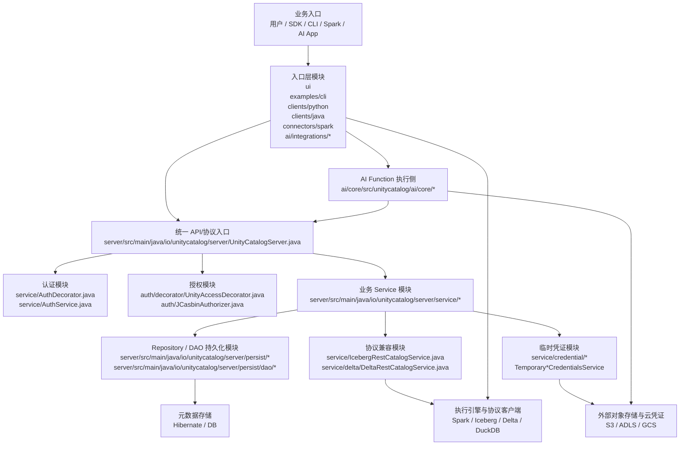

解读：
- 所有上层入口最终都会汇聚到 `server`
- `server` 内部先过认证和授权装饰器，再进入业务 service
- `service` 一边读写元数据持久层，一边把能力暴露给协议层和凭证层
- Spark/AI 等运行时并不只是“调 API”，还会消费存储位置、临时凭证和函数定义

### 13.2 总览：按业务场景划分的总体调用图

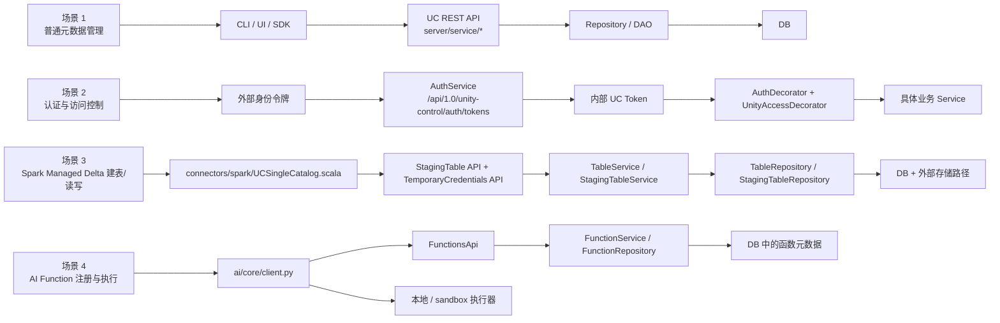

---

### 13.3 服务端总体模块图

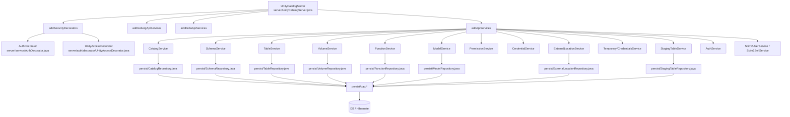

对应源码目录：
- 服务端入口：`server/src/main/java/io/unitycatalog/server/`
- 业务服务：`server/src/main/java/io/unitycatalog/server/service/`
- 授权装饰器：`server/src/main/java/io/unitycatalog/server/auth/decorator/`
- 持久化：`server/src/main/java/io/unitycatalog/server/persist/`
- DAO：`server/src/main/java/io/unitycatalog/server/persist/dao/`

---

### 13.4 服务端请求处理链图

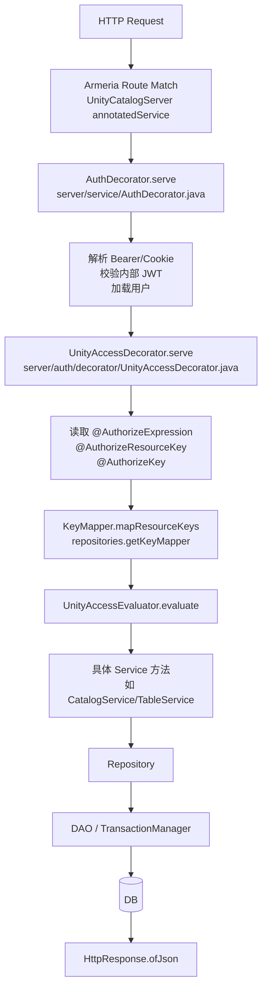

图中关键源码对应：
- 认证：`server/src/main/java/io/unitycatalog/server/service/AuthDecorator.java`
- 授权：`server/src/main/java/io/unitycatalog/server/auth/decorator/UnityAccessDecorator.java`
- Service：`server/src/main/java/io/unitycatalog/server/service/*`
- Repository：`server/src/main/java/io/unitycatalog/server/persist/*`

---

### 13.5 服务端认证与授权细化图

```mermaid
flowchart LR
    A1[外部身份令牌] --> A2[AuthService.grantToken<br/>server/service/AuthService.java]
    A2 --> A3[JwksOperations verifier]
    A3 --> A4[issuer / audience 校验]
    A4 --> A5[UserRepository.getUserByEmail]
    A5 --> A6[SecurityContext.createAccessToken]
    A6 --> A7[UC Internal Access Token]
    A7 --> A8[后续业务请求]
    A8 --> A9[AuthDecorator]
    A9 --> A10[UnityAccessDecorator]
    A10 --> A11[业务 Service]
```

这张图表达的是两段链：
- 外部身份接入链
- 运行时认证鉴权链

---

### 13.6 Catalog 模块内部调用图

```mermaid
flowchart TD
    C1[POST /catalogs] --> C2[CatalogService.createCatalog<br/>service/CatalogService.java]
    C2 --> C3[@AuthorizeExpression<br/>metastore + external location 权限]
    C3 --> C4[CatalogRepository.addCatalog<br/>persist/CatalogRepository.java]
    C4 --> C5[DAO 持久化<br/>persist/dao/CatalogInfoDAO.java]
    C5 --> C6[(DB)]
    C4 --> C7[返回 CatalogInfo]
    C7 --> C8[AuthorizedService.initializeBasicAuthorization]
    C8 --> C9[JCasbinAuthorizer.grantAuthorization]
    C9 --> C10[HttpResponse.ofJson]
```

图中逻辑点：
- 权限判断发生在 service 方法进入前后两处
- 创建成功后会把 OWNER 权限授予当前 principal

---

### 13.7 Table 模块内部调用图

```mermaid
flowchart TD
    T1[POST /tables] --> T2[TableService.createTable<br/>service/TableService.java]
    T2 --> T3[@AuthorizeExpression<br/>catalog/schema/table/external location]
    T3 --> T4[TableRepository.createTable<br/>persist/TableRepository.java]
    T4 --> T5{TableType}
    T5 -->|EXTERNAL| T6[validateNotOverlapWithManagedStorage]
    T5 -->|MANAGED| T7[commitStagingTable]
    T6 --> T8[构造 TableInfo]
    T7 --> T8
    T8 --> T9[TableInfoDAO + PropertyDAO + ColumnDAO]
    T9 --> T10[(DB)]
    T10 --> T11[返回 TableInfo]
    T11 --> T12[SchemaRepository.getSchema]
    T12 --> T13[initializeHierarchicalAuthorization]
    T13 --> T14[authorizer.addHierarchyChild]
    T14 --> T15[HttpResponse.ofJson]
```

对应源码目录：
- Service：`server/src/main/java/io/unitycatalog/server/service/TableService.java`
- Repository：`server/src/main/java/io/unitycatalog/server/persist/TableRepository.java`
- 权限父类：`server/src/main/java/io/unitycatalog/server/service/AuthorizedService.java`

---

### 13.8 Managed Delta 建表总体图

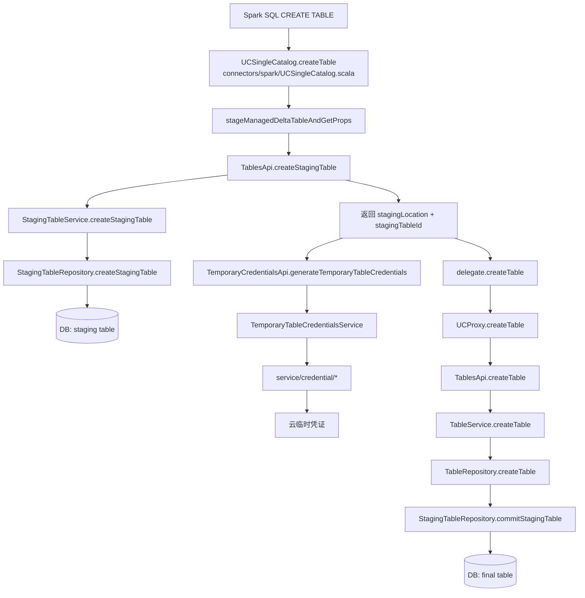

这张图是 managed Delta 最值得看的总图，表达了两段关键动作：
- 先 staging
- 再 create/commit

---

### 13.9 Managed Delta 建表细化图：Spark 侧内部逻辑

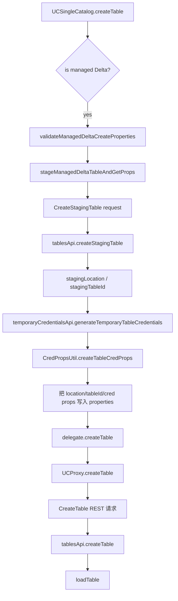

对应源码目录：
- Spark catalog：`connectors/spark/src/main/scala/io/unitycatalog/spark/UCSingleCatalog.scala`
- 凭证辅助：`connectors/spark/src/main/java/io/unitycatalog/spark/auth/CredPropsUtil.java`
- API client：`connectors/spark/src/main/java/io/unitycatalog/spark/ApiClientFactory.java`

---

### 13.10 Managed Delta 建表细化图：服务端 staging/commit 逻辑

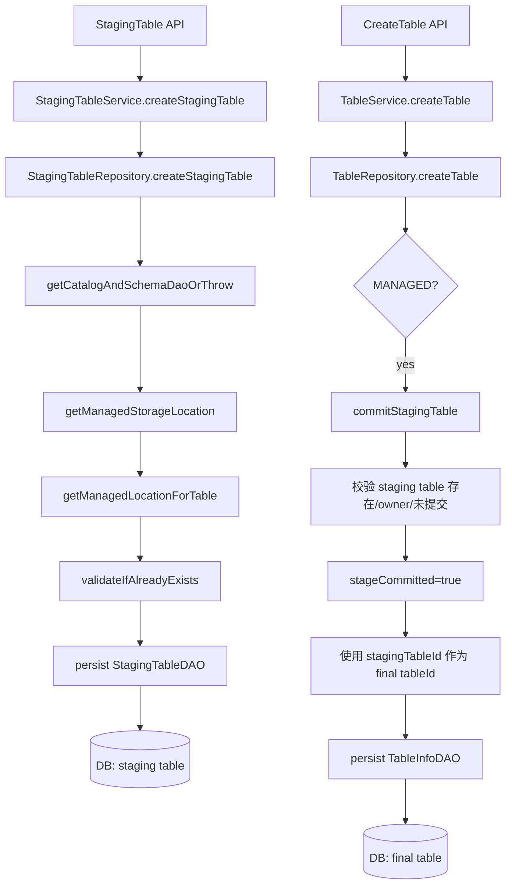

对应源码目录：
- staging service：`server/src/main/java/io/unitycatalog/server/service/StagingTableService.java`
- staging repository：`server/src/main/java/io/unitycatalog/server/persist/StagingTableRepository.java`
- table repository：`server/src/main/java/io/unitycatalog/server/persist/TableRepository.java`

---

### 13.11 AI Function 总体调用图

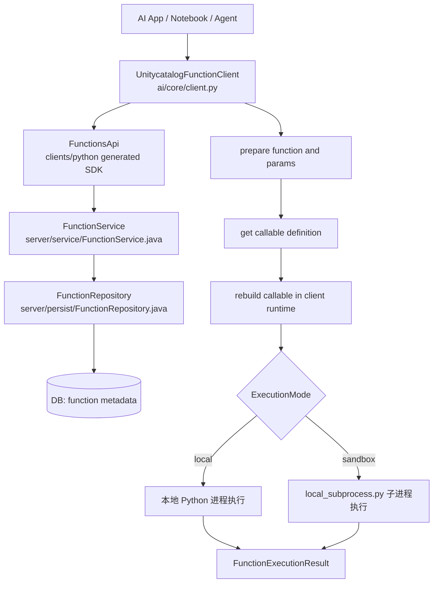

图中关键点：
- 函数元数据在 server
- 函数执行在 client

---

### 13.12 AI Function 创建链细化图

```mermaid
flowchart LR
    F1[Python callable] --> F2[generate_function_info<br/>ai/core/utils/callable_utils_oss.py]
    F2 --> F3[routine_definition + parameters + return type]
    F3 --> F4[UnitycatalogFunctionClient.create_function_async]
    F4 --> F5[CreateFunction / CreateFunctionRequest]
    F5 --> F6[self.uc.functions_client.create_function]
    F6 --> F7[server/service/FunctionService]
    F7 --> F8[persist/FunctionRepository]
    F8 --> F9[(DB)]
```

对应源码目录：
- AI core client：`ai/core/src/unitycatalog/ai/core/client.py`
- callable 处理：`ai/core/src/unitycatalog/ai/core/utils/`
- Python SDK：`clients/python/`

---

### 13.13 AI Function 执行链细化图

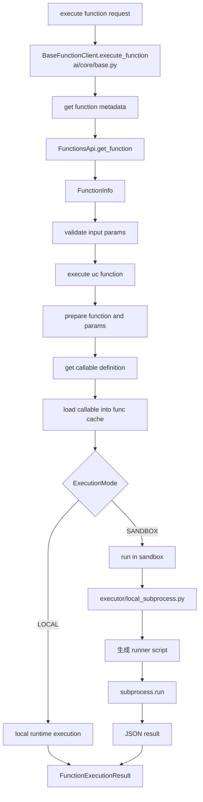

对应源码目录：
- 抽象基类：`ai/core/src/unitycatalog/ai/core/base.py`
- 具体 client：`ai/core/src/unitycatalog/ai/core/client.py`
- 执行模式与源码装载：`ai/core/src/unitycatalog/ai/core/utils/execution_utils.py`
- sandbox 执行器：`ai/core/src/unitycatalog/ai/core/executor/local_subprocess.py`

---

### 13.14 代码生成链图

这一条不是运行时主链，但对理解项目结构很重要。

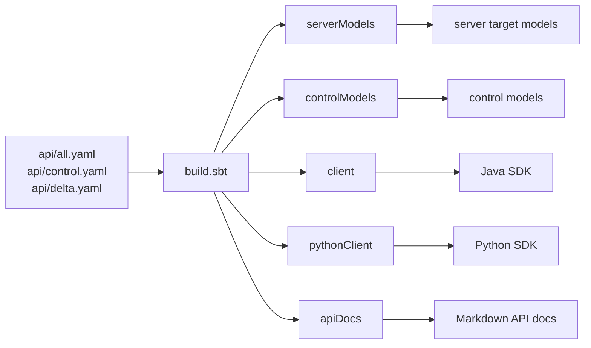

对应源码目录：
- OpenAPI specs：`api/`
- 构建定义：`build.sbt`
- Java client：`clients/java`
- Python client：`clients/python`
- 生成的 server models：`server/target/models`

---

### 13.15 从图看项目的源码结构重心

如果只从这些图里提炼最重要的三个中心模块，可以这样看：

1. `server/`
- 负责控制平面核心逻辑
- 入口、认证、授权、元数据、凭证、协议兼容都在这里收敛

2. `connectors/spark/`
- 负责把控制平面嵌入实际数据执行链
- 尤其是 managed Delta 的 staging 与 credential vending

3. `ai/core/`
- 负责把函数资产变成 AI runtime 可执行工具
- 但执行仍然发生在客户端侧
